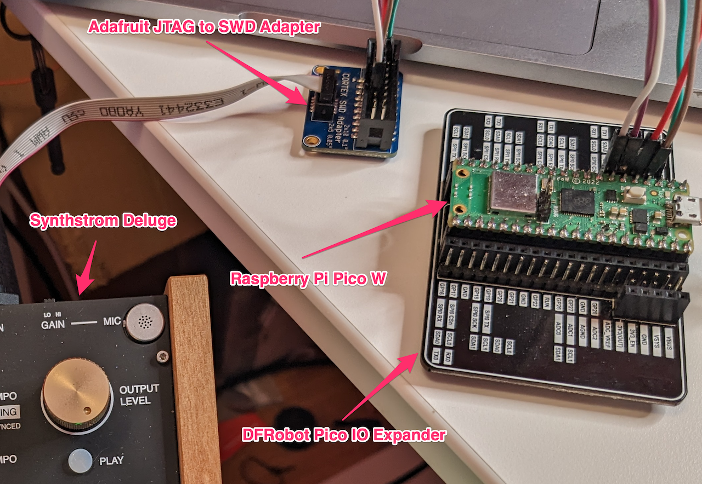
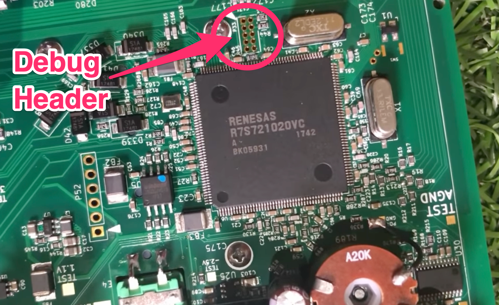
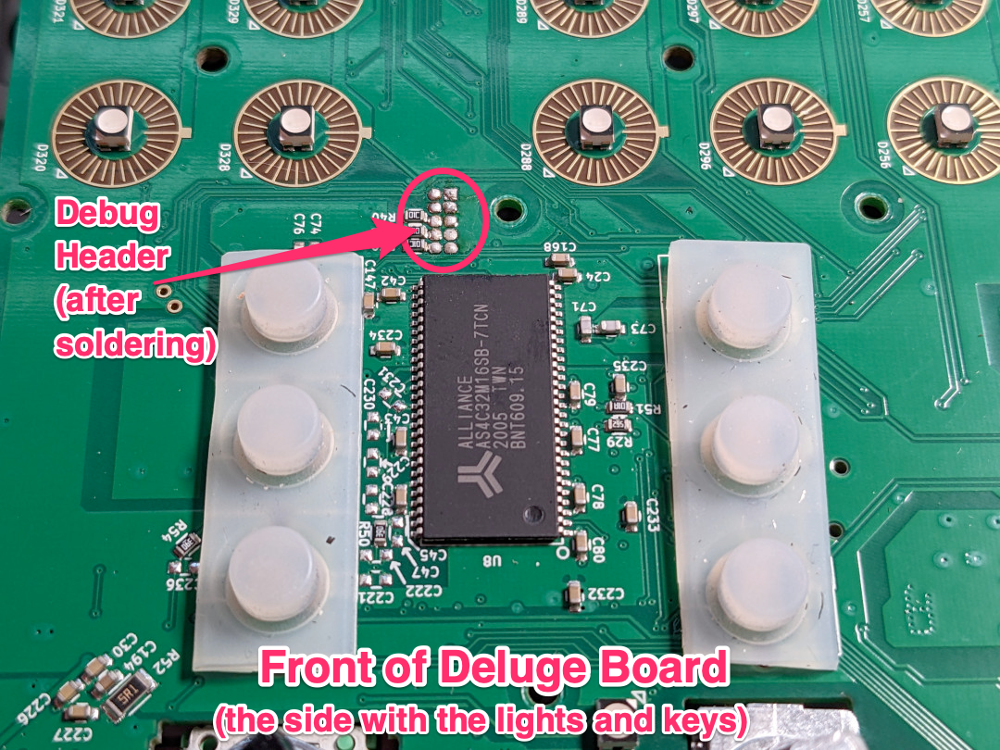
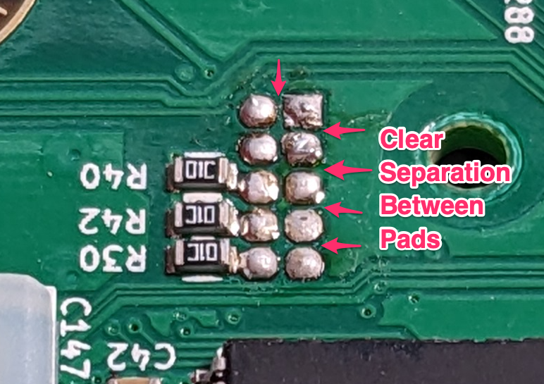
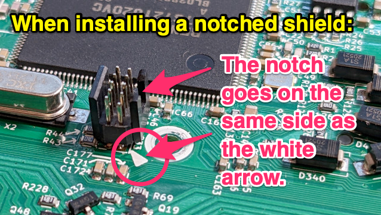
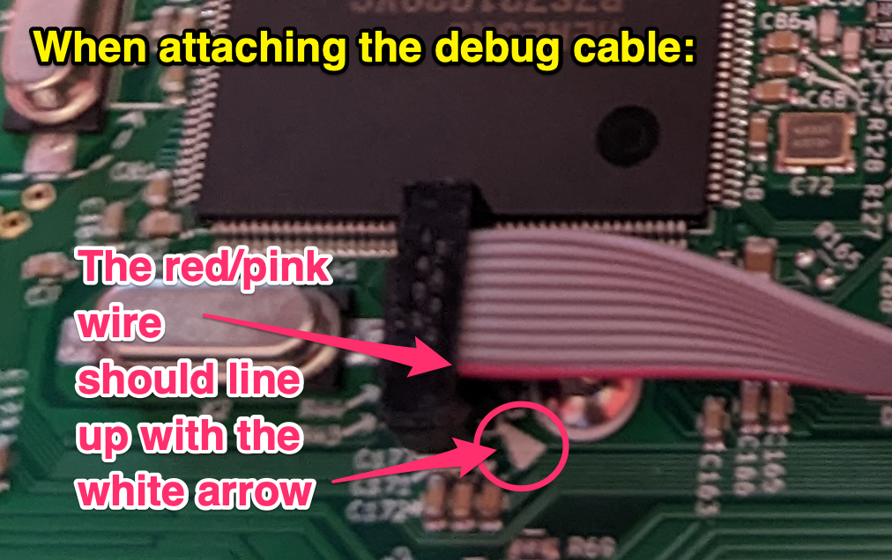

# The Hitchhiker's Guide to DIY Deluge Debugging Hardware

by *Aria Burrell \<litui@litui.ca\>*

---

> **DON'T PANIC**

So, you're a developer and synth enthusiast who is interested in contributing to the Deluge now that it's gone Open Source... welcome! Especially if you're new to embedded development, it can be a bit daunting at first, but this guide aims to start you off with the right gear!

This guide is intended primarily for those who are soldering at an **intermediate** level. Most of the process is very basic for those experienced with circuitry and embedded systems work (or even DIY synth modules), but for absolute beginners there are some difficult parts where you should enlist the help of a skilled solderer.

Be aware that if you follow any of these installation/modding steps, regardless of your degree of success: 

**Synthstrom waives all liability for damage incurred through the following of this process.**

**But**, you're an intrepid developer and/or synthesist who laughs in the face of adversity (*"ha ha ha!"*)! You got this, and if you're at all uncertain about any of these steps, by all means come ask for community help in the forum or in the *#dev-chat* channel on the *Synthstrom Audible* Discord.

### Hardware Debugger

Writing, compiling, and loading of firmware (via SD Card) *doesn't require any special hardware*. In the case of small code tweaks you can probably get by making and testing the change over a few iterations without special hardware.

Once things start getting *complicated* (e.g.: you need to track changing variable values, test function outputs, etc.), you're going to want a hardware debugger.

## Choose Your Own Debugging Adventure

There are two main paths you can take through this guide, depending on your situation, with more paths likely to open up as development matures.

### The Shorter (but pricier) Path

*IF* you use Windows and already own a [SEGGER J-Link](https://www.segger.com/products/debug-probes/j-link/) or don't mind spending between **$500 USD** and **$1000 USD** on a small, single-purpose piece of debugging gear, *THEN* you have the easier path: you can follow the **Debug Header Installation** instructions below, hook up your J-Link, and skip the rest of this guide.

The [e2 Studio](https://www.renesas.com/us/en/software-tool/e-studio) software (based on Eclipse) is the official (Windows) tool Renesas recommends for development and debugging on the Deluge's microprocessor. Everything JLink-related should work out-of-the-box in e2.

### The Longer (but MUCH cheaper) Path

*IF* you use Linux or Mac, already own a [DAPlink debugger](https://daplink.io/), or have $5 in your back pocket you're willing to spend on a [Raspberry Pi Pico](https://www.raspberrypi.com/products/raspberry-pi-pico/) which can easily be converted to a debugger, this is the path for you!

Rather than spending almost as much as you spent on your Deluge buying a debugger, you could spend a maximum of about $32 USD (all inclusive) plus a couple hours of your time to have everything you need to contribute to the Deluge open source project using your preferred IDE/Editor and operating system.

Interested? Read on. This whole guide is for you.

## Prerequisites (Stuff to Acquire)

Hardware debugging is going to require you to have access to the JTAG/SWD debug header on your Deluge. This means at minimum you will need to open up your Deluge and solder in an SWD (Serial Wire Debug) connector. If you'd like to be able to debug with your Deluge sealed up, you will also need to modify the body of the Deluge. Instructions below!

### Tools You'll Need:

Basic tools and supplies you will almost certainly need:
* a clean, freshly tinned precision soldering iron
* thin gauge flux-core solder wire for fine electronics work
* full size Phillips (X) head & precision Phillips (X) and Hex screwdrivers for opening and closing the chassis
* a divided tray for temporarily holding screws and components until needed
* wire cutters
* wire strippers
* an anti-static mat and/or bracelet
* needlenose pliers and/or an adjustable wrench (for removing nuts holding on the faceplate)
* a Dremel or other small metal-drilling/cutting/engraving apparatus to cut an access hole for the debug port
* electrician's tape (for covering up contacts and patching errors)

### Specific Components to Purchase

Whether or not you are the one doing the actual work, you will need the following components to complete all the mod steps in this guide, priced out below (in USD):

| **Qty.** | **Mouser**                                                                       | **Description**                                                              | **USD** Each |
|----------|----------------------------------------------------------------------------------|------------------------------------------------------------------------------|--------------|
|          | **For Debug Port Deluge Mod:**                                                   |                                                                              |              |
| 1x each  | [485-1675](https://mou.sr/3IIZnqR)                                               | Adafruit 10-pin 2x5 Socket 1.27mm pitch IDC (SWD) Cable                      | $2.95        |
| 1x each  | [200-FTS10501LD](https://mou.sr/43cyZh5)                                         | Samtec Micro Low Profile Header Strip (*ignore the photo*)                   | $2.62        |
| 1x each  | [485-2743](https://mou.sr/43xAPcu)                                               | Adafruit SWD (2x5 1.27mm) Cable Breakout Board                               | $2.95        |
| 1x tube  | [910-EGS10C-20G](https://mou.sr/43qNPkx)                                         | Electronics Grade Silicone Adhesive Sealant (Clear) 20g Squeeze Tube         | $4.94        |
|          | **For Making Picoprobe Debugger:**                                               |                                                                              |              |
| 1x each  | [485-1675](https://mou.sr/3IIZnqR)                                               | (Another) Adafruit 10-pin 2x5 Socket 1.27mm pitch IDC (SWD) Cable            | $2.95        |
| 1x each  | [485-2743](https://mou.sr/43xAPcu)                                               | (Another) Adafruit SWD (2x5 1.27mm) Cable Breakout Board                     | $2.95        |
| 1x spool | [485-4730](https://mou.sr/3N0l5Jh)                                               | Adafruit 30AWG Rainbow wire wrap (*way more than you'll probably ever need*) | $6.95        |
| 1x each  | [358-SC0917](https://mou.sr/3LXGxhT) **OR** [358-SC0915](https://mou.sr/41eZOjm) | Raspberry Pi Pico (*with or without pre-soldered pins*)                      | $5.00        |
|          |                                                                                  | **GRAND TOTAL**                                                              | **$31.31**   |

There *are* other parts you could use if you have different things on hand, and cheaper (bulk) supplies you *could* stock up on if you're an electronics technician or engineer but this guide is intended as a one-off. Remember it never hurts to get a couple extras of something in case of a parts defect or mistakes being made!

### Optional Parts

If you would like to house your debugger in some sort of case, lots of options are available on Mouser and other sites.

Personally, I am a fan of putting my Picos on [DFRobot IO Expansion Boards](https://mou.sr/45CTwNq). This exposes *labelled* male and female hookups for every pin so I don't need to solder anything to the board (allowing me to repurpose it for other things at any time). I then use an [Adafruit JTAG to SWD Adapter Board](https://mou.sr/3oG18Oz) to connect the Pico to the Deluge. It looks like this:

The guide below will do things slightly differently, soldering connections to the Picoprobe and making it more permanent (and less prone to user error).

## Adding a Debug Header to your Deluge

*The soldering skill required below is **Intermediate** in difficulty so if you are new to soldering it might be beneficial to ask someone with more soldering experience to help out with the more difficult parts. It's only one section that is hard, the rest is pretty basic.*

The Deluge will need to come apart almost completely and components will be vulnerable to static shock and damage throughout so please take care when the Deluge case is open.

**AGAIN, THIS WILL VOID YOUR WARRANTY**

You agree that by following the below process you understand the risks and that *Synthstrom Audible* is not liable in the event of damage.

### Part I: Unscrewing everything

Prepare table space (enough to fit three Deluges) and ready your parts tray as there will be many parts to keep track of. In addition to your anti-static mat, you will need the Deluge to be face-down for part of this so find a book at least as thick as the height of the knobs to rest the keybed of the Deluge on.

Follow the steps in [this YouTube video](https://www.youtube.com/watch?v=M5Go-ReaJEw) to take the Deluge apart. Please note the creator's correction that you should use a hex precision-driver, not a torx driver.

Don't be afraid to take pictures at each stage so you can remember how things looked when it comes time to put it all back together. Take your time, be methodical, and don't forget to breathe.

### Part II: Soldering the Debug Pins in Place

Now that the guts of the Deluge are exposed you'll need to locate the debug header. It will be 2 columns of 5 rows each, located above (or below depending what way you're looking at it) the Renesas processor.

Once located you'll need to insert the short-pinned side of your 10 pin strip and, holding it in place, flip the board over *gently* and locate the other side of these pins. Lower the board so the pins are resting in place. You should see them peeking through the holes on the other side.

You'll notice the holes are very closely positioned next to each other as compared to other headers on the board (for instance, P52 to the side of the processor). This makes for some difficult soldering to ensure there is no current flowing between pins. Check soldering guides on Youtube and do some practice runs on other boards first if you're new to this!

If you will be soldering yourself, ready your clean, *tinned* soldering iron. Gently, but quickly apply heat to each pin/pad and melt a very small amount of solder and flux on each. 

You absolutely don't want the solder to spread across pads, you just want it to bond each pin to the pads around each hole. Take care not to apply heat for too long. If it doesn't work within a couple seconds, stop. Wait for the board to cool, then try again. In the end it should look something like this:

It doesn't have to be perfect, but at a minimum, there must be clear separation between joints and good connections between each pin and its pad. If you mess up, there are a few tricks to cleaning up between pads.

* Remove any solder from your iron's tip by wiping it on the wet sponge included in your kit, then slowly, without much pressure, push the heated tip against the space between pins allowing it to melt and slide through the accumulated solder. If it doesn't work the first pass, wipe off the iron and try again - a well-tinned tip will attract excess solder to it.
* Get yourself a [solder vacuum](https://mou.sr/45Dn6Cw), melt the blob then immediately press the vacuum to the excess solder and press the trigger. It may over-clear the mess, but you can always apply additional solder to the pins.

Once complete, on the other side, it will look something like this, (though if you ordered from the parts list above, your pins will *not* include a plastic shield):

Regardless of whether you have a notched shield on your pins, you need to make sure when attaching the cable that you align the red/pink wire with the white arrow on your Deluge board. The wire may be a different colour but it will be unique as compared to the others in the ribbon.

... 

work-in-progress