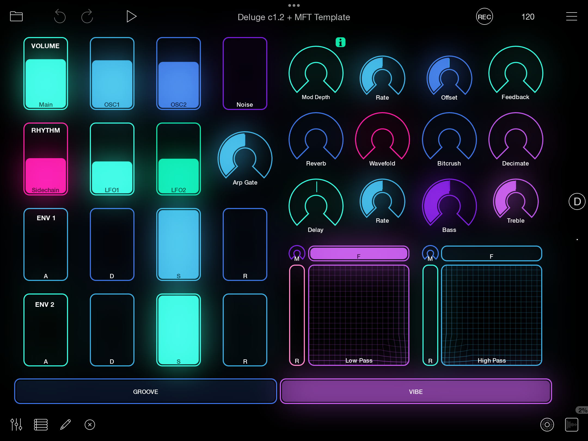

# Loopy Pro Template for Deluge MIDI Follow Mode

You can use [Loopy Pro](https://loopypro.com/) with [MIDI Follow Mode](https://delugecommunity.com/features/midi_follow_mode/) to create an interactive touch surface with for active clip on the Deluge. Parameter changes are bi-directional between Loopy Pro and the Deluge.

## Templates

There are two templates available, the main template and a minimal template.

The templates each include two main pages:

- One page contains the controls that you interact with. You can customize this page by removing, resizing, or reorganizing the elements.
- Another page contains the functional elements. The Stepped Dials on this page are synced with the interactive controls and also contain the Deluge MIDI Follow mappings. The Stepped Dials allow Loopy Pro to restore the state of the controls when you save and load your project. Don't delete this page or any of its elements.

### Main Template
Author: Monitus

The [Main Template](main_template/) includes a comprehensive set of controls for sound design and performance. It includes interactive controls for features up to Deluge community firmware [1.3](https://delugecommunity.com/changelogs/changelog/#c130), such as advanced arpeggiator controls, envelopes 3+4, and LFOs 3+4.

#### Pages
- Page **A** contains generic looping elements, which you can use or remove
- Page **B** contains the interactive Deluge controls
- Page **C** contains the functional Deluge MIDI elements

### Minimal Template + Optional MIDI Fighter Twister Companion Template
Author: Mike (Dream Reactor)

YouTube demo: [Loopy Pro, MIDI Fighter Twister, and Synthstrom Deluge Control Setup](https://www.youtube.com/watch?v=O0l5VL7sZfM) (1 min)

The [Minimal Template](minimal_template/) is a version of the [Main Template](main_template/) with a smaller set of performance-oriented controls. It includes interactive controls for features up to Deluge community firmware [1.2 Chopin](https://delugecommunity.com/changelogs/changelog/#c120-chopin).

#### Pages
- Page **D** contains the interactive Deluge controls
- Page **.** contains the functional Deluge MIDI elements

#### Layout

The interactive controls are arranged in two 4x4 grids:

- The "Groove" (left) side of the layout focuses on volume and time.

- The "Vibe" (right) side of the layout focuses on effects and filters.

#### Companion MIDI Fighter Twister template

This Loopy Pro template includes an optional companion template for the [MIDI Fighter Twister](https://store.djtechtools.com/products/midi-fighter-twister) (MFT). The matching control layout allows Loopy Pro to provide visual feedback while the MFT provides tactile control.

When used together, the MFT template communicates with Loopy Pro, and the Loopy Pro template communicates with the Deluge. Changes are synced in every direction between the MFT, Loopy Pro, and Deluge.

#### Control layout

- Bank 1 is mapped to the "Groove" side of the Loopy Pro template

- Bank 2 is mapped to the "Vibe" side of the Loopy Pro template

You can switch banks by tapping the Groove or Vibe buttons in Loopy Pro or by pressing the upper-right knob on the MFT.

### Creating your own template

You can create your own MIDI Follow Template for Loopy Pro by modifying the [Main Template](main_template/).

1. Customize page **B** by moving, resizing, or removing controls.
1. (Optional) Add new controls to page **B** and map them to the appropriate Stepped Dials on page **C**.

Don't modify the Stepped Dials on page **C**. They contain all of the MIDI mappings for the Deluge, and you can choose which ones to make use of on page **B**.

## Setup

### Requirements

#### Apple device with Loopy Pro

Loopy Pro requires an iOS device, such as an iPhone or iPad, with [Loopy Pro](https://loopypro.com/).

#### Deluge Firmware

The templates require the Deluge to have [MIDI Follow Mode](https://delugecommunity.com/features/midi_follow_mode/), which is available in community firmware [1.1 Beethoven](https://delugecommunity.com/changelogs/changelog/#c110-beethoven) and higher.

The Loopy Pro templates include features from firmware [1.2 Chopin](https://delugecommunity.com/changelogs/changelog/#c120-chopin) and [1.3](https://delugecommunity.com/changelogs/changelog/#c130), but both templates can be used with [1.1 Beethoven](https://delugecommunity.com/changelogs/changelog/#c110-beethoven) or higher.

#### MIDI communication

Loopy Pro requires the Deluge to be connected via USB with the iOS device acting as the USB host.

For iOS devices with a Lightning port, use an [Apple Lightning to USB 3 Adapter](https://www.apple.com/ca/shop/product/MX5J3AM/A/lightning-to-usb-3-camera-adapter) to allow the iOS device to charge via Lightning while providing a USB host connection to the Deluge.

If you want to use multiple devices with Loopy Pro, connect a USB hub to the iOS device and connect the Deluge and your other devices to the USB hub. A powered USB hub is recommended.

### Set up your Deluge

Set your Deluge to use MIDI channel 15 and enable feedback for MIDI Follow Mode.

1. On the Deluge, open the settings by pressing Shift+Select.
1. Go to **MIDI** > **MIDI-Follow** and do the following:
    1. In **Channel** > **Channel A**, set the value to 15.
    1. In **Feedback** > **Channel**, select **Channel A**.
    1. In **Feedback** > **Automation Feedback**, select **High**.
    1. In **Feedback** turn off **Filter Responses**.
1. Hold Back to exit settings.

### Set up Loopy Pro

#### Copy control settings (for non-English iOS devices)
If your iOS device is set to a language other than English, transfer the existing MIDI bindings from **Deluge Port 1** to the equivalent on your device, such as "Deluge Puerto 1".

1. In Loopy Pro, go to **Settings (≡)** > **Control Settings**.
1. In the **Current Project** section, tap **Default**.
1. In the **Deluge Port 1** section, tap **Transfer**.
1. On the **Transfer To** list, with **Copy** selected, tap the entry for your Deluge, such as "Deluge Puerto 1".

#### Check that MIDI feedback is enabled

1. In Loopy Pro, go to **Settings (≡)** > **Control Settings**.
1. In the **MIDI Devices** section, tap **Deluge Port 1**.
1. Check that **Feedback Enabled** is turned on.

### Get the Loopy Pro template

To download the template:

1. On your Apple device, go to the [main_template](main_template/) or [minimal_template](minimal_template/) folder.
1. Tap the `.lpproj` file
1. Tap **Raw** to download the template.

### Use the template in a project

You can use the template to create a new project, or you can add the template contents to an existing project.

> **Note:** If your Apple device shows the error **Couldn't import project: failed to open zip file**, download the `.lpproj` file on a computer and transfer it to your device using iCloud or USB, then try again.

#### Use the template to create a new project

 In the **Files** app, find and tap the template file to open it in Loopy Pro.

#### Copy the template into an existing project
If you have an existing Loopy Pro project, copy the MIDI follow controls from the template to your project.

##### Copy the MIDI bindings
1. In the **Files** app, find and tap the template file to open it in Loopy Pro.
1. Go to **Settings (≡)** > **Control Settings**.
1. In the **Current Project** section, tap the **MIDI Follow** profile.
1. Tap **Transfer**, then tap **Global Profiles**.
1. Open your existing project and go to **Settings (≡)** > **Control Settings**.
1. In the **Global Profiles** section, tap the **MIDI Follow** profile.
Tap **Transfer**, then tap **Current Project**.

##### Copy the widgets
1. Open the Deluge MIDI Follow template again.
1. Turn on the UI editor by tapping Edit (pencil icon).
1. On the page with the coloured interactive controls, drag a rectangle to select the whole page.
1. Press and hold an element, then tap **Copy**.
1. Open your existing project, add an empty page.
1. On the empty page, hold, then tap **Paste**.
1. Repeat these steps 1-6 to copy the page with Stepped Dials from the template to another page in your project.

  

