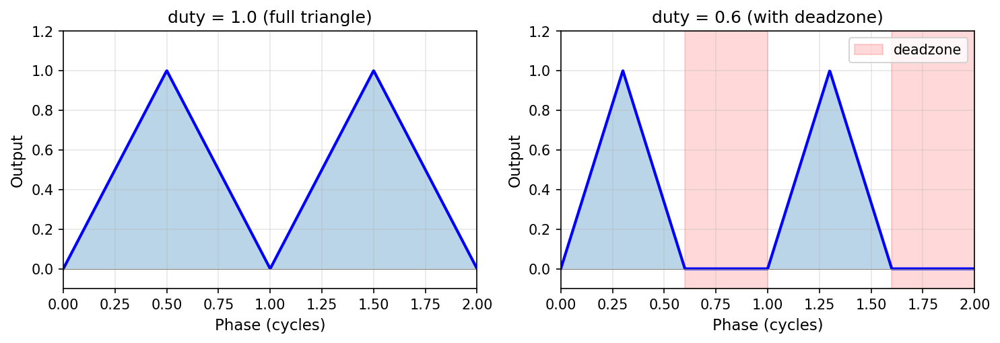
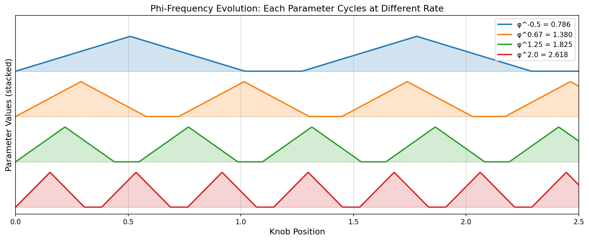
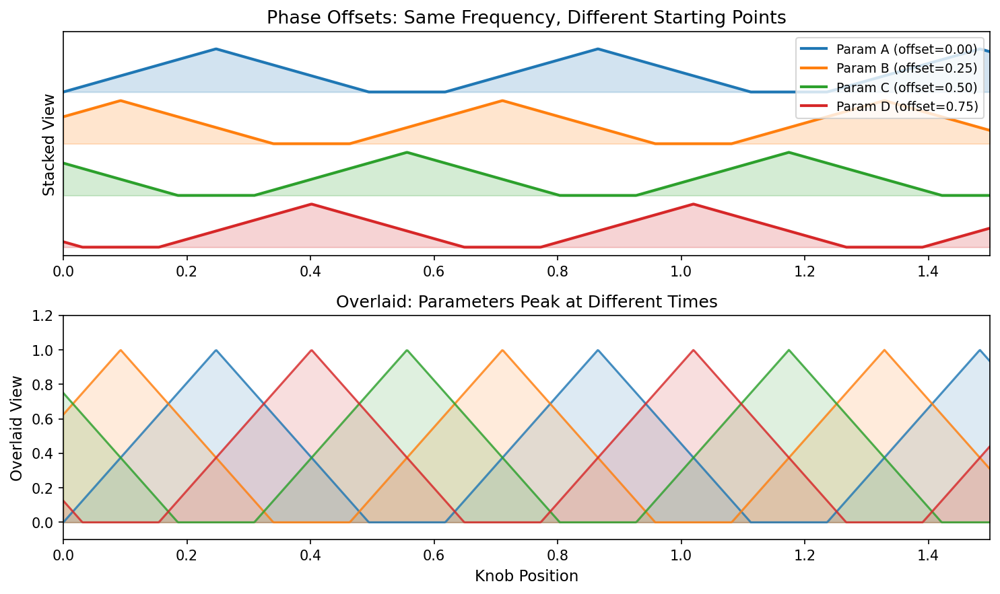
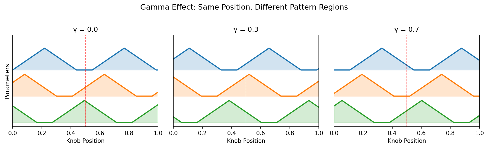
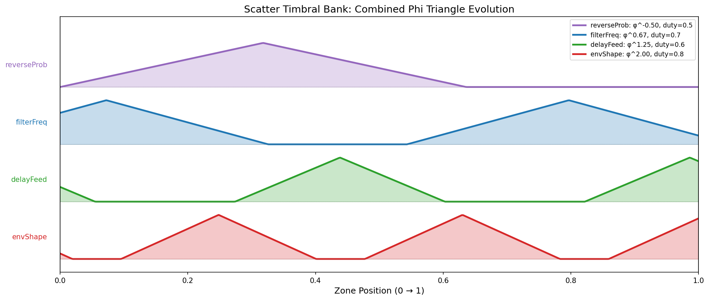
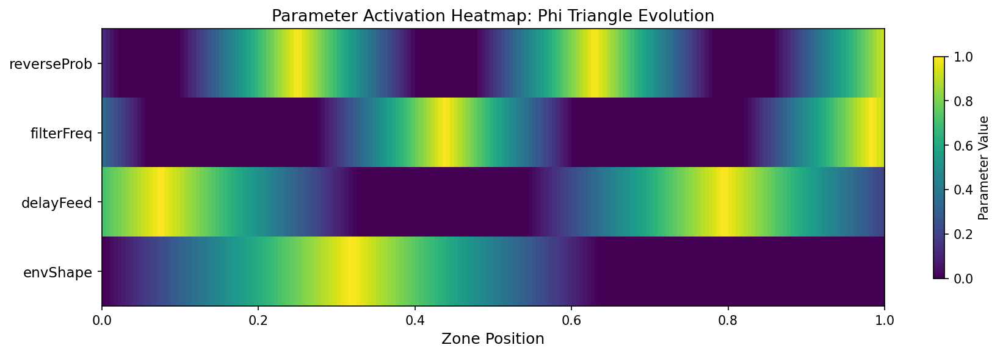

# Phi Triangle Parameter Evolution

The phi triangle system provides a framework for evolving multiple parameters from a single control. Rather than each knob controlling one parameter, a knob position maps to a coherent combination of parameters that evolves in musically interesting ways as the knob moves.

## Design Intent

### The Problem with Multi-Parameter Controls

When mapping a single knob to multiple effect parameters, naive approaches fail:

1. **Linear mapping**: All parameters move together monotonically. Sounds mechanical, predictable.
2. **Random mapping**: Parameters jump unpredictably. No musical coherence.
3. **Fixed ratios**: Creates periodic patterns that repeat and become fatiguing.

### The Phi Triangle Solution

Use the golden ratio (φ ≈ 1.618) to create parameter relationships that:

- **Never exactly repeat**: φ is irrational, so φ-scaled frequencies create quasi-periodic patterns
- **Feel organic**: The same mathematics underlies natural growth patterns (phyllotaxis, shells)
- **Maintain coherence**: Related parameters share the same phase evolution framework
- **Evolve at different rates**: Each parameter uses a different power of φ for its frequency

## Core Concepts

### Triangle Waveform

The base primitive is a unipolar triangle wave with configurable duty cycle:



The duty cycle creates "deadzones" where the parameter outputs zero. Since each parameter has its own duty cycle and phase offset, they drop in and out independently - sometimes all parameters are active, sometimes only a subset, sometimes none. This creates richer combinatorial variety than having all parameters always contributing.

### Phi Frequencies

Each parameter runs its triangle at a different φ-power frequency. As the knob position advances, each parameter completes its triangle cycle at a different rate:



Common frequency choices:
- **φ^-0.5 = 0.786** (slowest) - reverb, ambient parameters
- **φ^0.67 = 1.387** (medium) - filter, texture
- **φ^1.25 = 1.826** (faster) - rhythmic effects
- **φ^2.0 = 2.618** (fastest) - envelope, transient

Because the ratios are irrational, these patterns never align - creating infinite non-repeating combinations.

### Phase Offsets

Parameters are spread by fixed phase offsets (typically 0.25) so they don't all peak simultaneously:



This ensures that as the knob moves:
- Sometimes parameter A is high while B is low
- Sometimes both A and B are medium
- Sometimes B is high while A is low
- The combinations continuously shift

### Gamma (Secret Knob)

The gamma parameter (accessed via push+twist on encoders) globally offsets all phi phases:



Gamma shifts WHERE in the infinite pattern space you're exploring. The same knob position with different gamma values produces completely different parameter combinations. The red dashed line shows how the same position yields different parameter states.

Formula: `phase = position × φ^n × freqMult + phaseOffset + 1024 × gamma`

The 1024× multiplier ensures gamma sweeps through distinct pattern regions quickly.

## Zone-Specific Mode Controls

Some effects use a hybrid approach:

**Lower zones (0-3)**: Discrete control modes
- Each zone activates a specific behavior
- Position within zone controls intensity
- Predictable, learnable

**Upper zones (4-7)**: Meta/evolution modes
- All parameters controlled via phi triangles
- Position controls overall intensity
- Organic, exploratory

Example from Scatter:
```
Zone A (Structural):
  Zone 0-4: Individual slice behaviors
  Zone 5-7: Meta - all structural params via φ evolution

Zone B (Timbral):
  Zone 0-3: Individual effects (reverse, filter, delay, env)
  Zone 4-7: Meta - all timbral params via φ evolution
```

When **phaseOffset ≠ 0** (set via secret menus), the effect ignores discrete zones entirely and applies phi evolution across ALL parameters - the "full evolution" mode.

## Parameter Bank Configuration

Parameters are grouped into banks with coordinated settings:

```cpp
struct PhiTriConfig {
    float phiFreq;     // φ^n frequency (e.g., φ^1.25 = 1.826)
    float duty;        // Active portion [0,1]
    float phaseOffset; // Spread from other params
    bool bipolar;      // Map to [-1,1] instead of [0,1]
};
```

### Example: Scatter Timbral Bank



```cpp
constexpr std::array<PhiTriConfig, 4> kTimbraBank = {{
    {φ^-0.5, 0.50, 0.00, false},  // reverseProb: slowest, sparse
    {φ^0.67, 0.70, 0.25, false},  // filterFreq: medium
    {φ^1.25, 0.60, 0.50, false},  // delayFeed: faster
    {φ^2.0,  0.80, 0.75, false},  // envShape: fastest, dense
}};
```

Design considerations:
- **Slower frequencies** (φ^-0.5 to φ^0.5): Structural, ambient parameters
- **Medium frequencies** (φ^0.67 to φ^1.5): Timbral, textural parameters
- **Faster frequencies** (φ^1.75 to φ^2.5): Rhythmic, transient parameters
- **Phase offsets**: Spread by 0.25 or 0.33 for decorrelation
- **Duty cycles**: Lower duty = more time inactive, allowing other params to solo

## Evolution Heatmap

This visualization shows how parameter values change across the zone position:



Notice how:
- **envShape** (top) cycles rapidly, creating frequent transient variations
- **reverseProb** (bottom) changes slowly, providing structural anchoring
- Bright bands never align vertically - ensuring varied combinations

## Implementation

### Core Evaluation

```cpp
PhiTriContext ctx{yNorm, freqMult, periodScale, gammaPhase};
float value = ctx.eval(phiFreq, duty, phaseOffset, bipolar, enable);
```

### Bank Evaluation

```cpp
auto results = ctx.evalBank(kTimbraBank, enable);
p.reverseProb = results[0];
p.filterFreq  = results[1];
p.delayFeed   = results[2];
p.envShape    = results[3];
```

### Precision Considerations

- **gamma accumulation**: Use `double` for phase computation (gamma can reach 10^15)
- **wrapPhase**: Uses int64_t truncation for ~40 cycle savings over std::floor
- **output**: Float is sufficient after wrapping to [0,1)

## Effects Using Phi Triangles

| Effect | Banks | Notes |
|--------|-------|-------|
| Scatter | kStructuralBank, kTimbraBank | Zone-based + meta modes |
| Sine Shaper | kBlendWeightBank | 4-way harmonic blending |
| Table Shaper | kExtrasBank | Subharmonic/comb effects |

## Files

- [phi_triangle.hpp](../../src/deluge/dsp/phi_triangle.hpp): Core implementation
- [util.hpp](../../src/deluge/dsp/util.hpp): Triangle waveform functions
- [scatter.hpp](../../src/deluge/dsp/scatter.hpp): Largest usage example
- [sine_shaper.hpp](../../src/deluge/dsp/sine_shaper.hpp): Blend weight example
