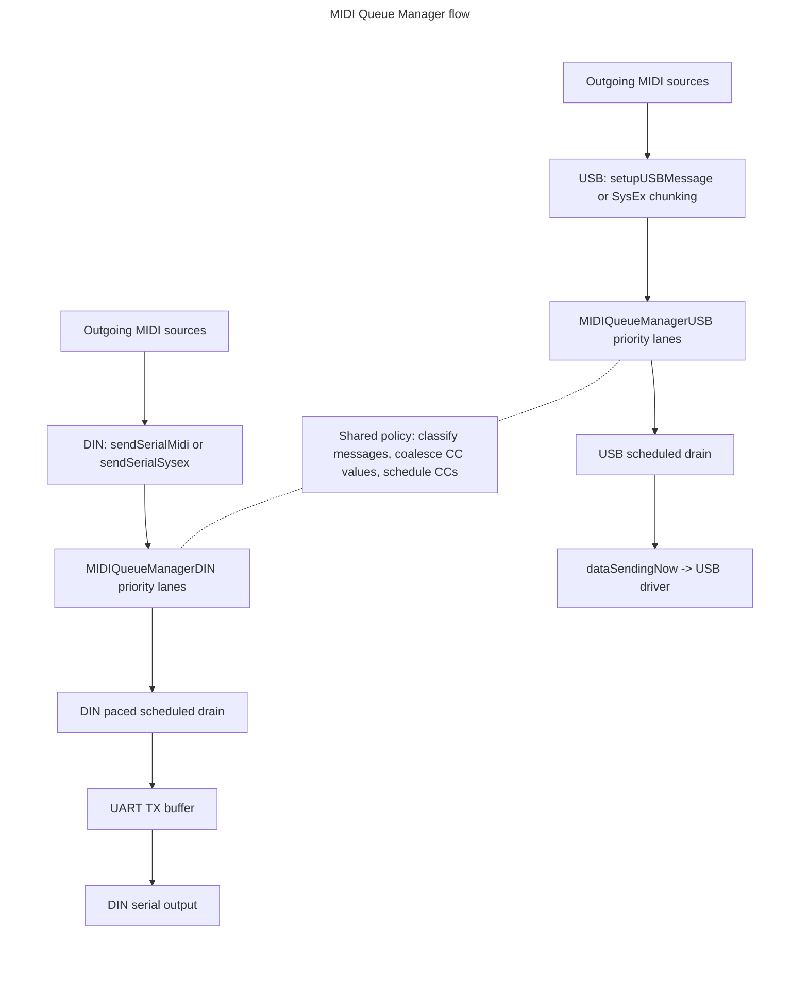

# MIDI Queue Manager

This document explains how the MIDI Queue Manager works: how outgoing MIDI is classified into
priority lanes, how those lanes are drained for each transport, and the special handling that keeps
dense CC traffic from delaying clock and notes.

## Solution description

The MIDI Queue Manager system schedules outgoing MIDI over the USB and DIN
transports based on the type of MIDI data being sent. Timing-sensitive data,
such as clock and notes, gets a higher-priority path, while lower-priority data,
such as ordinary CC's and SysEx, can wait when the transport is busy.
USB and DIN each keep transport-specific queue manager code because they store
and drain data differently: USB queues packed USB-MIDI events, while DIN queues
raw serial MIDI bytes and drains them into the UART using a send allowance. Policy
that is common to both transports, including message classification, CC
coalescing, and scheduled CC selection, is centralized in shared classes.

MIDI Device Manager owns the connected USB and DIN device classes, and those
device classes own their queue manager state. Outgoing MIDI is forwarded through
the appropriate device queue manager so it can be placed into a priority lane and
later drained when the transport can send more data.

USB SysEx is split into USB-MIDI event chunks and queued through the USB queue manager; DIN SysEx is
queued as raw bytes through the DIN queue manager. Once either transport begins
draining a SysEx stream, it stays on the SysEx lane until the terminating
USB-MIDI event or DIN `0xF7` byte has been sent, so other MIDI cannot be
interleaved inside the same SysEx message.

One key principle is that a queued MIDI channel message must be sent as a
complete message. The DIN queue manager does not emit partial note, expression,
or CC messages. USB queue entries are already complete USB-MIDI events, so a USB
dequeue emits one whole event. The queue manager can choose which priority lane
to drain next, but once it chooses a queued message, it sends the complete
transport unit for that message before moving on.

MIDI CCs get special handling because dense automation / midi follow feedback can generate more
low-priority traffic than the MIDI link can drain, especially over DIN where
serial bandwidth is much lower than USB. Without special handling, a burst of
ordinary CCs can sit ahead of later clock or note messages and cause jitter.

For CCs a sender has marked `Continuous`, the queue manager combines two strategies. First, it coalesces
stale queued values: if a new CC arrives for the same status/channel and CC
number as one already waiting in the CC lane, the queued value byte is replaced
with the latest value instead of appending another message. Second, it schedules
CC dequeue with a per-transfer or UART-staging allowance. CC numbers with newly
queued or coalesced values accumulate CC debt, so they are preferred when CC
traffic resumes; when no CC has debt, selection falls back to round-robin order.
This lets the queue catch up to the latest CC values while still leaving room
for higher-priority MIDI.

## What problem this solves

Outgoing MIDI can contain a mix of very time-sensitive messages, such as clock
and notes, and less time-sensitive messages, such as CC's and SysEx. If
all messages are sent strictly in arrival order, a burst of low-priority data can
sit ahead of later clock or note messages and cause timing jitter.

The MIDI Queue Manager adds per-priority queues between "a message was produced"
and "the transport is ready to send bytes". USB and DIN keep their
transport-specific details, but they share the same policy for:

- classifying outgoing messages by priority,
- coalescing stale queued CC values,
- choosing which CC should be scheduled next, and
- avoiding partial channel messages.

## Terms

| Term | Meaning |
| --- | --- |
| `Transport` | USB or DIN protocol for sending MIDI out of the Deluge to another device. |
| `MIDI message` | A logical MIDI event, such as clock, note on, expression, CC, or SysEx. |
| `USB-MIDI event` | The 4-byte USB transport representation of MIDI data. For most channel voice messages, one USB-MIDI event contains one MIDI message. SysEx is the main exception: one logical SysEx message is split across multiple USB-MIDI events. |
| `DIN byte` | One raw serial MIDI byte written to the DIN UART path. DIN channel messages are stored in the queue as 1 to 3 raw bytes. |
| `Priority lane` | One ring buffer for a specific message priority. Higher-priority lanes are checked before lower-priority lanes when data is drained for sending. |
| `Scheduled CC` | A CC selected by the shared CC policy. It may come from the middle of the CC lane instead of the lane head. |
| `CC debt` | A small per-CC-number score that means "this CC has unsent work waiting". The score is increased when a CC is newly queued or coalesced, and cleared after that CC is emitted. |

## Priority lanes

The shared priority order is:

| Lane | Contents | Notes |
| --- | --- | --- |
| `QUEUE_PRIORITY_CLOCK` | System/realtime messages | Highest priority. DIN drains these one byte at a time. |
| `QUEUE_PRIORITY_NOTES` | Note on/off | Timing-sensitive channel voice messages. |
| `QUEUE_PRIORITY_EXPRESSION` | Poly aftertouch, channel aftertouch, pitch bend, mod wheel CC, MPE Y CC, and every discrete `Event` CC or program change | Expressive performance data, plus anything that must keep its order and its duplicate values. Strictly FIFO; never coalesced. |
| `QUEUE_PRIORITY_CC` | `Continuous` CC messages only | Lowest-priority channel voice lane, and the only lane that coalesces and reorders. See [Message intent](#message-intent). |
| `QUEUE_PRIORITY_SYSEX` | USB SysEx event chunks and DIN SysEx bytes | Lowest priority until a SysEx stream starts draining. Once started, transport units are sent contiguously until the ending USB event or DIN `0xF7` byte. |

## Architecture

Each row flows left to right from message source to transport output. Solid arrows show message flow;
dotted lines show the shared policy both queue managers use.



## Example flow scenarios

These examples show how messages enter the queue manager and how they later
leave the queue for the transport.

### USB note message

Queueing path:

```text
Source creates MIDIMessage::noteOn / noteOff
  -> MidiEngine::sendMidi
  -> MidiEngine::sendUsbMidi
  -> setupUSBMessage
  -> add USB virtual cable number
  -> ConnectedUSBMIDIDevice::enqueue_message
  -> MIDIQueueManagerUSB::enqueue_message
  -> classify_packed_usb_priority
  -> QUEUE_PRIORITY_NOTES
  -> enqueue_priority_message
  -> USB notes lane
```

`setupUSBMessage()` packs the channel message into one 32-bit USB-MIDI event:
byte 0 is CIN/cable, byte 1 is MIDI status, byte 2 is data1, and byte 3 is
data2. `MidiEngine::sendUsbMidi()` or `MIDICableUSB::sendMessage()` then adds
the selected USB virtual cable number before passing the packed event to the
connected device.

Send-out path:

```text
MidiEngine::flushMIDI
  -> MidiEngine::flushUSBMIDIOutput
  -> ConnectedUSBMIDIDevice::consume_queued_messages
  -> MIDIQueueManagerUSB::consume_queued_messages
  -> scan priority lanes from clock to SysEx
  -> pop the notes-lane USB-MIDI event
  -> copy the 4-byte event into dataSendingNow
  -> usb_send_start_rohan
```

If more USB data remains after a transfer completes,
`usbSendCompleteAsHost()` or `usbSendCompleteAsPeripheral()` calls back into
`ConnectedUSBMIDIDevice::consume_queued_messages()` to prepare the next USB
transfer.

### DIN ordinary CC message

Queueing path:

```text
Source creates MIDIMessage::cc
  -> MidiEngine::sendMidi
  -> MidiEngine::sendSerialMidi
  -> ConnectedDINMIDIDevice::enqueue_message
  -> MIDIQueueManagerDIN::enqueue_message
  -> MIDIQueueManager::classify_message
  -> QUEUE_PRIORITY_CC
  -> enqueue_message_with_cc_policy
  -> coalesce_cc_message or enqueue_priority_message
  -> DIN CC lane
```

Ordinary CCs enter the lowest-priority channel lane. If the same status/channel
and CC number is already queued, `coalesce_cc_message()` overwrites the queued
value byte with the newer value instead of appending another stale CC. The CC
number's debt is bumped so the scheduler can prefer that refreshed CC the next
time CC traffic is allowed to send. If there is no matching queued CC, the
message is encoded into three serial bytes and appended to the DIN CC lane.

Send-out path:

```text
MidiEngine::flushMIDI
  -> ConnectedDINMIDIDevice::consume_queued_messages
  -> MIDIQueueManagerDIN::consume_queued_messages
  -> accrue DIN send allowance
  -> check UART space and reserve headroom
  -> scan priority lanes from clock to SysEx
  -> handle_cc_lane
  -> pop_next_scheduled_cc_message
  -> bufferMIDIUart for each byte in the selected CC
  -> uartFlushIfNotSending
```

The DIN drain only considers the CC lane after higher-priority lanes are empty or
blocked. Before sending a CC, it verifies that the complete three-byte message
fits the current send allowance, UART space, and CC staging allowance. The CC
scheduler then scans the CC lane, prefers CC numbers with debt, and falls back
to round-robin order when no candidate has debt. The selected three-byte CC is
removed as one complete message, the lane is rebuilt around it, and the emitted
CC number's debt is cleared.

### SysEx message

USB queueing path:

```text
Source provides SysEx bytes
  -> MIDICableUSB::sendSysex
  -> validate F0 ... F7 message
  -> split into USB-MIDI SysEx event chunks
  -> ConnectedUSBMIDIDevice::enqueue_message for each chunk
  -> MIDIQueueManagerUSB::enqueue_message
  -> classify_packed_usb_priority
  -> QUEUE_PRIORITY_SYSEX
```

DIN queueing path:

```text
Source provides SysEx bytes
  -> MIDICableDINPorts::sendSysex
  -> MidiEngine::sendSerialSysex
  -> ConnectedDINMIDIDevice::enqueue_sysex
  -> MIDIQueueManagerDIN::enqueue_sysex
  -> validate F0 ... F7 message
  -> check the whole stream fits
  -> push raw bytes into QUEUE_PRIORITY_SYSEX
```

Send-out behavior:

```text
Priority scan reaches QUEUE_PRIORITY_SYSEX
  -> pop first SysEx transport unit
  -> mark SysEx drain active
  -> keep draining only SysEx
  -> stop the lock after the ending USB-MIDI event or DIN 0xF7 byte is sent
```

SysEx remains the lowest-priority lane until it starts draining. Once USB pops a
SysEx USB-MIDI event or DIN pops a SysEx byte, the transport stays locked to the
SysEx lane until that logical SysEx message is complete. USB may still split the
stream across multiple USB transfers, and DIN may still split it across multiple
`flushMIDI()` calls because of serial pacing, but neither transport interleaves
other MIDI inside the active SysEx stream.

## Message intent

Coalescing and reordering are opt-in. A sender declares what a message is via `MIDIIntent` on
`MIDIMessage`, and `classify_message()` routes on it:

- `Event` (the default) - a discrete event. Routed to the expression lane, which is strictly FIFO and
  never coalesced, so its order and its duplicate values survive. RPN sequences, bank selects, program
  changes and momentary CCs rely on this.
- `Continuous` - the current value of a parameter, where a later value supersedes an earlier one. Routed
  to the CC lane, where it may be coalesced and reordered by CC debt.
- `NoteBound` - must stay ordered with the note stream. Routed to the notes lane. Used by the MPE
  expression that initialises a note, and by All Notes Off.

Intent is consumed only by classification. It is not stored per queue entry and cannot be - a USB entry
is a fully packed `uint32_t` and a DIN entry is a raw byte - so the dequeue path never sees it. Keeping
`Event` traffic out of the CC lane is what makes the coalescing and debt reordering there
unconditionally correct.

Because lanes are FIFO, the rule for any ordered sequence is: **messages that must stay ordered relative
to each other must share a lane.** That is why `NoteBound` exists rather than a separate grouping
mechanism.

The default is deliberately the conservative one, so that a sender which is never annotated loses
coalescing (a latency cost) rather than ordering (a correctness cost).

## CC coalescing and scheduling

The CC lane has extra logic because ordinary CC automation can generate many
messages faster than MIDI can send them, especially over DIN.

### Enqueue-time coalescing

Only `Continuous` CCs reach the CC lane, so only they are eligible. When one is queued, the queue
manager first scans the lane for the latest queued message with the same status byte and CC number.

- Same status byte means the same MIDI status type and channel.
- Same CC number means the same value in `data1`.
- The value byte, `data2`, is the only byte replaced.

If a match exists, the queued value is overwritten and no new queue entry is
added. This preserves the queued position while ensuring the eventually sent CC
uses the newest value.

USB and DIN perform the overwrite differently because they store different queue
units:

- USB replaces byte 3 inside one packed 32-bit USB-MIDI event.
- DIN replaces the third serial byte of the queued 3-byte CC message.

After a CC is newly queued or coalesced, its CC debt is bumped so the scheduler
knows that CC has unsent work.

### Scheduled CC dequeue

When the CC lane is eligible to send, the scheduler does not blindly pop the lane head. A single pass
over the lane both scans and selects:

1. Walk the lane once. For each CC number, only its first entry is a candidate; a four-word bitmask
   tracks which numbers have already been seen, so clearing per pass costs four stores rather than 128.
2. Track the highest-debt candidate and, separately, the first candidate in round-robin order from
   `next_cc_number`.
3. Prefer the highest-debt candidate; fall back to round-robin when nothing has debt.
4. Remove the selected message by exchanging it with the lane head and dropping the head.

This lets hot CCs catch up to their latest value without allowing one CC number to dominate the lane
indefinitely.

Step 4 matters more than it looks. A scheduled CC can be pulled from the middle of the lane, so the ring
cannot simply advance its read position. Swapping the selected span with the head and then dropping the
head is O(1), frees the slot immediately, and — critically — never writes `write_pos`, which the producer
owns. Scheduled removal only runs when the head is itself a three-byte channel CC, so the two spans are
always the same width. The entry displaced from the head takes the selected entry's position; CC entries
are independent of one another and this lane reorders them by design, so that is within the ordering the
scheduler is allowed to produce.

Marking the removed span dead in place would be simpler, but it leaks a slot per out-of-order removal
until that slot reaches the head. With a cold CC parked at the head and a hot one repeatedly sent and
re-queued, the lane grows until it fills and starts dropping MIDI.

## Transport-specific scheduling

### USB scheduling

USB queues one packed USB-MIDI event per lane entry. During
`MIDIQueueManagerUSB::consume_queued_messages`, the manager builds one USB
transfer by scanning priority lanes from highest to lowest and copying selected
4-byte USB-MIDI events into `dataSendingNow`.

USB SysEx is the exception to normal lane traversal. A logical SysEx message may
span multiple USB-MIDI events: CIN `0x4` starts or continues the SysEx, and CIN
`0x5`..`0x7` ends it. Once a SysEx event with CIN `0x4` has been popped, USB
drain stays locked to the SysEx lane across transfer boundaries until an ending
CIN is sent, which is what keeps one logical SysEx message contiguous.

Important USB limits:

- Peripheral mode can stage up to `MIDI_SEND_BUFFER_LEN_INNER` USB-MIDI events
  per transfer.
- Host mode uses `MIDI_SEND_BUFFER_LEN_INNER_HOST`, which is smaller because
  some hosted devices fail with larger transfers.
- `k_usb_cc_message_allowance_per_transfer` caps how many scheduled CC messages can
  be included in one transfer.
- `k_usb_flush_backlog_message_threshold` opportunistically triggers a flush
  when the queued backlog grows and no USB send is active.

`send_buffer_space()` reports remaining USB queue capacity as MIDI payload bytes,
not as 4-byte USB-MIDI event slots. This keeps the return value comparable with
callers that think in MIDI bytes.

### DIN scheduling

DIN queues raw serial bytes, not packed events. For non-clock lanes, the manager
validates that a full MIDI message is available and that the whole message fits
the current send allowance before popping any bytes.

DIN SysEx is queued as raw bytes in `QUEUE_PRIORITY_SYSEX`. Enqueueing is
all-or-nothing so the queue cannot contain a partial SysEx stream. During drain,
SysEx normally waits behind higher-priority lanes, but once the first SysEx byte
is popped, the drain stays locked to the SysEx lane until the terminating `0xF7`
byte is sent. This keeps one logical SysEx message contiguous even when pacing
splits it across multiple `flushMIDI()` calls.

DIN calculates a Q8 fixed-point send allowance to pace queue draining at the
serial MIDI link rate:

- The DIN link is treated as 3125 bytes per second.
- Partial-byte allowance accrues between audio callbacks.
- The allowance is capped so a long idle period cannot create an unlimited burst.
- If the allowance is temporarily zero, no SysEx stream is active, and the
  highest-priority system lane has data waiting, one realtime/system byte can
  still be written to the UART.

DIN also keeps UART headroom and applies a separate cap to how much queued CC
traffic may be staged into the UART buffer. That cap prevents dense CC bursts
from filling the UART ahead of later higher-priority messages.

## Important invariants

- A queued channel message must be emitted as a complete message. DIN does not
  pop partial note, expression, or CC messages.
- USB queue entries are already complete 4-byte USB-MIDI events, so one pop is
  one USB-MIDI event.
- A logical USB SysEx message can span multiple USB-MIDI events. Once USB starts
  draining that stream, no other MIDI is interleaved until the terminating SysEx
  event has been sent.
- A logical DIN SysEx message can span many raw bytes. Once DIN starts draining
  that stream, no other MIDI is interleaved until the terminating `0xF7` byte
  has been sent.
- DIN's highest-priority system lane is drained one byte at a time. Realtime
  messages are naturally complete in one byte.
- Priority ordering applies when draining queues, not when enqueueing.
- CC coalescing only updates a queued value; it does not move the queued message.
- Scheduled CC dequeue is the only path that intentionally removes a message
  from the middle of a lane.
- Each ring buffer keeps one slot unused so empty and full states are
  distinguishable.
- Logical offsets used while scanning are relative to the lane read position, not
  physical array indices.
- `write_pos` belongs to the producer and `read_pos` to the consumer. `consume_queued_messages()` runs
  in an ISR while senders enqueue from mainline code, so the consumer must never write `write_pos`.
  This is why out-of-order removal swaps with the head instead of rebuilding the ring.
- Out-of-order removal frees its slot immediately. A lane must not accumulate dead entries.
- Critical sections cover only the O(1) slot writes that producer and consumer share, never the
  surrounding scan.
- Because the scan runs unguarded, a coalescing write re-validates the entry's identity under the guard
  before overwriting it; a concurrent removal can shift logical offsets, so a captured offset may name a
  different message by the time it is used. On a mismatch the caller appends instead.
- Messages that must stay ordered relative to each other must share a lane, because lanes are FIFO and
  the drain reorders freely across them.

## Main classes

| Class | Role |
| --- | --- |
| `MIDIQueueManager` | Shared policy helpers for message classification, CC detection, scan result adaptation, and complete-message validation. |
| `MIDICCQueuePolicy` | Per-device CC policy state: CC debt, the round-robin selection point, and the seen-bitmask used by one selection pass. |
| `MIDIQueueLane` | Power-of-two ring buffer for one priority lane. |
| `MIDIQueueStorage` | Fixed set of priority lanes. |
| `MIDIQueueManagerDeviceState` | Combines queue storage with the per-device CC policy. |
| `MIDIQueueManagerUSB` | USB-specific queue manager. Stores packed 32-bit USB-MIDI events and drains them into `dataSendingNow`. |
| `MIDIQueueManagerDIN` | DIN-specific queue manager. Stores raw serial bytes, enforces serial pacing, keeps SysEx streams contiguous, and drains selected bytes into the MIDI UART buffer. |

## Testing

`tests/unit/midi_queue_manager_tests.cpp` covers the transport-neutral pieces on the host: ring-lane
mechanics, out-of-order removal, CC selection and coalescing, and one regression test per ordering
defect (RPN sequences, MPE note initialisation, bank select before program change, All Notes Off, and
momentary CCs). Build and run with:

```bash
cmake -S tests -B tests/build && ninja -C tests/build UnitTests && ./tests/build/unit/UnitTests
```

The transport wiring itself is not unit tested — it needs the USB and UART layers — so the following
still want checking on hardware:

- MIDI expression output, particularly that an MPE note-on no longer overtakes the expression that
  initialises it.
- MPE zone configuration actually applying (the RPN path).
- DIN behaviour under dense CC automation. At 31250 baud, congestion is far likelier there than on USB.
- Throughput after a change to which senders are marked `Continuous`. A sender that should be
  `Continuous` but isn't will simply stop coalescing, which shows up as CC backlog rather than an error.
