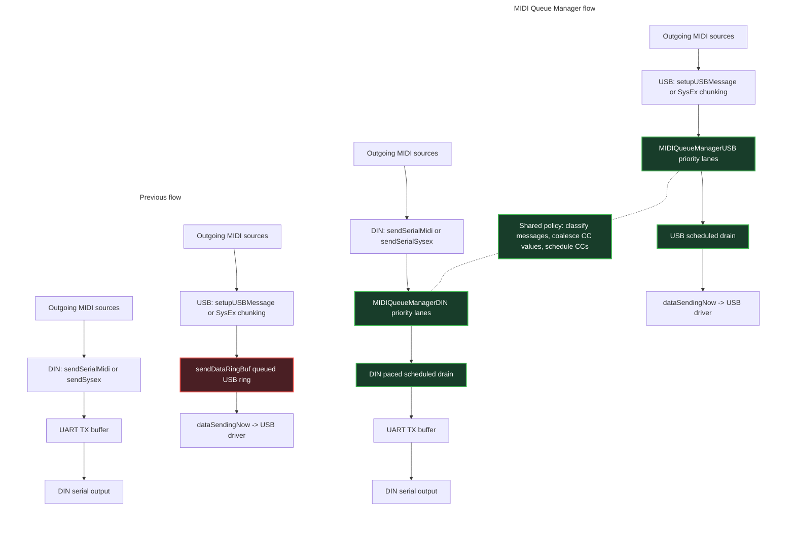

# MIDI Queue Manager

This document explains how the MIDI Queue Manager works. It describes the
outgoing MIDI flow before and after the queue manager changes, the priority
lanes used for scheduling, and the special handling used for dense MIDI CC
traffic.

## Solution description

The MIDI Queue Manager system schedules outgoing MIDI over the USB and DIN
transports based on the type of MIDI data being sent. Timing-sensitive data,
such as clock and notes, gets a higher-priority path, while lower-priority data,
such as ordinary CC's and SysEx, can wait when the transport is busy.
USB and DIN each keep transport-specific queue manager code because they store
and drain data differently: USB queues packed USB-MIDI events, while DIN queues
raw serial MIDI bytes and drains them into the UART using a send allowance. Policy
that is common to both transports, including message classification, CC
coalescing, and scheduled CC selection, is centralized in shared classes.

MIDI Device Manager owns the connected USB and DIN device classes, and those
device classes own their queue manager state. Outgoing MIDI is forwarded through
the appropriate device queue manager so it can be placed into a priority lane and
later drained when the transport can send more data.

USB SysEx is split into USB-MIDI event chunks and queued through the USB queue manager; DIN SysEx is
queued as raw bytes through the DIN queue manager. Once either transport begins
draining a SysEx stream, it stays on the SysEx lane until the terminating
USB-MIDI event or DIN `0xF7` byte has been sent, so other MIDI cannot be
interleaved inside the same SysEx message.

One key principle is that a queued MIDI channel message must be sent as a
complete message. The DIN queue manager does not emit partial note, expression,
or CC messages. USB queue entries are already complete USB-MIDI events, so a USB
dequeue emits one whole event. The queue manager can choose which priority lane
to drain next, but once it chooses a queued message, it sends the complete
transport unit for that message before moving on.

MIDI CCs get special handling because dense automation / midi follow feedback can generate more
low-priority traffic than the MIDI link can drain, especially over DIN where
serial bandwidth is much lower than USB. Without special handling, a burst of
ordinary CCs can sit ahead of later clock or note messages and cause jitter.

For ordinary CCs, the queue manager combines two strategies. First, it coalesces
stale queued values: if a new CC arrives for the same status/channel and CC
number as one already waiting in the CC lane, the queued value byte is replaced
with the latest value instead of appending another message. Second, it schedules
CC dequeue with a per-transfer or UART-staging allowance. CC numbers with newly
queued or coalesced values accumulate CC debt, so they are preferred when CC
traffic resumes; when no CC has debt, selection falls back to round-robin order.
This lets the queue catch up to the latest CC values while still leaving room
for higher-priority MIDI.

## What problem this solves

Outgoing MIDI can contain a mix of very time-sensitive messages, such as clock
and notes, and less time-sensitive messages, such as CC's and SysEx. If
all messages are sent strictly in arrival order, as was done previously, a burst
of low-priority data can sit ahead of later clock or note messages and cause
timing jitter.

The MIDI Queue Manager adds per-priority queues between "a message was produced"
and "the transport is ready to send bytes". USB and DIN keep their
transport-specific details, but they share the same policy for:

- classifying outgoing messages by priority,
- coalescing stale queued CC values,
- choosing which CC should be scheduled next, and
- avoiding partial channel messages.

### Previous First-in, First-out (FIFO) behavior

The previous implementation did not classify outgoing MIDI by priority. Once a
message reached the transport, ordering was effectively FIFO within that
transport path.

For USB, messages were appended to the per-device `sendDataRingBuf` by
`ConnectedUSBMIDIDevice::bufferMessage()`. `consumeSendData()` later copied
entries out of that ring in the same order into `dataSendingNow` for the USB
driver. For DIN, messages and SysEx bytes were written into the UART TX buffer
with `bufferMIDIUart()`, and the UART drained accepted bytes in FIFO order.

That FIFO behavior preserved arrival order, but it also meant ordinary CC or
SysEx traffic already in the buffer could sit ahead of later clock, note, or
expression messages. The queue manager changes that by inserting priority lanes
before the transport drain.

## Terms

| Term | Meaning |
| --- | --- |
| `Transport` | USB or DIN protocol for sending MIDI out of the Deluge to another device. |
| `MIDI message` | A logical MIDI event, such as clock, note on, expression, CC, or SysEx. |
| `USB-MIDI event` | The 4-byte USB transport representation of MIDI data. For most channel voice messages, one USB-MIDI event contains one MIDI message. SysEx is the main exception: one logical SysEx message is split across multiple USB-MIDI events. |
| `DIN byte` | One raw serial MIDI byte written to the DIN UART path. DIN channel messages are stored in the queue as 1 to 3 raw bytes. |
| `Priority lane` | One ring buffer for a specific message priority. Higher-priority lanes are checked before lower-priority lanes when data is drained for sending. |
| `Scheduled CC` | A CC selected by the shared CC policy. It may come from the middle of the CC lane instead of the lane head. |
| `CC debt` | A small per-CC-number score that means "this CC has unsent work waiting". The score is increased when a CC is newly queued or coalesced, and cleared after that CC is emitted. |

## Priority lanes

The shared priority order is:

| Lane | Contents | Notes |
| --- | --- | --- |
| `QUEUE_PRIORITY_CLOCK` | System/realtime messages | Highest priority. DIN drains these one byte at a time. |
| `QUEUE_PRIORITY_NOTES` | Note on/off | Timing-sensitive channel voice messages. |
| `QUEUE_PRIORITY_EXPRESSION` | Poly aftertouch, channel aftertouch, pitch bend, mod wheel CC, MPE Y CC | Expressive performance data that should sit ahead of ordinary CC's |
| `QUEUE_PRIORITY_CC` | Other CC messages and fallback channel messages | Lowest-priority channel voice lane. Uses CC coalescing and scheduled dequeue. |
| `QUEUE_PRIORITY_SYSEX` | USB SysEx event chunks and DIN SysEx bytes | Lowest priority until a SysEx stream starts draining. Once started, transport units are sent contiguously until the ending USB event or DIN `0xF7` byte. |

## Before / after flow diagram

This diagram shows the main architectural change. The MIDI Queue Manager flow is
shown first, and the previous flow is shown below it. Each row flows left to
right from message source to transport output. Solid arrows show message flow;
dotted lines show shared policy used by both queue managers. The source box is
repeated per transport row for readability; it represents the same outgoing MIDI
sources. Green boxes are new queue-manager components; the red box is the
previous queued-send buffer that was removed.



## High-level data flow comparison

These tables compare the previous path with the queue-manager path. Function
names in the "Before" columns refer to the previous implementation.
<mark>Highlighted</mark> steps are the parts that changed.

### USB before / after

<table>
<thead>
<tr>
<th>Flow</th>
<th>Before MIDI Queue Manager</th>
<th>After MIDI Queue Manager</th>
</tr>
</thead>
<tbody>
<tr>
<td>Normal MIDI messages</td>
<td><pre><code>Source
  -> MIDIMessage
  -> MIDICableUSB::sendMessage or MidiEngine::sendUsbMidi
  -> setupUSBMessage
  -> <mark>ConnectedUSBMIDIDevice::bufferMessage</mark>
  -> <mark>sendDataRingBuf queued USB ring</mark></code></pre></td>
<td><pre><code>Source
  -> MIDIMessage
  -> MIDICableUSB::sendMessage or MidiEngine::sendUsbMidi
  -> setupUSBMessage
  -> <mark>add virtual cable number</mark>
  -> <mark>ConnectedUSBMIDIDevice::enqueue_message</mark>
  -> <mark>MIDIQueueManagerUSB::enqueue_message</mark>
  -> <mark>classify_packed_usb_priority</mark>
  -> <mark>message is queued into correct priority lane</mark></code></pre></td>
</tr>
<tr>
<td>SysEx</td>
<td><pre><code>Source
  -> SysEx bytes
  -> MIDICableUSB::sendSysex
  -> USB-MIDI event chunks
  -> <mark>ConnectedUSBMIDIDevice::bufferMessage</mark>
  -> <mark>sendDataRingBuf queued USB ring</mark></code></pre></td>
<td><pre><code>Source
  -> SysEx bytes
  -> MIDICableUSB::sendSysex
  -> USB-MIDI event chunks
  -> <mark>ConnectedUSBMIDIDevice::enqueue_message</mark>
  -> <mark>MIDIQueueManagerUSB::enqueue_message</mark>
  -> <mark>message is queued into QUEUE_PRIORITY_SYSEX priority lane</mark></code></pre></td>
</tr>
<tr>
<td>Flush / transfer start</td>
<td><pre><code>MidiEngine::flushMIDI
  -> MidiEngine::flushUSBMIDIOutput
  -> <mark>ConnectedUSBMIDIDevice::consumeSendData</mark>
  -> dataSendingNow
  -> usb_send_start_rohan</code></pre></td>
<td><pre><code>MidiEngine::flushMIDI
  -> MidiEngine::flushUSBMIDIOutput
  -> <mark>ConnectedUSBMIDIDevice::consume_queued_messages</mark>
  -> <mark>MIDIQueueManagerUSB::consume_queued_messages</mark>
  -> dataSendingNow
  -> usb_send_start_rohan sends the dataSendingNow buffer to the connected USB device</code></pre></td>
</tr>
<tr>
<td>Transfer completion</td>
<td><pre><code>usbSendCompleteAsHost / usbSendCompleteAsPeripheral
  -> <mark>consume more buffered data for the same device</mark>
  -> start the next USB transfer</code></pre></td>
<td><pre><code>usbSendCompleteAsHost / usbSendCompleteAsPeripheral
  -> <mark>ConnectedUSBMIDIDevice::consume_queued_messages</mark>
  -> <mark>MIDIQueueManagerUSB::consume_queued_messages</mark>
  -> <mark>any remaining queued messages are drained into dataSendingNow buffer in priority order</mark>
  -> <mark>usb_send_start_rohan sends the dataSendingNow buffer to the connected USB device</mark></code></pre></td>
</tr>
</tbody>
</table>

### DIN before / after

<table>
<thead>
<tr>
<th>Flow</th>
<th>Before MIDI Queue Manager</th>
<th>After MIDI Queue Manager</th>
</tr>
</thead>
<tbody>
<tr>
<td>Channel/system messages</td>
<td><pre><code>Source
  -> MIDIMessage
  -> MIDICableDINPorts::sendMessage or MidiEngine::sendMidi
  -> MidiEngine::sendSerialMidi
  -> <mark>bufferMIDIUart</mark>
  -> <mark>UART TX buffer</mark></code></pre></td>
<td><pre><code>Source
  -> MIDIMessage
  -> MIDICableDINPorts::sendMessage or MidiEngine::sendMidi
  -> MidiEngine::sendSerialMidi
  -> <mark>ConnectedDINMIDIDevice::enqueue_message</mark>
  -> <mark>MIDIQueueManagerDIN::enqueue_message</mark>
  -> <mark>classify_message</mark>
  -> <mark>priority lane</mark></code></pre></td>
</tr>
<tr>
<td>Flush / UART staging</td>
<td><pre><code>MidiEngine::flushMIDI
  -> uartFlushIfNotSending
  -> UART TX buffer
  -> UART driver
  -> DIN serial output</code></pre></td>
<td><pre><code>MidiEngine::flushMIDI
  -> <mark>ConnectedDINMIDIDevice::consume_queued_messages</mark>
  -> <mark>MIDIQueueManagerDIN::consume_queued_messages</mark>
  -> bufferMIDIUart
  -> uartFlushIfNotSending
  -> UART TX buffer
  -> UART driver
  -> DIN serial output</code></pre></td>
</tr>
<tr>
<td>SysEx</td>
<td><pre><code>Source
  -> SysEx bytes
  -> MIDICableDINPorts::sendSysex
  -> bufferMIDIUart
  -> UART TX buffer</code></pre></td>
<td><pre><code>Source
  -> SysEx bytes
  -> MIDICableDINPorts::sendSysex
  -> <mark>MidiEngine::sendSerialSysex</mark>
  -> <mark>ConnectedDINMIDIDevice::enqueue_sysex</mark>
  -> <mark>MIDIQueueManagerDIN::enqueue_sysex</mark>
  -> <mark>QUEUE_PRIORITY_SYSEX</mark></code></pre></td>
</tr>
</tbody>
</table>

DIN SysEx now enters `MIDIQueueManagerDIN` instead of writing directly to
`bufferMIDIUart`. It is queued all-or-nothing in the SysEx lane; once the DIN
drain starts sending it, the drain stays locked to SysEx until the terminating
`0xF7` byte has been accepted by the UART buffer.

### Previous SysEx continuity

The previous implementation kept SysEx streams continuous through FIFO ordering
rather than through an explicit SysEx drain lock.

For USB, `MIDICableUSB::sendSysex()` split one logical SysEx message into
USB-MIDI event chunks and appended each chunk to `sendDataRingBuf` with
`ConnectedUSBMIDIDevice::bufferMessage()`. `consumeSendData()` then copied those
queued USB-MIDI events into `dataSendingNow` in the same FIFO order. Because one
`sendSysex()` call appended all of its chunks consecutively, the USB drain sent
those chunks consecutively too, even when the USB transfer size split the stream
across multiple transfers.

For DIN, `MIDICableDINPorts::sendSysex()` wrote the validated SysEx byte stream
directly to the UART TX buffer by calling `bufferMIDIUart()` once per byte in a
tight loop. The UART buffer then drained those accepted bytes in FIFO order, so
the DIN SysEx bytes stayed contiguous on the serial output. The previous DIN
path did not reserve space for the whole SysEx; it relied on this direct write
loop and the existing `MIDI_TX_BUFFER_SIZE` limit.

The queue manager keeps that intended behavior, but makes it explicit: SysEx is
queued in the SysEx lane, and once a transport starts draining a SysEx stream it
stays on that lane until the terminating USB-MIDI event or DIN `0xF7` byte has
been sent.

## Example flow scenarios

These examples show how messages enter the queue manager and how they later
leave the queue for the transport.

### USB note message

Queueing path:

```text
Source creates MIDIMessage::noteOn / noteOff
  -> MidiEngine::sendMidi
  -> MidiEngine::sendUsbMidi
  -> setupUSBMessage
  -> add USB virtual cable number
  -> ConnectedUSBMIDIDevice::enqueue_message
  -> MIDIQueueManagerUSB::enqueue_message
  -> classify_packed_usb_priority
  -> QUEUE_PRIORITY_NOTES
  -> enqueue_priority_message
  -> USB notes lane
```

`setupUSBMessage()` packs the channel message into one 32-bit USB-MIDI event:
byte 0 is CIN/cable, byte 1 is MIDI status, byte 2 is data1, and byte 3 is
data2. `MidiEngine::sendUsbMidi()` or `MIDICableUSB::sendMessage()` then adds
the selected USB virtual cable number before passing the packed event to the
connected device.

Send-out path:

```text
MidiEngine::flushMIDI
  -> MidiEngine::flushUSBMIDIOutput
  -> ConnectedUSBMIDIDevice::consume_queued_messages
  -> MIDIQueueManagerUSB::consume_queued_messages
  -> scan priority lanes from clock to SysEx
  -> pop the notes-lane USB-MIDI event
  -> copy the 4-byte event into dataSendingNow
  -> usb_send_start_rohan
```

If more USB data remains after a transfer completes,
`usbSendCompleteAsHost()` or `usbSendCompleteAsPeripheral()` calls back into
`ConnectedUSBMIDIDevice::consume_queued_messages()` to prepare the next USB
transfer.

### DIN ordinary CC message

Queueing path:

```text
Source creates MIDIMessage::cc
  -> MidiEngine::sendMidi
  -> MidiEngine::sendSerialMidi
  -> ConnectedDINMIDIDevice::enqueue_message
  -> MIDIQueueManagerDIN::enqueue_message
  -> MIDIQueueManager::classify_message
  -> QUEUE_PRIORITY_CC
  -> enqueue_message_with_cc_policy
  -> coalesce_cc_message or enqueue_priority_message
  -> DIN CC lane
```

Ordinary CCs enter the lowest-priority channel lane. If the same status/channel
and CC number is already queued, `coalesce_cc_message()` overwrites the queued
value byte with the newer value instead of appending another stale CC. The CC
number's debt is bumped so the scheduler can prefer that refreshed CC the next
time CC traffic is allowed to send. If there is no matching queued CC, the
message is encoded into three serial bytes and appended to the DIN CC lane.

Send-out path:

```text
MidiEngine::flushMIDI
  -> ConnectedDINMIDIDevice::consume_queued_messages
  -> MIDIQueueManagerDIN::consume_queued_messages
  -> accrue DIN send allowance
  -> check UART space and reserve headroom
  -> scan priority lanes from clock to SysEx
  -> handle_cc_lane
  -> pop_next_scheduled_cc_message
  -> bufferMIDIUart for each byte in the selected CC
  -> uartFlushIfNotSending
```

The DIN drain only considers the CC lane after higher-priority lanes are empty or
blocked. Before sending a CC, it verifies that the complete three-byte message
fits the current send allowance, UART space, and CC staging allowance. The CC
scheduler then scans the CC lane, prefers CC numbers with debt, and falls back
to round-robin order when no candidate has debt. The selected three-byte CC is
removed as one complete message, the lane is rebuilt around it, and the emitted
CC number's debt is cleared.

### SysEx message

USB queueing path:

```text
Source provides SysEx bytes
  -> MIDICableUSB::sendSysex
  -> validate F0 ... F7 message
  -> split into USB-MIDI SysEx event chunks
  -> ConnectedUSBMIDIDevice::enqueue_message for each chunk
  -> MIDIQueueManagerUSB::enqueue_message
  -> classify_packed_usb_priority
  -> QUEUE_PRIORITY_SYSEX
```

DIN queueing path:

```text
Source provides SysEx bytes
  -> MIDICableDINPorts::sendSysex
  -> MidiEngine::sendSerialSysex
  -> ConnectedDINMIDIDevice::enqueue_sysex
  -> MIDIQueueManagerDIN::enqueue_sysex
  -> validate F0 ... F7 message
  -> check the whole stream fits
  -> push raw bytes into QUEUE_PRIORITY_SYSEX
```

Send-out behavior:

```text
Priority scan reaches QUEUE_PRIORITY_SYSEX
  -> pop first SysEx transport unit
  -> mark SysEx drain active
  -> keep draining only SysEx
  -> stop the lock after the ending USB-MIDI event or DIN 0xF7 byte is sent
```

SysEx remains the lowest-priority lane until it starts draining. Once USB pops a
SysEx USB-MIDI event or DIN pops a SysEx byte, the transport stays locked to the
SysEx lane until that logical SysEx message is complete. USB may still split the
stream across multiple USB transfers, and DIN may still split it across multiple
`flushMIDI()` calls because of serial pacing, but neither transport interleaves
other MIDI inside the active SysEx stream.

## CC coalescing and scheduling

The CC lane has extra logic because ordinary CC automation can generate many
messages faster than MIDI can send them, especially over DIN.

### Enqueue-time coalescing

When a new ordinary CC is queued, the queue manager first scans the CC lane for
the latest queued message with the same status byte and CC number.

- Same status byte means the same MIDI status type and channel.
- Same CC number means the same value in `data1`.
- The value byte, `data2`, is the only byte replaced.

If a match exists, the queued value is overwritten and no new queue entry is
added. This preserves the queued position while ensuring the eventually sent CC
uses the newest value.

USB and DIN perform the overwrite differently because they store different queue
units:

- USB replaces byte 3 inside one packed 32-bit USB-MIDI event.
- DIN replaces the third serial byte of the queued 3-byte CC message.

After a CC is newly queued or coalesced, its CC debt is bumped so the scheduler
knows that CC has unsent work.

### Scheduled CC dequeue

When the CC lane is eligible to send, the scheduler does not blindly pop the
lane head. Instead, it:

1. Scans the CC lane.
2. Records the first queued offset for each CC number into a scratch map.
3. Selects the CC number with the highest debt.
4. Falls back to round-robin order when no candidate has debt.
5. Removes the selected message from the lane.
6. Rebuilds the lane around the removed message so all other queued data keeps
   its relative order.

This lets hot CCs catch up to their latest value without allowing one CC number
to dominate the lane indefinitely.

The `cc_reorder_scratch_` buffers exist for step 6. A scheduled CC can be pulled
from the middle of the CC lane, so the ring buffer cannot simply advance its
read position. The selected message is copied out, all remaining entries are
copied into scratch storage, and the lane is rebuilt from those survivors.

## Transport-specific scheduling

### USB scheduling

USB queues one packed USB-MIDI event per lane entry. During
`MIDIQueueManagerUSB::consume_queued_messages`, the manager builds one USB
transfer by scanning priority lanes from highest to lowest and copying selected
4-byte USB-MIDI events into `dataSendingNow`.

USB SysEx is the exception to normal lane traversal. A logical SysEx message may
span multiple USB-MIDI events: CIN `0x4` starts or continues the SysEx, and CIN
`0x5`..`0x7` ends it. Once a SysEx event with CIN `0x4` has been popped, USB
drain stays locked to the SysEx lane across transfer boundaries until an ending
CIN is sent. This preserves the previous FIFO behavior that kept a SysEx message
contiguous.

Important USB limits:

- Peripheral mode can stage up to `MIDI_SEND_BUFFER_LEN_INNER` USB-MIDI events
  per transfer.
- Host mode uses `MIDI_SEND_BUFFER_LEN_INNER_HOST`, which is smaller because
  some hosted devices fail with larger transfers.
- `k_usb_cc_message_allowance_per_transfer` caps how many scheduled CC messages can
  be included in one transfer.
- `k_usb_flush_backlog_message_threshold` opportunistically triggers a flush
  when the queued backlog grows and no USB send is active.

`send_buffer_space()` reports remaining USB queue capacity as MIDI payload bytes,
not as 4-byte USB-MIDI event slots. This keeps the return value comparable with
callers that think in MIDI bytes.

### DIN scheduling

DIN queues raw serial bytes, not packed events. For non-clock lanes, the manager
validates that a full MIDI message is available and that the whole message fits
the current send allowance before popping any bytes.

DIN SysEx is queued as raw bytes in `QUEUE_PRIORITY_SYSEX`. Enqueueing is
all-or-nothing so the queue cannot contain a partial SysEx stream. During drain,
SysEx normally waits behind higher-priority lanes, but once the first SysEx byte
is popped, the drain stays locked to the SysEx lane until the terminating `0xF7`
byte is sent. This keeps one logical SysEx message contiguous even when pacing
splits it across multiple `flushMIDI()` calls.

DIN calculates a Q8 fixed-point send allowance to pace queue draining at the
serial MIDI link rate:

- The DIN link is treated as 3125 bytes per second.
- Partial-byte allowance accrues between audio callbacks.
- The allowance is capped so a long idle period cannot create an unlimited burst.
- If the allowance is temporarily zero, no SysEx stream is active, and the
  highest-priority system lane has data waiting, one realtime/system byte can
  still be written to the UART.

DIN also keeps UART headroom and applies a separate cap to how much queued CC
traffic may be staged into the UART buffer. That cap prevents dense CC bursts
from filling the UART ahead of later higher-priority messages.

## Important invariants

- A queued channel message must be emitted as a complete message. DIN does not
  pop partial note, expression, or CC messages.
- USB queue entries are already complete 4-byte USB-MIDI events, so one pop is
  one USB-MIDI event.
- A logical USB SysEx message can span multiple USB-MIDI events. Once USB starts
  draining that stream, no other MIDI is interleaved until the terminating SysEx
  event has been sent.
- A logical DIN SysEx message can span many raw bytes. Once DIN starts draining
  that stream, no other MIDI is interleaved until the terminating `0xF7` byte
  has been sent.
- DIN's highest-priority system lane is drained one byte at a time. Realtime
  messages are naturally complete in one byte.
- Priority ordering applies when draining queues, not when enqueueing.
- CC coalescing only updates a queued value; it does not move the queued message.
- Scheduled CC dequeue is the only path that intentionally removes a message
  from the middle of a lane.
- Each ring buffer keeps one slot unused so empty and full states are
  distinguishable.
- Logical offsets used while scanning are relative to the lane read position, not
  physical array indices.

## Main classes

| Class | Role |
| --- | --- |
| `MIDIQueueManager` | Shared policy helpers for message classification, CC detection, scan result adaptation, and complete-message validation. |
| `MIDICCQueuePolicy` | Per-device CC policy state. It owns the first-offset scratch map, CC debt, and round-robin CC selection point. |
| `MIDIQueueLane` | Power-of-two ring buffer for one priority lane. |
| `MIDIQueueStorage` | Fixed set of priority lanes. |
| `MIDIQueueManagerDeviceState` | Combines queue storage with the per-device CC policy. |
| `MIDIQueueManagerUSB` | USB-specific queue manager. Stores packed 32-bit USB-MIDI events and drains them into `dataSendingNow`. |
| `MIDIQueueManagerDIN` | DIN-specific queue manager. Stores raw serial bytes, enforces serial pacing, keeps SysEx streams contiguous, and drains selected bytes into the MIDI UART buffer. |

## Tests Performed

- [x] Confirm that ./dbt loadfw release still works
- [x] Confirm that ./dbt sysex-logging still works
- [x] Confirm that https://bfredl.github.io/delugeclient/app.html still works for display emulation
- [x] Confirm that https://bfredl.github.io/delugeclient/app.html still works for debug logs
- [x] Confirm that you can automate all midi cc's and send out a stable midi clock and midi notes to another device (no clock or note jitter)
- [x] Confirm that you can automate all midi cc's and send out all midi cc changes to another device (e.g. if you automate a sweep of all 120 cc's from 0-127, you see all 120 cc's sweeping from 0-127 on the other device)

## Tests Not Performed

- [ ] Confirm that sending out midi expression works as expected
