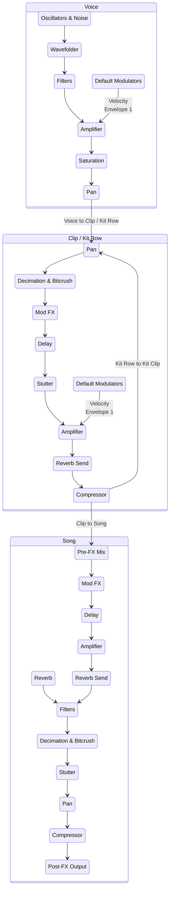

```mermaid
stateDiagram-v2
    state Voice {
        OscillatorNoise --> Wavefolder
        Wavefolder --> FiltersVoice
        FiltersVoice --> AmplifierVoice
        DefaultModulatorsVoice --> AmplifierVoice: Velocity <br> Envelope 1
        AmplifierVoice --> Saturation
        Saturation --> PanVoice
        PanVoice --> PanClipKitRow: Voice to Clip / Kit Row
    }
    OscillatorNoise: Oscillators & Noise
    FiltersVoice: Filters
    AmplifierVoice: Amplifier
    DefaultModulatorsVoice: Default Modulators
    PanVoice: Pan

    state ClipKitRow {
        PanClipKitRow --> DecimationBitCrushClipKitRow
        DecimationBitCrushClipKitRow --> ModFXClipKitRow
        ModFXClipKitRow --> DelayClipKitRow
        DelayClipKitRow --> StutterClipKitRow
        StutterClipKitRow --> AmplifierClipKitRow
        DefaultModulatorsClipKitRow --> AmplifierClipKitRow: Velocity <br> Envelope 1
        AmplifierClipKitRow --> ReverbSendClipKitRow
        ReverbSendClipKitRow --> CompressorClipKitRow
        CompressorClipKitRow --> PanClipKitRow: Kit Row to Kit Clip
        CompressorClipKitRow --> PreFXMix: Clip to Song
    }
    ClipKitRow: Clip / Kit Row
    PanClipKitRow: Pan
    DecimationBitCrushClipKitRow: Decimation & Bitcrush
    ModFXClipKitRow: Mod FX
    DelayClipKitRow: Delay
    StutterClipKitRow: Stutter
    AmplifierClipKitRow: Amplifier
    DefaultModulatorsClipKitRow: Default Modulators
    ReverbSendClipKitRow: Reverb Send
    CompressorClipKitRow: Compressor

    state Song {
        PreFXMix --> ModFXSong
        ModFXSong --> DelaySong
        DelaySong --> AmplifierSong
        AmplifierSong --> ReverbSendSong
        Reverb --> FiltersSong
        ReverbSendSong --> FiltersSong
        FiltersSong --> DecimationBitCrushSong
        DecimationBitCrushSong --> StutterSong
        StutterSong --> PanSong
        PanSong --> CompressorSong
        CompressorSong --> PostFXOutput
    }
    PreFXMix: Pre-FX Mix
    ModFXSong: Mod FX
    DelaySong: Delay
    AmplifierSong: Amplifier
    ReverbSendSong: Reverb Send
    FiltersSong: Filters
    DecimationBitCrushSong: Decimation & Bitcrush
    StutterSong: Stutter
    PanSong: Pan
    CompressorSong: Compressor
    PostFXOutput: Post-FX Output
```
