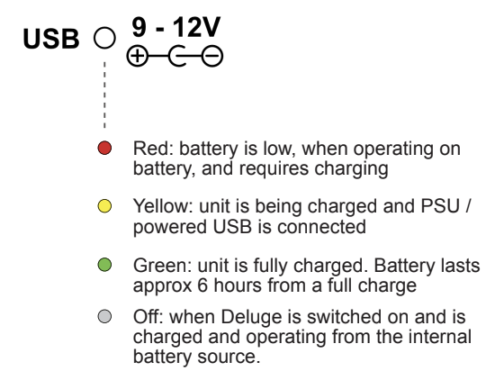

import { Card } from "@astrojs/starlight/components"
import { Steps } from "@astrojs/starlight/components"

You can power the Deluge through the USB port or DC power socket.

The Deluge has an internal battery that can last for over six hours.

<Card title="Battery shipped with low charge" icon="information">

The internal battery is shipped with a low charge. When you use the Deluge for the first time, connect to a power source to charge the battety.

</Card>

## Turning on the Deluge

<Steps>

1. Connect a power source to the USB port or DC power socket.
1. Install the SD card with the metal contacts facing up.
1. Switch the power switch on the rear of the device to **On**.

</Steps>

## Power Sources

### USB port

Using the USB port, you can power and charge the Deluge with any USB power source that outputs at least 500mA, such as a computer, USB wall adapter, or powered USB hub. A USB-B to USB-A cable is included.

### DC power socket

Using the DC power socket, you can power and charge the Deluge with any centre-negative 9-12V DC power supply that outputs at least 500mA. This type of power supply isn't included, but you can buy one from a variety of manufacturers and shops.

<Card title="Warning" icon="warning">

The 9-12V DC power supply MUST be centre-negative (not centre-positive). Using the wrong type of power supply can damage the Deluge.

</Card>

If the power supply provides enough current, you can connect the Deluge in series with other devices. Internal circuitry minimizes most ground loop noise, but some noise is possible.

If power is connected to the USB port and DC power socket at the same time, the Deluge draws power from the DC power socket.

### Battery

#### Charging the battery

The Deluge has an internal Li-ion battery, providing 6+ hours of life.

The battery charges any time a power source is connected to the USB or DC power socket, whether the Deluge is on or off.

The battery status LED illuminates yellow for charging, green for charge-complete, or red for low-battery.

Please note that your Deluge will be shipped with very little charge in the battery. You will need to plug it into a power source to use it and begin charging the battery.

> Diagram credit: [SynthDawg](https://www.synthdawg.com)

#### Replacing the battery

The Deluge’s battery is an “18650” 3.7V Li-ion, and may be replaced by the user. No special tools or skills are needed.

These batteries are readily available from stores everywhere. A “protected” or “unprotected” type may
be used. A battery of any mAh rating may be used - higher mAh ratings simply mean longer
battery life.

The original battery is 3000mAh, but you can use batteries of any capacity (mAh rating). Higher mAh ratings simply mean longer battery life.
