import { Badge } from "@astrojs/starlight/components"

## Song

A discrete creative endeavour, such as an arrangement, sketch, 8-bar loop, jam, live recording template, or musical experiment. A song is always associated with at least one song file on the Deluge.

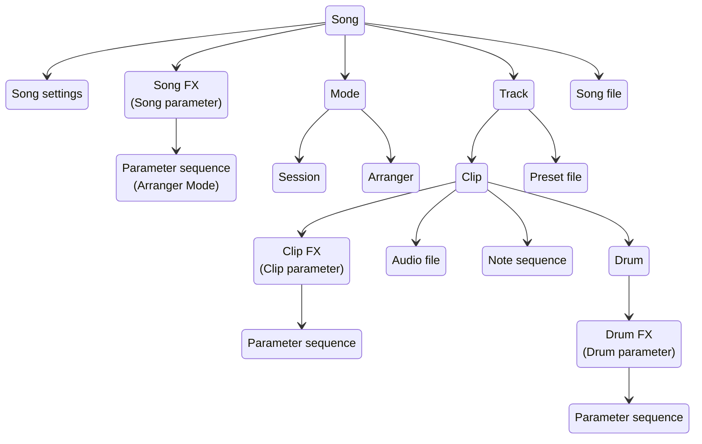

### Song settings

User configurable settings that dictate how a song should operate

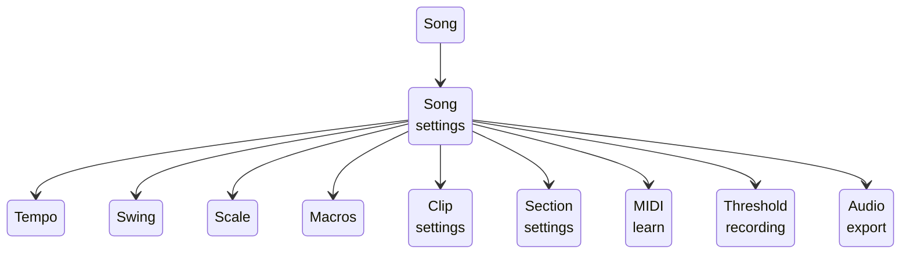

### Song FX (Master Parameters)

The name of an adjustable value, such as LPF Frequency, that can be manipulated and saved as part the Song and which adjust the output generated by each song component (e.g. clip).

### Song file

A file on the SD card that stores all of the information about a song.

## Track

A single instrument or layer in a song.

- Each track is either an audio track or an instrument track.
- An instrument track is either a kit instrument track or a melodic instrument track (synth, MIDI, CV).
- All instrument tracks (except for CV) can be saved as an instrument preset file.
- A MIDI track can also be associated with a MIDI device definition file.
- Tracks contain one or more clips.
- Only one clip can be active (playing) in a track at a time.

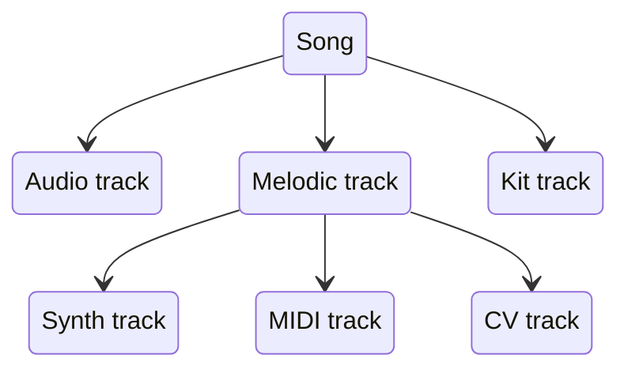

### Instrument preset file

A preset file can be saved for synth, kit and MIDI instrument tracks.

- A preset file contains track information configured in a clip (such as base parameter values, synth engine settings, kit drum information, samples used), but not all track information.
  - For example, note sequences and parameter automation sequences are not saved in the track preset file (that information is only saved as part of the song file).
  - New in <Badge text="c1.3" variant="tip" />: Note sequence patterns can be saved to and loaded from a pattern file.

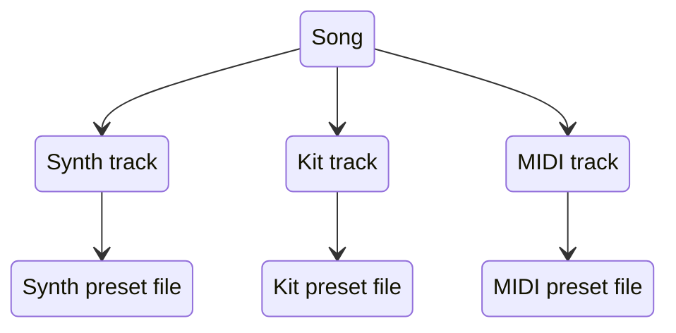

#### Synth preset file

Saving a synth preset only saves the synth setting data and sample links. No patterns are stored with synth presets.

#### Kit preset file

Saving a kit preset only saves the kit setting data and sample links. No patterns are stored with kit presets.

#### MIDI preset file

Saving a MIDI preset only saves the MIDI track setting data and MIDI device definition file link. No patterns are stored with MIDI presets.

### MIDI device definition file

A MIDI device definition file can be saved for a MIDI instrument track.

- A MIDI device definition file includes labels for CC's used to control a specific MIDI device.
- A MIDI device definition file can be linked in a song file and/or MIDI instrument preset file so that the MIDI device definition file can be updated separately but changes are loaded with the Song / MIDI instrument preset files.

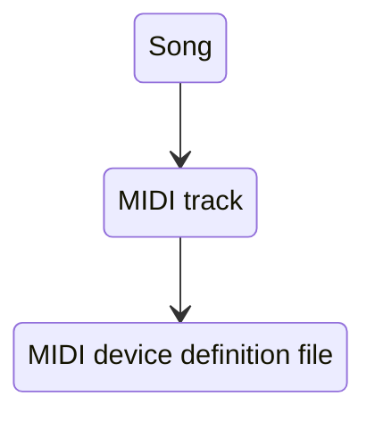

## Clip

A unique instance of a track that stores information required to generate an output (for example, samples, note sequences, parameter automation sequences, and other track settings).

- Each clip is either an audio clip or an instrument clip.
  - Each instrument clip is either a melodic instrument clip (synth, MIDI, CV) or a kit instrument clip.
- Each clip is assigned to a section and clips from different tracks can be grouped by / assigned to the same section.

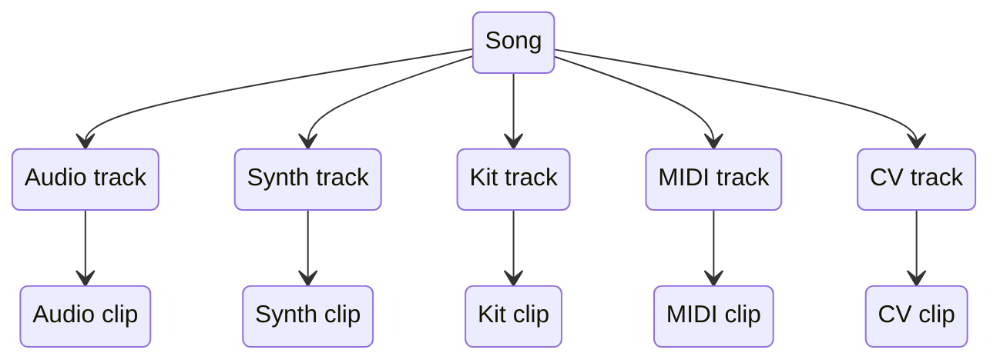

### Audio clip

Audio clips can be used to playback audio samples and/or to process and/or record the audio from external input or internal tracks.

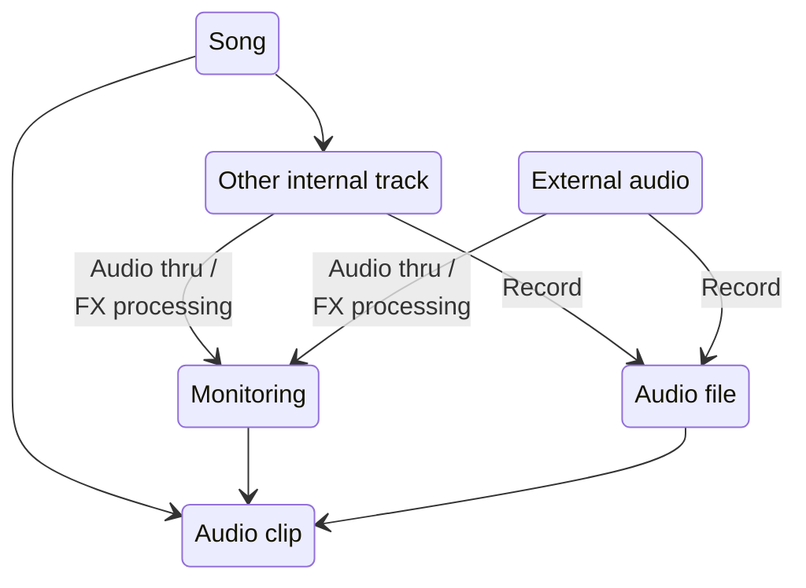

### Instrument clip

Instrument clips enable you to sequence patterns by entering events in the sequencer. Without these events, an instrument clip does not generate an output.

#### Row

- A unique sequencer instance that is associated with a specific drum (for kit instrument clips) or note pitch (for melodic instrument clips).
- The instrument clip row contains information on the notes programmed into the sequencer.
- The instrument clip row also contains information on sequence length and the direction that the sequence should playback.

#### Note

- The name of an event that can be programmed in an instrument clip row in order to generate audio (for example, a synthesized sound or sample) or non-audio (for example, MIDI, CV, Gate) output.
- Each note has specific parameters that determine when and how a note is to be triggered (e.g. note position, note velocity, note probability, note iterance, note fill, note lift).

#### Synth instrument clip

The Deluge synth engine allows sound design by configuration of subtractive or FM synthesis, or the playback and manipulation of samples.

- Synth clips are typically used to create a melody for both lead and bass-style instruments.
- Notes are populated across the pad grid with the pitch affected by the up / down position on the grid rows.
- A colour is indicated for the notes on a synth clip and set by pitch.
  - Colour can be edited.

#### Kit instrument clip

Kits consist of unique outputs per row. Typically based on samples but also may be synthesized sounds, or MIDI or Gate outputs.

- While the obvious and common use of kits is to trigger drum sounds such as a kick or snare, longer loops and non-percussive samples can also be used within kits.
- Kit sounds are mapped across rows of the sequencer - each individual sound is represented on its own row.
- Each row of the clip is coloured independently.
  - Colour can be edited.

##### Drum

A unique instance of a kit instrument clip row that is associated with a sequence to generate an output. A drum is either an audio drum (synthesizer or sample) or non-audio drum (MIDI, Gate).

#### MIDI instrument clip

- Placeholder to add information about MIDI instrument clips

#### CV instrument clip

- Placeholder to add information about CV instrument clips

### Section

A clip can only belong to one section. Sections have settings that dictate the number of times a section should playback before stopping or moving to the next section.

- Each section has a distinct colour.
- In session mode, a section groups clips from separate tracks together so that they can be launched together.
- In arranger mode, section colours are used to identify the different clip instances of a track.

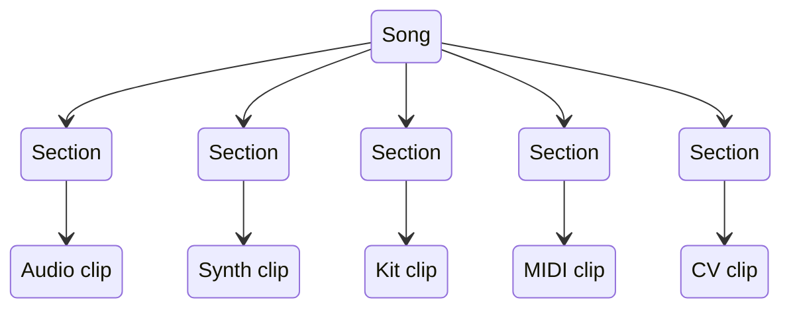

### Clip FX (Parameter)

The name of an adjustable value, such as LPF Frequency, Reverb Room Size, or OSC1 Level, that can be manipulated and saved as part of a clip and which influence the output generated by that clip.

- With exception for MIDI and CV clips, parameters do not generate an output on their own. A trigger, such as the playback of a sample (in an audio clip) and a note event in an instrument clip, is required in order for parameters to impact the output of a clip.
  - Exception: MIDI clips can send MIDI CC parameters, and CV clips can send CV monophonic expression without any note triggers.
- For a Kit, there are two layers of FX:
  1. at the clip level (after all kit sound drum's have been processed); and
  1. at the sound drum level;
- Some parameters can be modulated and automated.
  - Audio clip, MIDI clip, and CV clip parameters cannot be modulated.

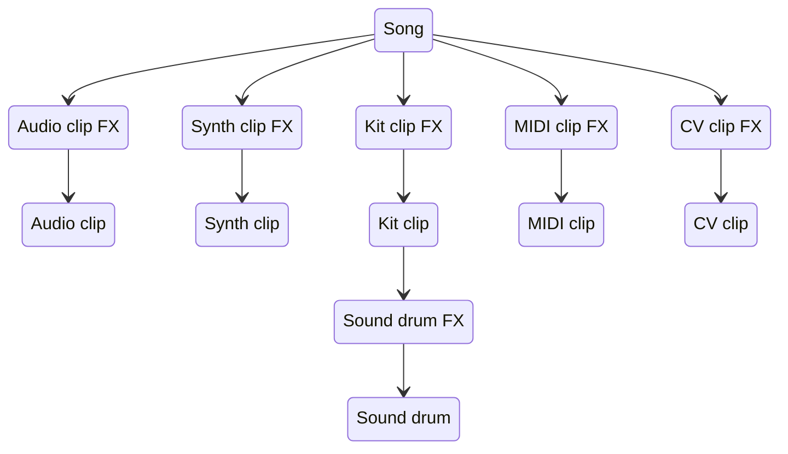

### Audio file / sample

An audio file that can be played back as part of an audio clip or sequenced as part of an instrument clip (excl. MIDI and CV)

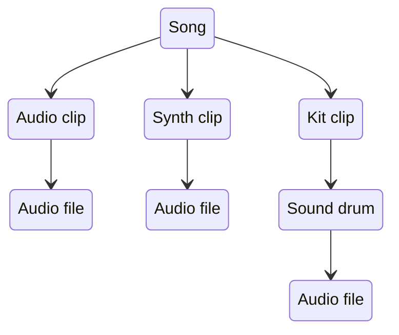

### Output

The information stored in a clip (samples, notes, parameters) generates an output for a track. An output either generates audio (synthesizer sound or sample) or non-audio (MIDI, CV, Gate).

## Modes

Modes provide different ways of working with tracks and clips and contain the configuration settings for which tracks and clips are playing at any given time. They are mutually exclusive, meaning only one mode can be played at a time. Each mode is associated with a View which is the user interface for configuring the mode.

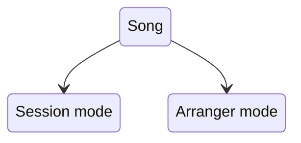

### Arranger mode

Allows you to arrange a song chronologically from beginning to end using Arranger View. Each track is represented by a single row on a timeline. The clips for a given track are placed in sequence from left to right.

### Session mode

Allows you to work with tracks and clips using two main Session View layouts: Rows and Grid.

## Views

### Arranger mode

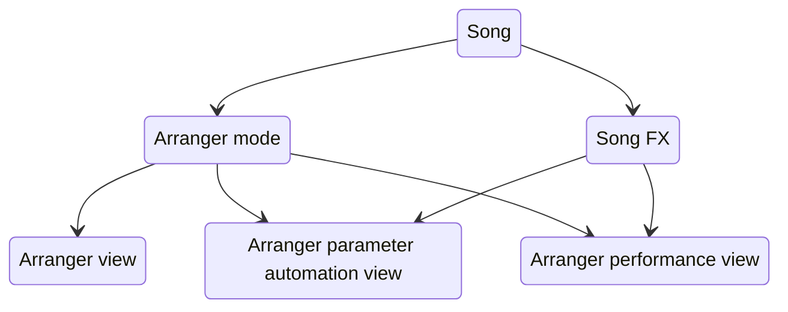

#### Arranger view

The user interface for interacting with Arranger mode.

#### Arranger parameter automation view

The user interface for interacting with the automatable song parameters of Arranger mode.

#### Arranger performance view

The user interface for interacting with the song parameters of Arranger Mode and for muting / unmuting Arranger tracks.

- Song parameter changes can be recorded as automation in Arranger mode.

### Session mode

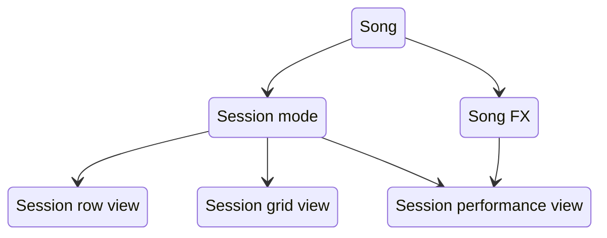

#### Session Rows / Grid views

The user interfaces for interacting with Session mode.

- You can record a session to Arranger mode.

#### Session Performance view

The user interface for interacting with the song parameters of Session mode and for launching / stopping session sections.

- You can record as performance to Arranger mode.

### Audio clip

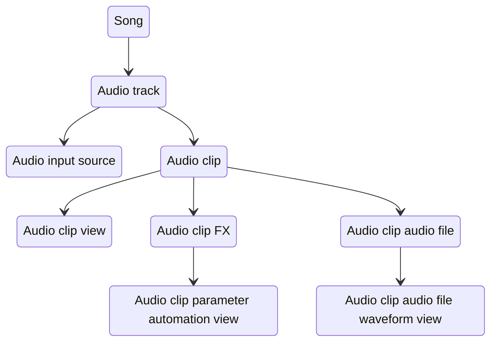

#### Audio clip view

The user interface for interacting with an Audio clip.

#### Audio clip parameter automation view

The user interface for interacting with the automatable parameter's of an Audio clip.

#### Audio clip audio file waveform view

The user interface for interacting with the Audio File loaded into an Audio clip.

### Synth clip

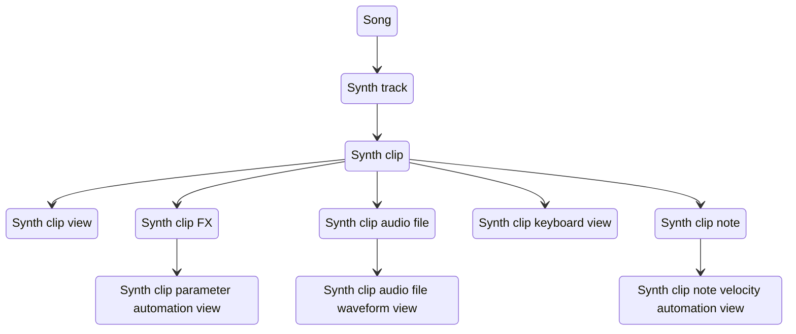

#### Synth clip view

The user interface for interacting with a Synth clip.

#### Synth clip keyboard view

The user interface for interacting with the Melodic Instrument Keyboard Layouts for a Synth clip.

Includes several layouts: isomorphic, in-key, norns, chord, chord library, piano.

#### Synth clip parameter automation view

The user interface for interacting with the automatable parameter's of a Synth clip.

#### Synth clip audio file waveform view

The user interface for interacting with the Audio File(s) loaded into a Synth clip.

#### Synth clip note velocity automation view

The user interface for interacting with the note velocities of a note row in a Synth clip.

### Kit clip

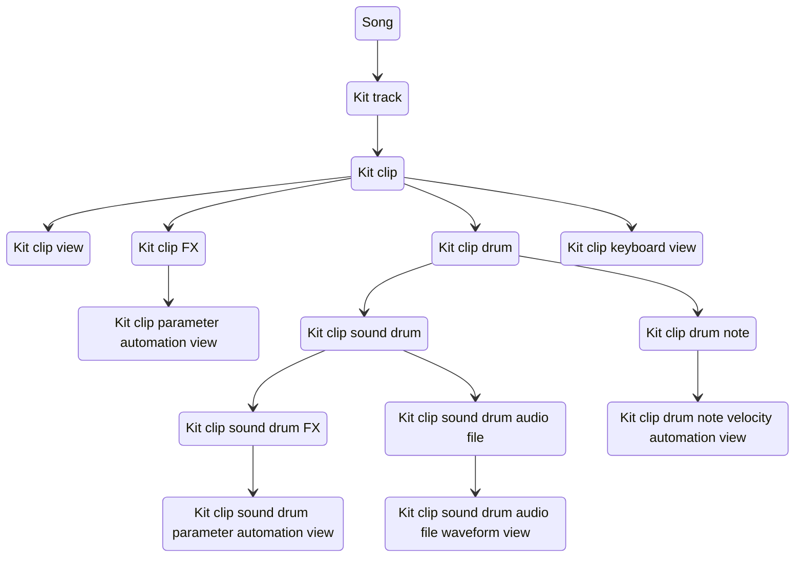

#### Kit clip view

The user interface for interacting with a Kit clip.

#### Kit clip keyboard view

The user interface for interacting with Kit Instrument Keyboard Layouts.

Includes the Drum Velocity layout.

#### Kit clip parameter automation view

The user interface for interacting with the automatable parameter's of a Kit clip.

#### Kit clip sound drum parameter automation view

The user interface for interacting with the automatable parameter's of a sound drum row in a Kit clip.

#### Kit clip sound drum audio file waveform view

The user interface for interacting with the Audio File loaded into a sound drum row in a Kit clip.

#### Kit clip drum note velocity automation view

The user interface for interacting with the note velocities of a drum row in a Kit clip.

### MIDI clip

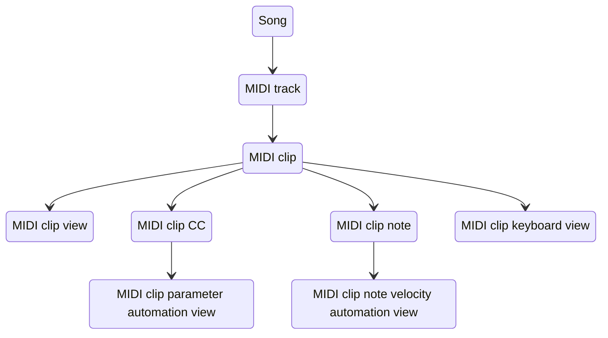

#### MIDI clip view

The user interface for interacting with a MIDI clip.

#### MIDI clip keyboard view

The user interface for interacting with the Melodic Instrument Keyboard Layouts for a MIDI clip.

Includes several layouts: isomorphic, in-key, norns, chord, chord library, piano.

#### MIDI clip parameter automation view

The user interface for interacting with the automatable parameter's of a MIDI clip.

#### MIDI clip note velocity automation view

The user interface for interacting with the note velocities of a note row in a MIDI clip.

### CV clip

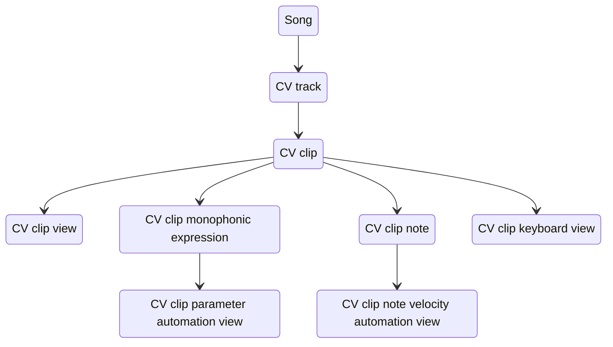

#### CV clip view

The user interface for interacting with a CV clip.

#### CV clip keyboard view

The user interface for interacting with the Melodic Instrument Keyboard Layouts for a CV clip.

Includes several layouts: isomorphic, in-key, norns, chord, chord library, piano.

#### CV clip parameter automation view

The user interface for interacting with the automatable parameter's of a CV clip.

#### CV clip note velocity automation view

The user interface for interacting with the note velocities of a note row in a CV clip.

## Menus

The user interface for interacting with various project settings. More information on the menu's and their structures can be found on the [Menu Hierarchies](https://delugecommunity.com/reference/menu_hierarchies) page.

Menu's are opened on top of a specific view and can sometimes interact with the underlying view.

Here is a summary of the menu's that exist on the Deluge, the view(s) they can be opened from, and whether they can interact with the underlying view.

| Menu     | Shortcut to Open           | Opened from view(s) | Can interact with view(s)?                        |
| -------- | -------------------------- | ------------------- | ------------------------------------------------- |
| Settings | :key[Shift] + :key[Select] | Any view            | No                                                |
| Song     | :key[Select]               | Arranger, Session   | Only in Configure Macros and Midi Learn submenu's |
| ...      | ...                        | ...                 | ...                                               |

## File Browser

The user interface for loading and saving compatible files (e.g. project file, preset file, midi device definition file).

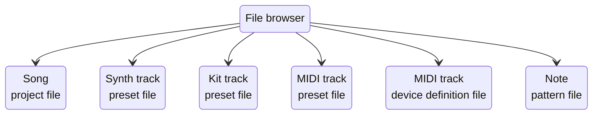

## Hardware controls

The controls built into the Deluge hardware that enable a user to interact with the Deluge device. Controls include: Buttons, Pads, and Encoders.

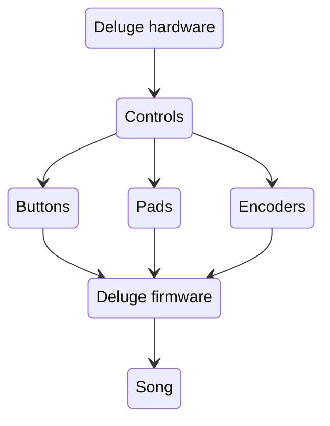

## MIDI controls

Control commands received from external MIDI hardware that enable a user to interact with the Deluge device.

```mermaid
stateDiagram-v2
  MIDIHardware --> DelugeHardware
  DelugeHardware --> DelugeFirmware
  MIDIHardware: MIDI hardware
  DelugeHardware: Deluge hardware
  DelugeFirmware: Deluge firmware
```
