## Getting Oriented

Songs are the project files for the Deluge. Songs contain all the file references and settings to make the sounds (internally or externally) you want to play and perform. Only one song can be played or edited at a time so loading a new song will remove access to any previous song information. (Make sure you save your work before loading a song. The Deluge does not auto-save.)

If the song is the container for your audio project then clips are the primary things that you create, edit, and align to fill that container. Clips define the sounds that can be made through audio files (samples) and using the synth engines in the Deluge and can send commands via MIDI or CV (control voltage) to external sound devices. Clips also define the timing of those sounds and commands through sequencing.

Clips on the Deluge can be any length of beats and bars (including fractional beats). Multiple clips can play at the same time but only one clip per track or instrument can play. Layering clips and timing their launch and repeating is the primary method of arranging or performing a sound experience.

This diagram provides an overview of the various components of a Song.

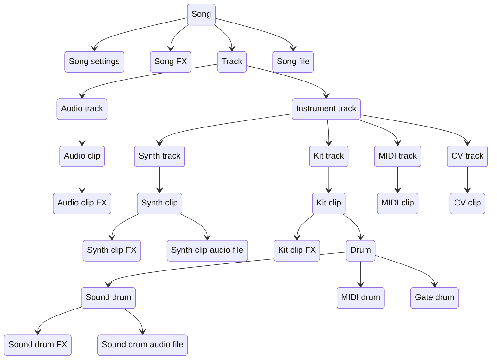

## Song Modes and Workflow

Like many Digital Audio Workstations (DAWs) the Deluge provides two modes to manage clips in the song. The Session mode provides two clip launcher workflows that are oriented towards performance and experimentation. The Arranger mode provides a view that manages the tracks and execution of clips along a strict timeline which is a workflow more oriented towards creating a repeatable project.

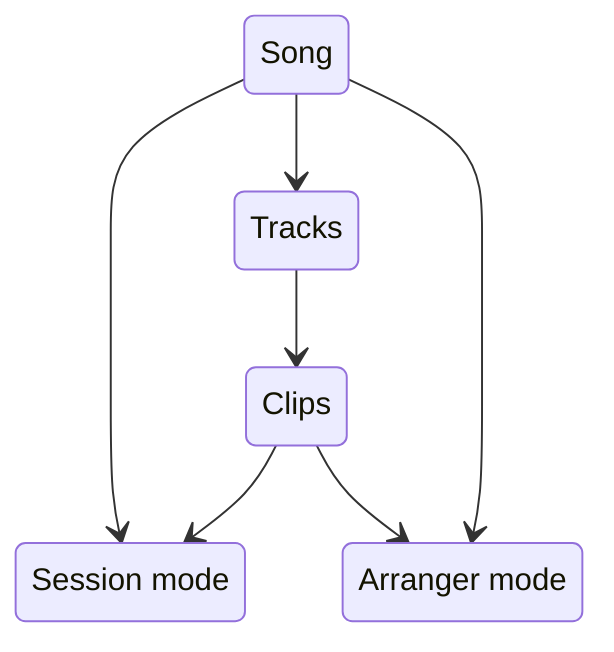

A song can use both Session and Arranger modes and views to continue to refine a project and there's interaction and sharing of information between the two, but only one mode can be played or performed at a time.

An example high level workflow for working with Songs on the Deluge:

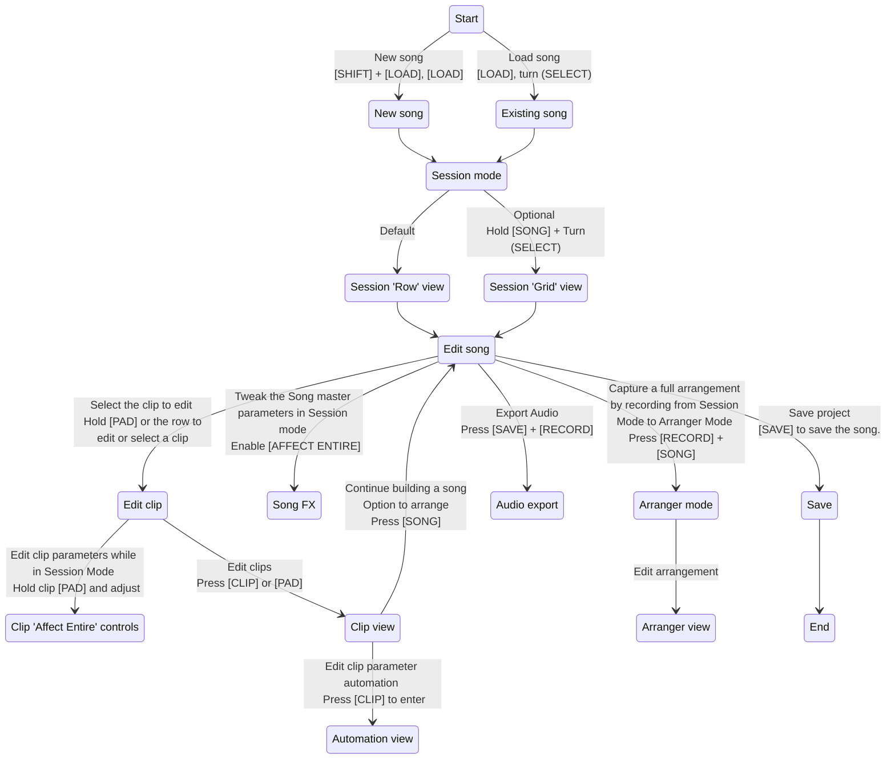

## Clip Types

There are five types of clips in the Deluge: three that generate sounds using the Deluge's internal synth, sampling, and recording capabilities and two that send synchronized commands to external sound generators.

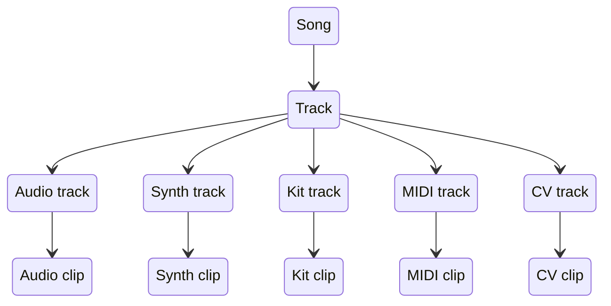

The two command clip types are MIDI and CV clips. These clips are used to define signals that send note and control voltage signals in addition to timing synchronization (i.e. clock) commands to sound notes on the external equipment. There's also the ability to send non-note commands to the external gear to change parameters and edit the sound while performing.

The three sound generating clip types are Synth, Kit, and Audio clips. Synth clips focus on the sound synthesis engines within the Deluge to create melodic sounds. Kit clips coordinate multiple samples focused on rhythmic sounds and effects. Audio clips focus on playing sampled recorded sounds and resampled internally generated sounds.

## Song

A discrete creative endeavour, such as an arrangement, sketch, 8-bar loop, jam, live recording template, or musical experiment. A song is always associated with at least one song file on the Deluge.

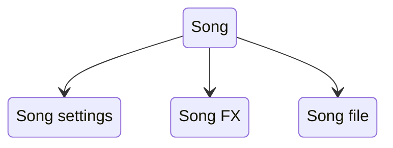

### Settings

- User configurable settings that dictate how a song should operate - e.g. swing, tempo.

### Song FX

- The name of an adjustable value, such as LPF Frequency, that can be manipulated and saved as part the Song and which adjust the output generated by each song component (e.g. clip).

### Song file

- A file on the SD card that stores all of the information about a song.

## Track

- A single instrument or layer in a song.
- Each track is either an audio track or an instrument track.
- An instrument track is either a kit instrument track or a melodic instrument track (synth, MIDI, CV).
- Tracks contain one or more clips.
- Only one clip can be active (playing) in a track at a time.

### Instrument preset file

- A preset file can be saved for synth, kit and MIDI instrument tracks.
- A preset file contains track information configured in a clip (such as base parameter values, synth engine settings, kit drum information, samples used), but not all track information.
  - For example, note sequences and parameter automation sequences are not saved in the track preset file (that information is only saved as part of the song file).

## Clip

- A unique instance of a track that stores information required to generate an output (for example, samples, note sequences, parameter automation sequences, and other track settings).
- Each clip is either an audio clip or an instrument clip.
  - Each instrument clip is either a melodic instrument clip (synth, MIDI, CV) or a kit instrument clip.
- Each clip is assigned to a section.

### Section

- In session mode, a section groups clips from separate tracks together so that they can be launched together.
- A clip can only belong to one section. Sections have settings that dictate the number of times a section should playback before stopping or moving to the next section.
- Each section has a distinct colour.
- In arranger mode, section colours to identify the different clip instances of a track.

### Parameter

- The name of an adjustable value, such as LPF Frequency, Reverb Room Size, or OSC1 Level, that can be manipulated and saved as part of a clip and which influence the output generated by that clip.
- Parameters do not generate an output on their own. A trigger, such as the playback of a sample (in an audio clip) and a note event in an instrument clip, is required in order for parameters to impact the output of a clip.
- Some parameters can be modulated and automated.

### Sample

- An audio file that can be played back as part of an audio clip or sequenced as part of an instrument clip.

### Audio Clip

- Audio clips can be used to playback audio samples or to process the audio from external input or internal tracks.

### Instrument Clip

- Instrument clips enable you to sequence patterns by entering events in the sequencer. Without these events, an instrument clip does not generate an output.

#### Synth

- The Deluge synth engine allows sound design by configuration of subtractive or FM synthesis, or the playback and
  manipulation of samples.
- Synth clips are typically used to create a melody for both lead and bass-style instruments.
- Notes are populated across the pad grid with the pitch affected by the up / down position on the grid rows.
- A colour is indicated for the notes on a synth clip and set by pitch.
  - Colour can be edited.

##### Synth preset file

- Saving a synth preset only saves the synth setting data. No patterns are stored with synth presets.

#### Kit

- Kits consist of unique outputs per row. Typically based on samples but also may be synthesized sounds, or MIDI or CV outputs.
- While the obvious and common use of kits is to trigger drum sounds such as a kick or snare, longer loops and non-percussive samples can also be used within kits.
- Kit sounds are mapped across rows of the sequencer - each individual sound is represented on its own row.
- Each row of the clip is coloured independently.
  - Colour can be edited.

##### Kit preset file

- Saving a kit preset only saves the kit setting data and sample links. No patterns are stored with kit presets.

#### MIDI

- Placeholder to add information about MIDI clips

##### MIDI preset file

- Placeholder to add information on MIDI device definition files

##### MIDI device definition file

- Placeholder to add information on MIDI device definition files

#### CV

- Placeholder to add information about CV clips

#### Row

- A unique sequencer instance that is associated with a specific drum (for kit instrument clips) or note pitch (for melodic instrument clips).
- The instrument clip row contains information on the notes programmed into the sequencer.
- The instrument clip row also contains information on sequence length and the direction that the sequence should playback.

#### Note

- The name of an event that can be programmed in an instrument clip row in order to generate audio (for example, a synthesized sound or sample) or non-audio (for example, MIDI, CV, Gate) output.
- Each note has specific parameters that determine when and how a note is to be triggered (e.g. note position, note velocity, note probability, note iterance, note fill, note lift).

#### Drum

A unique instance of a kit instrument clip row that is associated with a sequence to generate an output. A drum is either an audio drum (synthesizer or sample) or non-audio drum (MIDI, Gate).

### Output

The information stored in a clip (samples, notes, parameters) generates an output. An output either generates audio (synthesizer sound or sample) or non-audio (MIDI, CV, Gate).

## Modes

Modes provide different ways of working with tracks and clips and contain the configuration settings for which tracks and clips are playing at any given time. They are mutually exclusive, meaning only one mode can be played at a time. Each mode is associated with a View which is the user interface for configuring the mode.

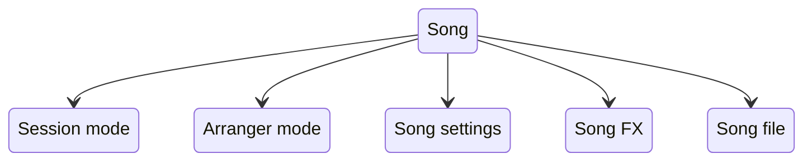

### Arranger mode

Allows you to arrange a song chronologically from beginning to end using Arranger View. Each track is represented by a single row on a timeline. The clips for a given track are placed in sequence from left to right.

### Session mode

Allows you to work with tracks and clips using two main Session View layouts: Rows and Grid.

## Views

### Arranger mode

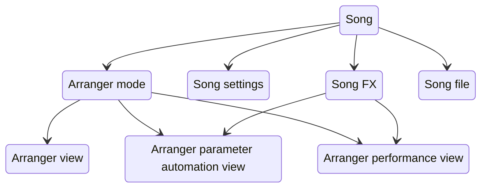

#### Arranger view

The user interface for interacting with Arranger Mode

#### Arranger parameter automation view

The user interface for interacting with the automatable song parameters of Arranger Mode

#### Arranger performance view

The user interface for interacting with the song parameters of Arranger Mode

### Session mode

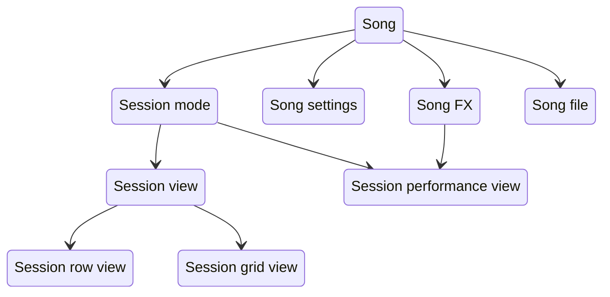

#### Session Rows / Grid views

The user interfaces for interacting with Session mode

#### Session Performance view

The user interface for interacting with the song parameters of Session Mode

### Audio clip

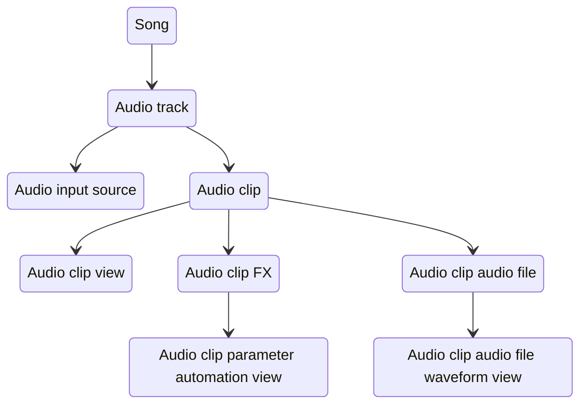

#### Audio clip view

The user interface for interacting with an Audio clip.

#### Audio clip parameter automation view

The user interface for interacting with the automatable parameter's of an Audio clip.

#### Audio clip audio file waveform view

The user interface for interacting with the Audio File loaded into an Audio clip.

### Synth clip

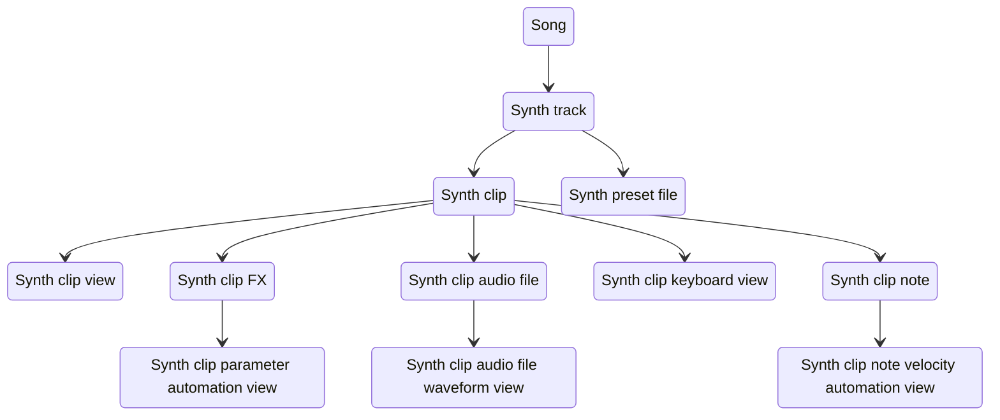

#### Synth clip view

The user interface for interacting with a Synth clip.

#### Synth clip keyboard view

The user interface for interacting with the Melodic Instrument Keyboard Layouts for a Synth clip.

Includes several layouts: isomorphic, in-key, norns, chord, chord library, piano.

#### Synth clip parameter automation view

The user interface for interacting with the automatable parameter's of a Synth clip.

#### Synth clip audio file waveform view

The user interface for interacting with the Audio File(s) loaded into a Synth clip.

#### Synth clip note velocity automation view

The user interface for interacting with the note velocities of a note row in a Synth clip.

### Kit clip

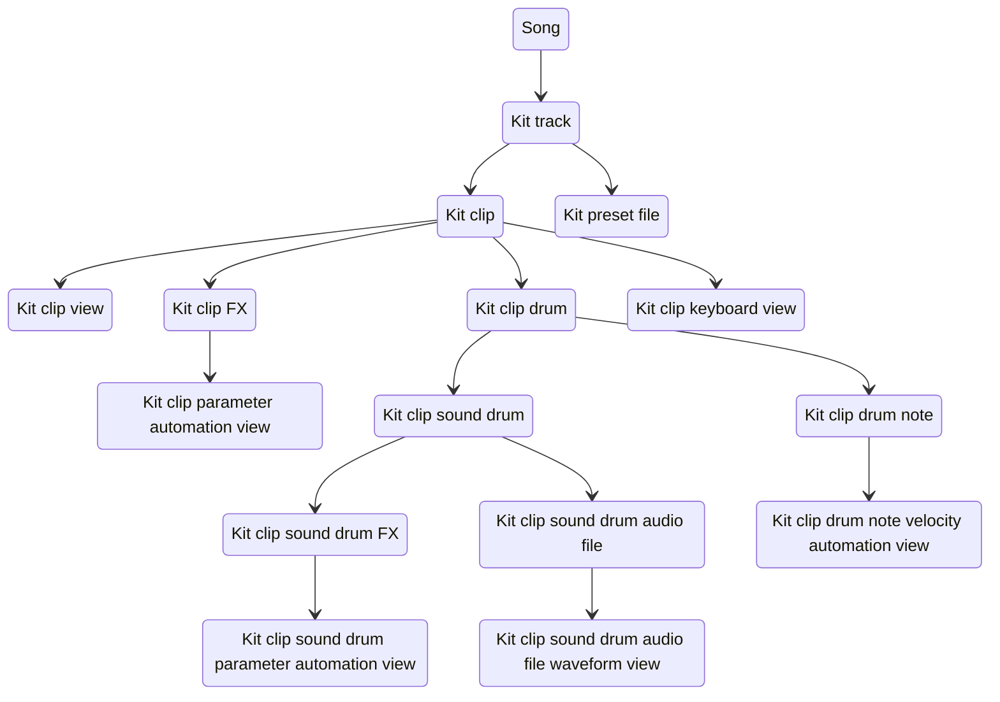

#### Kit clip view

The user interface for interacting with a Kit clip.

#### Kit clip keyboard view

The user interface for interacting with Kit Instrument Keyboard Layouts.

Includes the Drum Velocity layout.

#### Kit clip parameter automation view

The user interface for interacting with the automatable parameter's of a Kit clip.

#### Kit clip sound drum parameter automation view

The user interface for interacting with the automatable parameter's of a sound drum row in a Kit clip.

#### Kit clip sound drum audio file waveform view

The user interface for interacting with the Audio File loaded into a sound drum row in a Kit clip.

#### Kit clip drum note velocity automation view

The user interface for interacting with the note velocities of a drum row in a Kit clip.

### MIDI clip

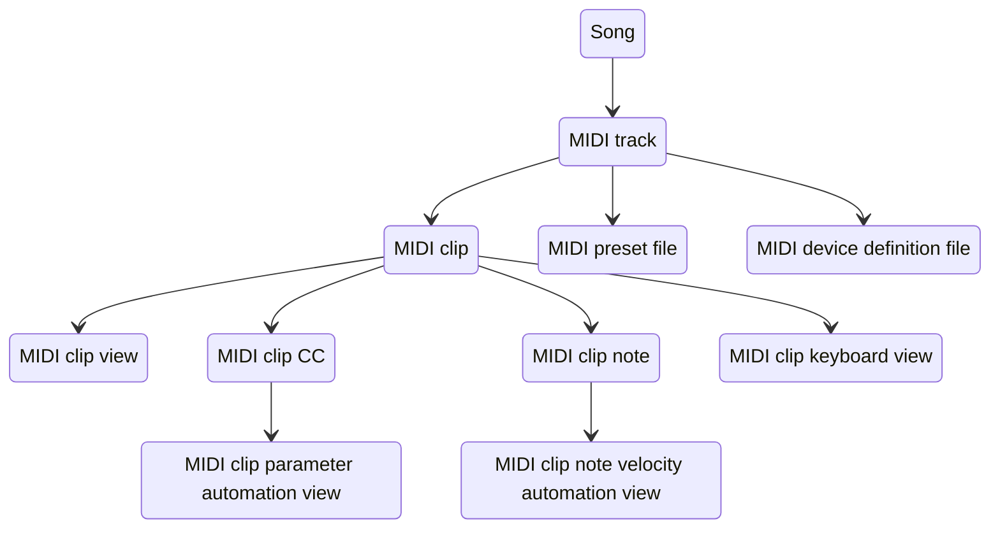

#### MIDI clip view

The user interface for interacting with a MIDI clip.

#### MIDI clip keyboard view

The user interface for interacting with the Melodic Instrument Keyboard Layouts for a MIDI clip.

Includes several layouts: isomorphic, in-key, norns, chord, chord library, piano.

#### MIDI clip parameter automation view

The user interface for interacting with the automatable parameter's of a MIDI clip.

#### MIDI clip note velocity automation view

The user interface for interacting with the note velocities of a note row in a MIDI clip.

### CV clip

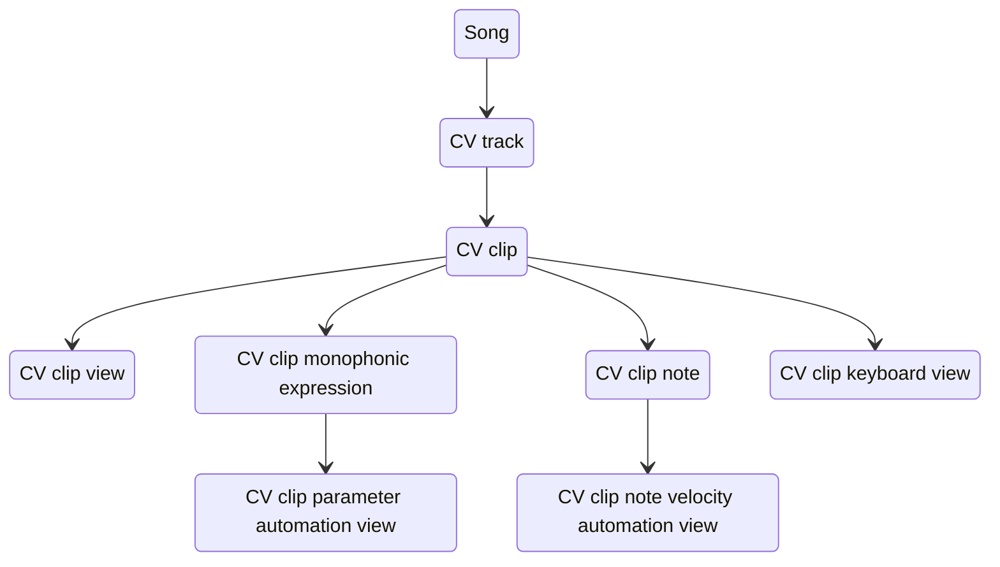

#### CV clip view

The user interface for interacting with a CV clip.

#### CV clip keyboard view

The user interface for interacting with the Melodic Instrument Keyboard Layouts for a CV clip.

Includes several layouts: isomorphic, in-key, norns, chord, chord library, piano.

#### CV clip parameter automation view

The user interface for interacting with the automatable parameter's of a CV clip.

#### CV clip note velocity automation view

The user interface for interacting with the note velocities of a note row in a CV clip.

## Menus

- The user interface for interacting with various project settings.

## File Browser

- The user interface for loading and saving compatible files (e.g. project file, preset file, midi device definition file).

## Hardware controls

- The controls built into the Deluge hardware that enable a user to interact with the Deluge device.
- Controls include: Buttons, Pads, Encoders
