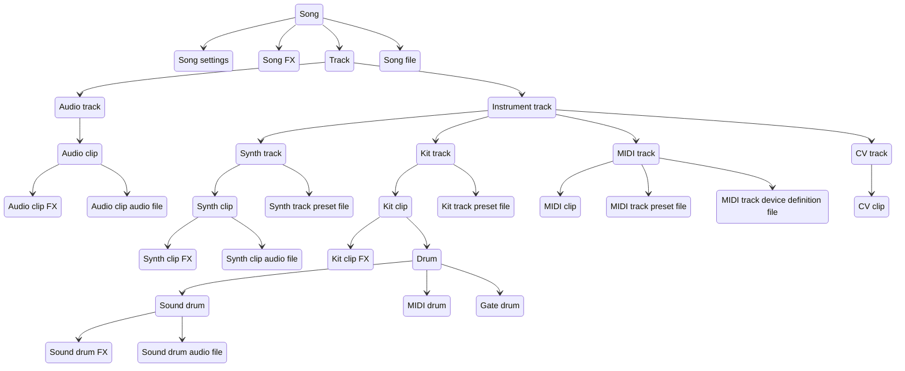
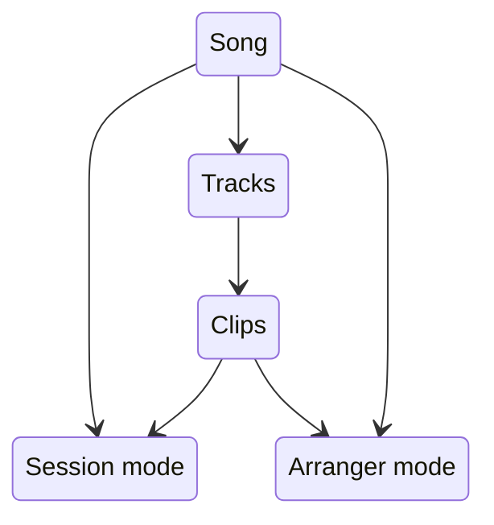
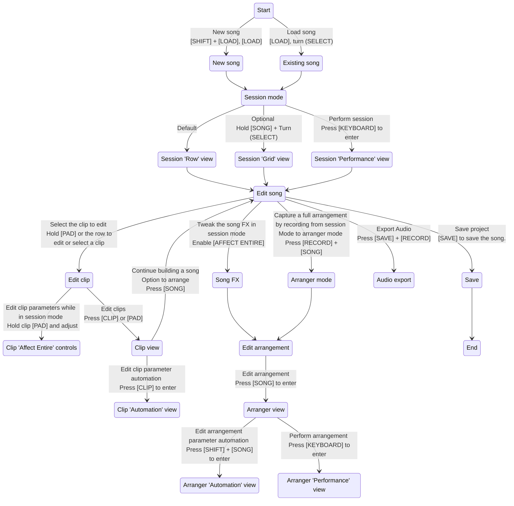
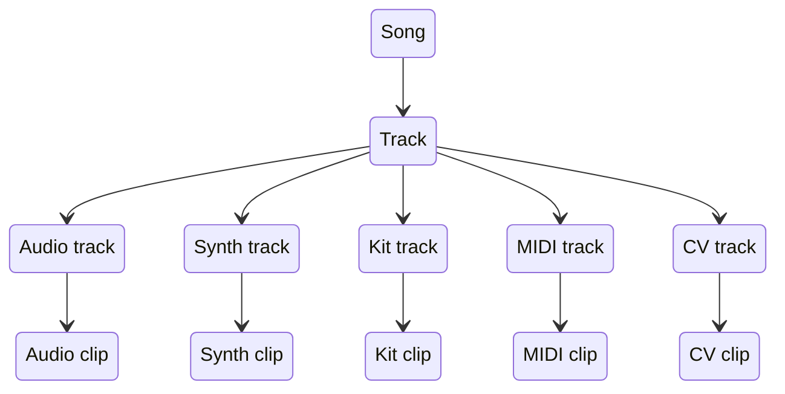

Songs are the project files for the Deluge. Songs contain all the file references and settings to make the sounds (internally or externally) you want to play and perform. Only one song can be played or edited at a time so loading a new song will remove access to any previous song information. (Make sure you save your work before loading a song. The Deluge does not auto-save.)

If the song is the container for your audio project then clips are the primary things that you create, edit, and align to fill that container. Clips define the sounds that can be made through audio files (samples) and using the synth engines in the Deluge and can send commands via MIDI or CV (control voltage) to external sound devices. Clips also define the timing of those sounds and commands through sequencing.

Clips on the Deluge can be any length of beats and bars (including fractional beats). Multiple clips can play at the same time but only one clip per track or instrument can play. Layering clips and timing their launch and repeating is the primary method of arranging or performing a sound experience.

This diagram provides an overview of the various components of a Song.

## Song Modes and Workflow

Like many Digital Audio Workstations (DAWs) the Deluge provides two modes to manage clips in the song. The Session mode provides two clip launcher workflows that are oriented towards performance and experimentation. The Arranger mode provides a view that manages the tracks and execution of clips along a strict timeline which is a workflow more oriented towards creating a repeatable project.

A song can use both Session and Arranger modes and views to continue to refine a project and there's interaction and sharing of information between the two, but only one mode can be played or performed at a time.

An example high level workflow for working with Songs on the Deluge:

## Clip Types

There are five types of clips in the Deluge: three that generate sounds using the Deluge's internal synth, sampling, and recording capabilities and two that send synchronized commands to external sound generators.

The two command clip types are MIDI and CV clips. These clips are used to define signals that send note and control voltage signals in addition to timing synchronization (i.e. clock) commands to sound notes on the external equipment. There's also the ability to send non-note commands to the external gear to change parameters and edit the sound while performing.

The three sound generating clip types are Synth, Kit, and Audio clips. Synth clips focus on the sound synthesis engines within the Deluge to create melodic sounds. Kit clips coordinate multiple samples focused on rhythmic sounds and effects. Audio clips focus on playing sampled recorded sounds and resampled internally generated sounds.
