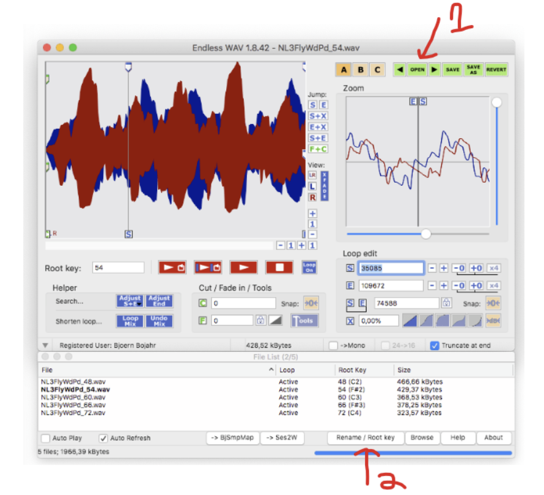
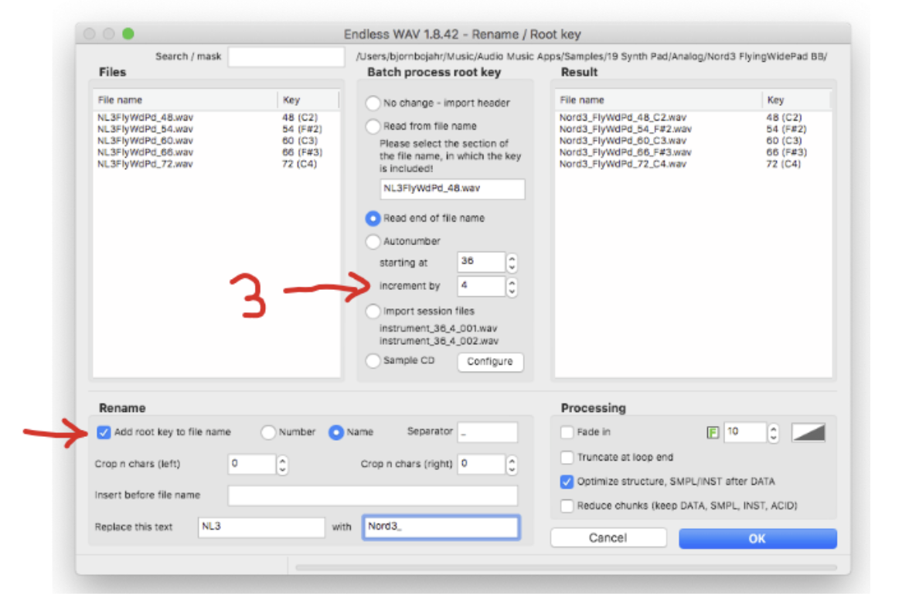
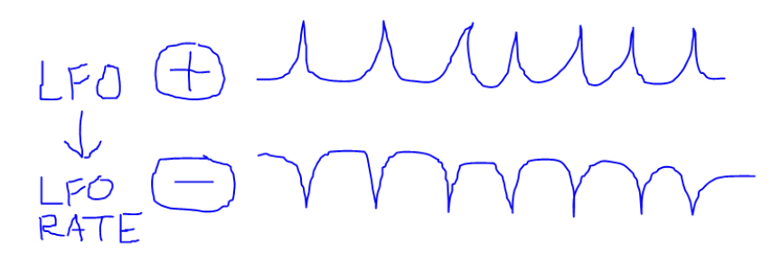

import { Steps } from "@astrojs/starlight/components"

This page provides various tips and tricks from the Deluge Community that have been gathered over the years.

Original source: [Deluge Discord Tips and Tricks](https://docs.google.com/document/d/19kMPOUQkjPSATEmscG-kO1CfFvc16-h8_Y8BJhICOOo/edit?tab=t.0)

## Links and resources

### PDFs

[F.A.Q - Synthstrom Audible](https://synthstrom.com/frequently-asked-questions/)

[Synthstrom OLED Update](https://synthstrom.com/oled/)

[Deluge Official Manual - 4.0 Guidebook from Synthdawg (8-segment display pictures)](https://synthstrom-audible-deluge.s3.us-east-2.amazonaws.com/Deluge-Guidebook-4p0.pdf)

[4.1 Guidebook - OLED update](https://synthstrom-audible-deluge.s3.us-east-2.amazonaws.com/Deluge-Guidebook-4p1-OLED.pdf)

[The Community Quick Reference](https://synthstrom-audible-deluge.s3.us-east-2.amazonaws.com/Deluge-Community-Guide-4p0.pdf)

### Free Synth Presets

[Synthstrom Factory Presets](https://s3.us-east-2.amazonaws.com/synthstrom-audible-deluge/Deluge+V2p1p0+factory+card+contents.zip)

[Synthstrom Deluge Archives | Patchstorage - (User uploaded synth presets)](https://patchstorage.com/platform/synthstrom-deluge/)

[Synthstrom Audible - Forum Link](https://forums.synthstrom.com/)

[Delugist - Neuma Studio - Delugist - Deluge Content Sharing Site](https://delugist.neuma.studio/)

[Delugator Web Randomizer - generates random synth presets](https://randomdelugesynth.azurewebsites.net/)

### Data and Software

[GitHub - SynthstromAudible/DelugeFirmware](https://github.com/SynthstromAudible/DelugeFirmware)

[Deluge Synth Parameter Testing](https://docs.google.com/spreadsheets/d/1-55lTQVAij6_va_uEUVczFltpOwkUT05AtIm6nzPJ8s/edit#gid=1854644637)

[Deluge XML file format](https://github.com/SynthstromAudible/DelugeFirmware/wiki/XML-file-format-documentation)

[Deluge Synth Parameter List - descriptions of XML params, notes in XML post by Jamie Fenton](https://docs.google.com/spreadsheets/d/1ag6yWUS6tJw3BRG9Ejs5ItM_YSq4r47SFzaebH8hH7g/edit#gid=990592618)

[Deluge commander app - Neuma Studio - Deluge Commander](https://neuma.studio/deluge-commander.html)

### Cases

[2022 Synthstrom made their own case! Synthstrom Audible Case](https://synthstrom.com/product/deluge-case-custom/)

[DIY Dustsaver from FondsofFall 10/17/2022](https://www.reallyusefulproducts.co.uk/usa/html/onlineshop/rub/b04_0litreUS.php)
Bought at Office Depot for ~ $13 USD. The brand is Really Useful Products Ltd- made in the UK. I am impressed with the quality. The foam from recycle that offered free giveaway so I reused to protect Delly from slipping. Enjoy hacking DIY. Closed lid 14" L x 13.25" W x 3.25" H

postolarpunk has [MicroFreak / MiniLab / MicroBrute Travel Case | Analog Cases](https://analogcases.com/products/pulse-microfreak-microbrute-case)
Loosely fits the deluge, international flights and multiple road trips tested, sometimes the buttons get clicked when traveling, works okay but I wish I got something that fit the deluge better and had more space for headphones

[Decksaver review from Heptagen 05/11/2022](https://www.decksaver.com/product/deluge-cover/)
Only contact is on the sides (with foam) and from the top on the flat surfaces (cheeks, deluge logo). No contact with knobs or pads, definitely no wear. Sits tight, can definitely recommend, wouldn't take my deluge anywhere without it. Someone on the forum reported problems with worn pads that were a result of transport in a bag where something continuously pressed and rubbed the pads, which wore off the contact material. (And the knobs feel very sensitive, especially the golden ones. I'd never expose those to anything but my hands.) That's why I opted for a decksaver instead of a bag. Can still fit it in the laptop compartment of my backpack with the decksaver on.

Bay Mud, PatersonC, MChristian, rm - 05/26/2022
I've been using the Magma case (meant for Roland Boutiques, if I recall) for a few years now without fail. Nice amount of protection for when I throw it in my bag on my bike or something. [Amazon.com: MAGMA 48003 Ctrl Hard-shell Case For Roland Boutique Key](https://www.amazon.com/dp/B06X9MJCHV) I would try 14" or 13.3" My bag is for 13.3" laptop and works fine. That Magma case is nice, it fits the Deluge snugly

Voynich, porkloin - 05/29/2022
on the subject of cases, I have this one in silver, it's awesome [Amazon.com: Nanuk 910 Waterproof Hard Case with Foam Insert - Black : Sports & Outdoors](https://www.amazon.com/dp/B00BP8URVS?ref=ppx_yo2ov_dt_b_product_details&th=1)
the nanuk 910 fits the deluge perfectly, and it's built like a tank. I wanted something substantial since the deluge is so central to my setup. It's worth it.
I have this same one in black color and can agree it’s very great. And made in Canada! It is very bulky though. I’ve never flown with my deluge, it just seems to be a hair too big for bringing along on a trip like that.

volsteh - 05/23/2022
[LTGEM EVA Hard Case for Novation Launchkey Mini 25-Note USB Keyboard MK2 Controller - Travel Protective Carrying Storage Bag](https://www.amazon.com/LTGEM-Novation-Launchkey-Keyboard-Controller/dp/B07F9YKWQW)

## FX

### Learn a parameter to a gold knob

<Steps>

1. Open the parameter you want for editing. See: Edit a parameter
1. Hold LEARN and turn the GOLD KNOB you want to bind it to. (Turn, not press!)

</Steps>

## VU Meter

Since community release 1.1.

In SONG, ARRANGER, or PERFORMANCE view:

<Steps>

1. Press LEVEL mod button while it is already lit, and AFFECT ENTIRE is on.

</Steps>

## Song View

### Set audio clip input source

<Steps>

1. Hold INPUT and press PAD on the audio clip row.

</Steps>

### Solo a clip

<Steps>

1. Hold HORIZONTAL and press MUTE for the clip you want to solo. Solo starts at the end of loop.
1. To solo the clip immediately, hold SHIFT while pressing HORIZONTAL.

</Steps>

### Clip / Section Launching

Credit: postsolarpunk

I tried to investigate exactly when and why a set of armed clips will launch (clip sequencing study section)

Multiple index of 8 is defined as 0, 8, 16, 24, etc.

Section A playing, arm section B
If the longest playing clip in section A is a multiple of the longest armed clip in section B, then section B launches at the next multiple index of the longest armed clip. Otherwise, section B launches at the end of the longest playing clip of section A.

Launching individual clips
If all armed clips have multiples of their clip lengths currently playing, then all armed clips launch at the multiple index of the longest armed clip. If some armed clips have multiples of the clip lengths currently playing but not all armed clips, then Deluge checks if the highest positioned playing clip length is longer than the longest armed clip with a multiple. If it is longer, then it launches at the highest positioned playing clip loop point. Otherwise, it launches at the multiple index of the longest armed clip with a multiple. If none of the armed clips have multiples of the clip lengths currently playing, then the armed clips launch at the highest playing clip loop point. Muting multiple playing clips occurs at the end of the longest clip length.

```
SECTION: PLAYING SECTION A, ARM SECTION B
Is longest ARMED is multiple of longest PLAYING
TRUE: launch at MULTIPLE index of longest ARMED
FALSE: launch at LONGEST PLAYING loop

NOT SECTION: PLAYING ANY CLIPS, ARM INDIVIDUAL OR MULTIPLE CLIPS
(all, some, none) ARMED clips have multiples in set of PLAYING clips:
ALL MULTIPLE:
launch at MULTIPLE index of longest ARMED
SOME MULTIPLE:
IF: highest positioned PLAYING > longest ARMED MULTIPLE
TRUE: launch at highest positioned PLAYING loop
FALSE: launch at MULTIPLE index of longest ARMED
NONE MULTIPLE:
		launch at highest positioned PLAYING loop
```

## Arranger View

### Improvisation

Credit: TOTAL, synthrik

Improvisation inside Arranger workflow is possible. When playing back an arrangement, you may want the currently playing section of a song to continue so that you can do some improvisation on top of it. This can be seamlessly enabled by first switching to song mode, then pressing whichever of the mute buttons for the section currently enabled. Dimmed mute lights are now fully lit and the loops which have been on will continue playing and looping. To seamlessly go back to Arranger view to continue the song after improvising, switch back to arranger view, scroll horizontally to where you want to jump back to the arrangement, then push and hold the horizontal scroll knob and press play (press horizontal + play). After completing the current clip, playback will continue in the arrangement. Turn the select knob to increase the number of cycles before arrangement playback is resumed.

## Clip View

### General

#### Add / remove columns anywhere in a clip

<Steps>

1. Rotate the clip so the place where you want add/remove columns in is at the end.
1. Change clip length to add/remove columns at the end.
1. Rotate the clip back to its original position.

</Steps>

#### Clear a clip

<Steps>

1. Hold HORIZONTAL and press BACK.

</Steps>

#### Change clip play direction

<Steps>

1. Hold SHIFT and press PAD unlabelled pad immediately below the left gold encoder, to the right of the OSC SYNC PAD.

</Steps>

#### Change clip length

<Steps>

1. Hold SHIFT and turn HORIZONTAL.

</Steps>

#### Rotate a clip

<Steps>

1. Hold VERTICAL and turn HORIZONTAL.
1. This rotates the clip: turning left will move notes that used to be at the beginning of the clip to the end, and vice versa.

</Steps>

#### Edit a parameter

<Steps>

1. Hold AUDITION and press PAD for the parameter.
1. Hold SHIFT and press PAD for the parameter.
1. Press SELECT and use the menu to select the parameter.

</Steps>

Note: in a KIT you must have a row selected first!

### Re-quantizing a clip

Credit: nilc

Connect MIDI Out to MIDI In; See MIDI Out to MIDI IN section for more details on this setup

The source clip is any clip with notes already recorded, that you wish to re-quantize. If it is a kit or synth, switch it to MIDI. Arm this clip to play (but no others).

Create a new synth (or kit) clip. This will be the destination. Press and hold Learn + any Audition pad, to associate your midi source clip with this destination clip.

Set the quantization level as desired. Note that this must be a larger value than any quantization that was done on the source clip. E.g. if the source was quantized to 1/32, then you may re-quantize to 1/16, ⅛, etc. Quantizing always loses information, when it changes notes.

Press record, then press play, to record the notes from the source clip into the destination clip, at the newly selected quantization level.

### Kit

#### Tempo match for autoslicer

Credit: lodro, ok_reza, postsolarpunk

Let’s say you have a sample recorded at 78 BPM (or an unknown BPM) and your song is at a different BPM, say 120 and you want to use the autoslicer feature to slice the audio into a kit where each slice is a compatible length for the 120 BPM song. First, put the sample into an audio clip. The sample will timestretch automatically to the song’s BPM. Next, resample the audio clip only with rec+play then press rec+play to trigger turning off playback and resampling at the end of the audio clip. Finally, load the resample into a new kit using the autoslicer. The slices will be the right length with respect to the BPM.

Another technique is to use the autoslicer on the original 78 BPM sample to make a kit of equal length slices, then timestretch all slices at the same time, tuning them by ear. Press shift + SPEED on any sample, then with the Affect Entire button held down, turn the select knob to adjust the SPEED of all samples in the kit at once. This won’t get you exactly the BPM of your song, but might get somewhere close enough.

#### Create a New Kit

<Steps>

1. Hold SHIFT and press KIT.
1. Select sample to load to first row of the kit.

</Steps>

#### Delete a Kit Row

<Steps>

1. Hold PAD on the kit row to delete and press DELETE.

</Steps>

#### Delete all unused kit rows

c1.0 feature

<Steps>

1. Hold KIT, hold SHIFT, and press DELETE.

</Steps>

#### Change sample repeat mode for all kit rows

<Steps>

1. Open the sample repeat mode editor. See: Edit a parameter. (Bottom left corner pad.)
1. Hold AFFECT ENTIRE while turning the SELECT encoder.

</Steps>

#### Load a folder of samples as a kit

<Steps>

1. Create a kit
1. Browse to the name of the folder you want, and long-press SELECT.

</Steps>

#### Move a kit row

<Steps>

1. Hold both MUTE and AUDITION buttons on the row you want to move.
1. Rotate VERTICAL to move it.

</Steps>

#### Send MIDI from a Kit

<Steps>

1. Hold AUDITION for a row and press MIDI. This converts the drum to a MIDI drum.
1. Hold AUDITION and turn the upper and lower GOLD knobs to set the MIDI note and channel.

</Steps>

### MIDI

#### Assign CC to gold knob in MIDI clip

<Steps>

1. Press MODE button for the paramater whose CC you want to assign.
1. Hold GOLD and turn SELECT to assign the CC.

</Steps>

#### Load or save a MIDI instrument preset

Since community release 1.1.

<Steps>

1. Hold LOAD and press MIDI to load.
1. Hold SAVE and press MIDI to save.

</Steps>

### Audio Clips

#### Set audio clip input source

<Steps>

1. In Audio clip, enter Menu by pressing SELECT and enter Audio Source menu.

</Steps>

#### Edit length of audio clip without timestretching

From the manual:

In audio clip view, much like instrument clip view, you can change the clip’s length by holding shift and turning the ◄► knob. When this is done to an audio clip, the audio waveform shortens and lengthens with the clip’s length, causing the audio to sound faster or slower. If you instead want to trim or extend the audio clip while leaving its waveform unstretched, tap a pad at the right-most end of the visible waveform. A red marker will begin blinking there, representing the loop-point in a similar way to in waveform view. You may now tap where you want to move it to. Or you can tap the red marker again to make it disappear.

## Resampling

### Arm resampling to start/stop with Playback

<Steps>

1. Hold RECORD and press PLAY. Recording and playback both start immediately.
1. While resampling is in progress, hold RECORD and press PLAY to stop resampling at next loop point. Note: doing this will cut off any reverb trails.

</Steps>

### Backwards spinning vinyl effect

Gives a reverse tape stop style of effect.

Credit: Heptagen

1. Resample a couple of bars of the track
2. Init new synth and load the sample as osc
3. Sample mode: loop
4. Reverse it
5. Pitch-Speed: linked
6. Env2: Attack 32, Decay 26, Sustain 0, Release 50 (values are what I used in the example)

### Live Sampling, Looping Performance

Credit: Heptagen

The Elektron Octatrack has this neat function where you sample a loop of what's going on currently, then seamlessly switch to said loop so you're free to mangle it (or prepare something different "behind the scenes" while the loop keeps the track going), to then get back to the normal sound / live performance.

To some extent you can imitate this on your Deluge:

- Set up a new row as an audio track, set source to "outp".
- Arm Rec
- Press launch pad of said track, and the recording will start

Now if you were to press the launch pad again at the end of your loop, you would hear the live performance AND the loop-sample. To avoid that, press HORIZONTAL and the launch pad instead, to stop the loop and switch to solo mode of this track. Now you can do whatever you want to this sample, and you will be able to return to your original performance "non destructively".

If you now leave the solo mode, you'll have the same problem as before. To avoid this, press shift + launch pad to assign it to a separate section. Now you can return to any other section (of any color other than the loop-sample track is on). The loop will be muted, the other section will play.

### Live Resample Deluge Audio into Slices

Credit: Cowboy, voltseh, ok_reza

I want to take one or more currently-playing clips and sample them into slices in a new Kit clip so I can reorder the slices arbitrarily, all without stopping playing the main groove. Then I'll mute the clips I had recorded and play the new Kit clip and have an insta-remix.

This is what I did. While the groove is playing:

1. Create a new audio clip in Song mode by holding an empty clip pad and pressing Select
2. Set the new audio clip to record Mix by holding Learn and pressing a clip pad of the new audio clip, turning Select until Mix is visible, and pressing Select
3. Ensure Record is armed (red)
4. Mute all but the clip(s) you want to record to a new clip
5. Unmute the audio clip to start recording at the beginning of the next measure and re-mute when done recording to end recording at the end of the current measure (step 4+5 can be done at the same time!)
6. Save the project so that the audio clip is written to disk by pressing Save followed by Select
7. (Optional) Delete the newly-created audio clip by holding a clip pad of the audio clip and pressing Delete
8. Create a new kit clip by holding an empty clip pad and pressing Kit
9. Enter Clip mode in the new kit clip by pressing one if its pads
10. Hold Shift and press Kit to create a new kit preset
11. Navigate to the root directory and then to the CLIPS directory (if not already there) and scroll to the 2nd-to-last file
12. While holding Select, rotate Select until Slice is selected, press Select, and choose the number of slices (eg. 8), then press Select
13. Hold Shift and press Polyphony, and then while holding Affect Entire, rotate Select until Choke is displayed. Release Affect Entire and press Select
14. Place slices!

Alternatively to step 6 with the Save, the resampled audio should be saved to a folder inside Deluge and can be navigated to using Browse. The manual also says, “If playing already, Hold Rec + Play to Quantize Rec to start loop” but often the sequencer stops while trying to quantize the recording to the tempo.

## Sound Design

### Saturation

The Saturation effect on the Deluge works WAY better if you turn down the Osc/Gain level of the instrument. Like down to 1-5.

This pretty much goes for any nonlinear effects - not just the deluge. The input level and frequency content will dramatically change what comes out.

### Stereo Width / Widening

Credit: postsolarpunk

There’s a technique called stereo widening where a noise sounds like it’s spread across the stereo field (L and R) instead of only from the center point. Slightly delaying either the L or R channel from the other can produce this effect, but we don’t have that control on Deluge. Hard panning two copies of a track L and R can also aid in producing stereo width. This technique is used often for vocal doubling, layering guitar tracks, widening synth pads, making bass “huge”, and so on.

On the Deluge, we can start first with the digital delay with stereo ON. Get any sound, then set the delay time to a very short time, say 40. Turn up the delay amount from 0 to a small value, say 8. The stereo delay hard pans the delay repeats L R L R L R, and so on, which at small delay times fills the stereo field. This might be good enough, but it has a specific delay sound which might not be what you want.

Another method is to duplicate a track twice, and then pan a copy L, Center, and R. This gives you 3 copies of a sound to work with that fills the stereo field. This gets hard to manage and mix, so it’s a good technique to use when you’re done composing and you’re onto the mixing stage. Alternatively, this can be used as a good composition technique if you modulate the filter, volume, and panning of these tracks in a complimentary way. For example, if you had a copy L that was rising in volume and the high pass filter was rising as well, you could compliment this sound with the R copy by pulling down the lowpass filter and its volume in an “opposite” modulation way. Since they’re the same sound and melody, it’ll sound like it’s being modulated inside the stereo field, when really it’s just two copies of the same synth. You could then do some creative panning here too.

Lastly, if you want to “thicken” a single synth track, layering multiple synth voices, slow rate and small amounts of chorus, and small amounts of short time stereo digital delay will give you a bunch of layered voices inside of a single synth track. This is called unison and is the basis for the supersaw type of patch common to a lot of sawtooth basses. Try layering octaves or sub bass as well for OSC1 and OSC2. This process of generating multiple voices for one patch can be CPU intensive, but if you’re happy with how a patch sounds, you can resample the melody and load it as a sample. Resampling could be part of the composition as well, because all of these techniques can be reapplied to the resampled multivoice synth.

### Additive Synthesis

Credit: annaluise

I just realized that the Delly is also capable of additive synthesis. By assigning multiple synth tracks to the same midi controller you can play them simultaneously. This may be pretty obvious to some of you. I was trying to replicate a Hammond organ using the eorgan single cycle waveforms from AKWF. That actually worked well enough. But then I realized I could just as well use five synth tracks (nine sine waves) to emulate the nine drawbars of the b3 organ. Using LFO1 to modulate the pitch of each track and LFO2 to modulate the LPF frequency as well as the pan of each track makes for a good enough Leslie.

Then I assigned the volumes of the individual oscillators to the nine drawbars of my midi controller and the rates of all the LFOs to the same single knob on the controller. Another knob assigned to the reverb of each track. Turning the knob for the LFOs by hand until you reach the rate that sounds right seems to emulate the acceleration of the Leslie good enough.

I just had a few minutes to experiment with this this morning. But it's a promising sound already.

### Neurofunk Bass

Credit: Kravening (https://soundcloud.com/kravening/mosfet-deluge-jam-03)

<Steps>

1. Low pass filter with resonance
1. Add in the Saturation
1. Turn up both OSC Levels
1. Detune them slightly with Transpose -5 cent on OSC1 and + 5 cents on OSC2
1. Turn Synth Voices to 2 voices, and play with the voice detune amount
1. Adjust / Automate the Transpose detuning, filter cutoff, and distortion to taste.

</Steps>

### Reese bass

Reese bass using 3 synth clips controlled by a single midi clip (See MIDI Out to MIDI IN section). Start with a sub bass synth clip using a sine wave. Next, add a low bass synth clip using sawtooth waves, low-passed, with some saturation to taste. Third, add a top bass synth clip of sawtooth waves, low-passed, then add as much unison, saturation, chorus, reverb, and delay as you want to flavor it. The sub and low bass clips provide a foundation for the bass sound while the top bass can be used to sculpt the tone of the signal.

### Granular Synthesis Hack

Demo Video and Explanation: https://www.youtube.com/watch?v=6nYdeFWyY9s

So here's a quick rundown:

- New Synth
- Sample as OSC
- Shorten clip to 0.1.0 bars, zoom level 64th
- Sequence a whole row of notes (untested alternative: use arpeggiator e.g. set to 64th notes. Could make it easier to play and add / remove notes)
- Play

At this point you already have grains, but very choppy ones. You can change the grain count by adjusting the tempo (or the arp rate).

To make the grains smoother:

- More attack, more decay, more release
- Modulate A, D, R with random (so that it doesn't sound so static)
- Modulate LPF with random
- Modulate Pan with random
- Modulate master volume with random
- For more sparkles and highs add some notes one or two octaves above (try out pitch/speed: link - independent, makes a huge difference)
- EQ: less lows, more highs (the low end tends to get way too muddy)
- Add all the reverb
- Add a lot of delay with slow rate

Now you have a nice pad.

To change the position:

- Go to waveform editor
- Change sample start position (green bar) by pressing somewhere or by rotating the select knob (zoom in for finer resolution for both)
- To make the switch even smoother, turn the LPF (or volume) way down before switching and pull it back up after the switch, before the reverb has faded

-> RESAMPLE THE PROCESS AND PROFIT

You could also:

- Record each desired position into a separate sample
- Put those samples into a kit
- Make them loop
- Add a long attack/release/reverb

This way you can switch between the different positions/chords in a more controlled way or sequence it to make it fit your track. -Heptagen

Wavetable synths also work well for granular. Either put down lots of notes at 1/64 or set the ARP rate very fast, as above. Wavetable position (Custom 2 gold knob) now changes the sound of the grains. Modulate with a slow LFO1 or record automation for great sweeping effects (ENVs and LFO2 retrigger at the granular level, not as useful). -nilc

### Percussion Synthesis

Credit: postsolarpunk

A general purpose percussion patch is a quickly decaying envelope patched to the transpose of an oscillator and/or patched to the cutoff frequency of a filter. Turn envelope 2 sustain down to 0, set the attack to 0, set the decay somewhere between 1-15 to taste, turn up the resonance of the low pass filter, patch ENV2 to the the cutoff frequency of the low pass filter. Turn down the cutoff frequency of the low pass filter to the point that sounds good. Whenever you play a note, the envelope will quickly sweep the cutoff frequency from a high to a low value.

LPF cutoff frequency determines percussion tone.
ENV2 > LPF modulation depth shapes percussion transient tone.
Decay time changes how long it takes to move the filter (plucky vs slow descent)
Resonance affects how pronounced the filter is.

Apply this same idea of a “snappy envelope” to modulate other parameters to achieve different results (FM feedback, OSC transpose, HPF, PW …) Percussion sounds consistent of a transient, body, and “tail” to the sound. Try synthesizing all 3 components individually and layering them to create different percussion sounds. For example, a snare drum using only white noise is hard to replicate the sound of a physical snare drum. A better approximation can be found by synthesizing the plucky drum stick hit, the snare noise, the tonality of the snare resonating, and then layering these 3 sounds together. Try layering samples instead of synthesizing. Use 3 samples for the transient and 4 different samples for the body. Try resampling sounds to print multiple layers of sound to a single .wav file.

### Feedback Synthesis

Credit: postsolarpunk

Watch your volume!

We can patch the audio outputs into the audio input of Deluge and listen to the result using the headphones output (or alternatively patch the headphones output to the input and listen using the main outs). Using either an audio clip or a synth clip with the OSC TYPE set to inL, inR, or inLR can be used to create an audio feedback loop inside Deluge. Placing a note at C3 extended across the length of the clip means the audio input is played out with no pitch shifting applied. This audio is immediately read at the input of the device and thus feedback is generated.

Volume control can be done using Deluge’s main gold volume knob to control what is sent out of the module. The OSC LEVEL on the synth clip can be used to adjust the input gain. A loud output volume could be used to overdrive the input of Deluge creating clipping distortion artifacts to be introduced into the loop. However, this is also the monitoring volume, so watch your levels. The OSC LEVEL could also be used to drive the signal internally and saturate the headroom of the device. Use gain controls to encourage feedback if the gain is dying.

The high pass (HPF) and low pass (LPF) filters can self-oscillate when resonance is turned up. Modulating the cutoff frequency yields a lot of cool sounds while feedbacking. Modulate the resonance to send bursts of tone into the feedback loop.

Transposing + feedback can generate rising tones as the transposed signal transposes itself and so on. Decimal transpose values of 0.01 give more subtle effects than integer values like 5.00. Feedback transpose of octaves and fifths are used for a lot of pitch shifting delays. Patch and LFO to the transpose with a small amount of depth to push the transpose slightly positive then slightly negative to hear the audio spill upwards and downwards. Use the arpeggiator to pitch shift the audio feedback. Turn the gate down to a low value and turn up the delay to get feedbacking arpeggiated noise. Modulate everything!

### Panned reverb feedback

Credit: heptagen

Panned Reverb Feedback

- deluge stereo out -> deluge stereo in
- listen to what the deluge is doing through headphone jack
- make a synth, pan it to right, add reverb, pan reverb to left
- add new synth, osc type "inL", place a C3
- add bitcrush, phaser, decimation etc to reverb
- You can even transpose it or turn it into an arp. -Heptagen

### Humanizing drum loops

Credit: Koka Nikoladze
https://www.youtube.com/watch?v=WGNclh-eTe4

Koka’s Talk Episode 002 is often linked as an example of how to make a drum loop sound more like if a human played it. It involves doing a lot of small changes that add up to a great effect.
DTCTS + other magic

Dynamics: Accent specific triggers of a pattern by adjusting velocity louder on emphasized trigs.

Timing: Nudge notes left and right to establish small amounts of swing

Chance: 90% or 85% chance for all notes. Add lower chance triggers for fills at 40% or below and apply dynamics, timing, and chance to the fill triggers as well.

Tone: Randomize LPF freq by very little, maybe 10. Randomize snare frequency by 4. Small amounts of random modulation

Space: Delay time to something very small slapback, amount to something small, reverb amount to something small as well for both the high hat and reverb. This gives it a small amount of reverberation inside a room as if recording it.

Envelope Release: Randomize high hat release time, this means that high hats will be very short or sometimes very long which adds a lot of interest, especially good at varying how fills sound. Do the same with snares.

### Stereo desktop FX unit

Credit: postsolarpunk

Using an audio track, the Deluge can constantly output whatever audio is coming into the input. This can be useful for playing something before the Deluge Play button is engaged, or just simple monitoring of something through the unit. Audio tracks can also be used to record incoming audio to loops in a guitar pedal looper style workflow. Each overdub can be individually recorded, played, reverse, timestretched, and have FX applied to it.

A synth track can also be used to monitor incoming audio. Make a new synth, set OSC TYPE to inL, inR, or inLR, then place a note on the grid at C3 and extend it the entire length of the clip. Press play and Deluge will play out whatever it hears at its audio input as long as the note is playing. At C3 there is no pitch shifting of the audio input, but if you play notes higher up, you will get corresponding pitch shifted versions of the audio input. Think of this as if the audio input was your oscillator in the synth.

Arp can be used to sequence and gate the audio input rhythmically. The two filters can be used and modulated. The input can be panned L or R. The reverb, delay, and mod effects like flanger can be used and modulated. Playing notes can pitch shift the input. The transpose and level of the OSC can be modulated. Noise can be added. EQ, saturation, bitcrush. What’s a good portamento for an arpeggiated audio input into stereo delay modulated with an audio rate sawtooth LFO sidechained to a drum kit???

This is only one synth patch. Deluge lets you make more. Load up 5 different parallel stereo delays with different parameters. Load up 6 different audio input arpeggio patterns. Try parallel dry, saturation, bitcrush, and flanger then use the Song View reverb send on the mix. Try 4 of the same patches and pan them all across the stereo field to fill up the space.

### Karplus strong synthesis

Credit: Heptagen

What is Karplus Strong synthesis?
I wondered and went on to find out that it means that a short burst of white noise gets fed through a delay with a very short delay time to get comb filter effects. This is used to simulate plucked strings and such. Then I wondered if the Deluge is able to do this (most important factor being the delay time) and lo and behold - it is! (Although just a very basic form of it)

Shift + Synth = New Synth patch
OSC1 and OSC2 are silent (Set OSC level at 0 for both)
Noise to 50
Patch ENV1 to Noise
Set ENV1 attack 0 decay 3 sustain 0 release 0
Delay normal (not pingpong), analog, very short time, very high feedback (around the middle)
Optional: LPF frequency to ENV1

The delay feedback handles the sustain of the note, the delay frequency changes the pitch
deluge limit: can't only put delay signal into lpf, source gets filtered too. Also there's no way to musically play the "string" with different pitches, you can only change the delay time by hand, map it to sidechain or to lfo1 (which could make this useful for a limited amount of cases after all).

So yeah, deluge does Karplus Strong.
Is it useful? I don't know. Probably not.
But since when does stuff like this get measured by its usefulness anyway...?

Credit: postsolarpunk

To add to this, you could use different sample types instead of the noise to change the tone of the string. Instead of a short noise burst with ENV1, load a noisy sample of something into OSC1 and shape that sound to send into the delay. You might be able to “sequence it” using a kit track by changing the sidechain send amount per step, but that seems like a lot of work. The other way is to parameter-lock the delay time and sequence it that way.

### Sampler

Credit: postsolarpunk

There are thousands of things you can do with a Sampler.

One unique thing Deluge can do is use the Synth Voice parameter to have multiple playbacks of the same sample and detune them, similar to how synths can do unison but with samples. Refer to the Sound Engine: Number of Synth Voices section for more details.

Pressing and holding [Affect All] + turning Select knob will change the value of a parameter for all rows in a Kit clip. This only applies to Polyphony, Sample Mode, Reverse, Speed, and Pitch/Speed. Doing this for speed is a fun way to get a “decay” effect to all the samples at once. It’s also great for setting the playback mode of a Kit with a ton of rows, specifically when using the auto slicer feature and a drum loop. Affect all Reverse, Speed, and the gold knob for pitch (defaults to Custom 1) as live performance effects. Make a copy of the kit clip, modulate all the parameters, then return to the original copy. Affect all Speed can timestretch a lot of samples simultaneously. At lower speeds, a pseudo-reverb effect can be achieved. At higher speeds, it achieves a similar outcome to “shortening the decay” for a kit of basic drum machine one-shot samples.

### Make Multisample of Any Folder of Samples

Credit: postsolarpunk

Endless WAV | Bjorn Bojahr Save your data before trying anything with 3rd Party Software! (https://www.bjoernbojahr.de/endlesswav.html)
Deluge Sample Maps by postsolarpunk A few sample maps I’ve made using my own samples (https://drive.google.com/file/d/1tHSacHr22IeTv463JSnhDXsIdUfPR4Ez/view?usp=share_link)

The multisampler on Deluge works by automatically detecting the pitch of a sample and then mapping it to the correct location along the keyboard. If the metadata (https://en.wikipedia.org/wiki/WAV#Metadata) of the .wav file samples have the Key set to a note, then Deluge will look at that data and map that sample to that note, bypassing the automatic pitch detection. This means that we can distribute a folder of samples across the keyboard in any way we want by setting the metadata on the .wav files. Then we load up the multisample like usual and it should map all the samples correctly. Any software that can edit metadata of .wav files can work for this. Endless WAV was a free software recommended to me.

1. Make a folder full of samples you want to make a multisample with.

This can be any pile of samples. I’ve mapped drum loops to a multisample here (https://www.youtube.com/watch?v=3FVTTXZitaI) and created a few different maps of percussion samples here (https://www.youtube.com/watch?v=0wJXjwLtRKQ) as two examples. The .wav files need to have a metadata tag applied to it. Some .wav files can be seen as “corrupted” because the metadata tags are absent. Some applications truncate the metadata tags from .wav files. I ran into this while chopping up a 5 minute recording in Ableton where the audio was saved to the .wav, but the metadata for all the chops was absent. VLC Media Player is a common software that can reapply metadata tags to all your files by importing and exporting all the chops samples as .wav file type again.

2. Edit the metadata of your wav files

I used Endless WAV linked above, but it should work with anything that can edit all the metadata of your samples.



Open a sample in the folder with your samples. The rest should show up at the bottom.
Click the Rename / Root Key button



On the left are your current files and on the right is what the current operation will do to them. Use the Autonumber feature to set at what note we start mapping from and the spacing between samples as we increase in note. I usually started from zero and moved up by 1 or 2 mapping around 100 files across the keyboard. I also added the root key to the file name, but I don’t think you need to modify the names of the files at all. If your files are “corrupted” which means the metadata tags are missing and the software can’t find them, you’ll see that the Key parameter can’t be updated. Use VLC Media Player to batch import / export all your samples as .wav files which should save them all with metadata tags appended to the file and try again.

3. Load up your multisample!

Copy the folder of the multisamples to the Deluge SD card. Shift + Synth makes a new synth. Shift + [Browse] lets you browse files on the Deluge. Navigate to the folder with your multisample. Click and hold the select knob, you should see MULT flash on the screen, click it. Deluge should load up the multisample!

4. Enjoy your multisample!

Using this technique we can modulate the sample selection on Deluge. Usually the arp sequences the note, but with a multisample each note is mapped to a different sample, which lets us sequence the sample selection. This is fun for rapidly firing off a dozen different drum samples. Polyphony acts strangely here. Poly will let the samples ring out as we play chords or melodies, usually to completion depending on the sample mode. Mono will cut off any previous sample played, which can be fun for sequencing multiple long loops and triggering playback of one sample while cutting off playback of another. Portamento can lead to fun unintentional effects as unrelated samples try to slew their pitch while moving across the keyboard.

This opens up SP404 style sample playing as well using the isomorphic keyboard. Hit record and start finger drumming patterns. Use the arp sync rate as a performative feature to do quantized fills while finger drumming patterns.

### Subtractive synth

Credit: postsolarpunk

FM inside Subtractive Synth Mode with the Filters

For some reason, the filters are disabled when using the FM synth mode. Traditionally, FM adds harmonics by multiplying sine waves whereas with subtractive synthesis we start with a harmonically rich waveform and subtract harmonics using the filter.

However, we can map audio-rate LFOs to OSC transpose in subtractive synth mode to imitate an FM synth, then use the filters additionally. Turn up the LFO speed super high, set them to sine wave shape (for now) and modulate the transpose of OSC using the LFO. Then, use an ENV to modulate the modulation depth of the Transpose LFO. This means that the envelope controls how strongly the LFO modulates the Transpose, which is sort of how FM synths do it.

Continue from here modulating the LFO speed with another audio rate LFO or something. You can modulate the transpose of each OSC individually and then modulate the main transpose of the whole synth track too for different layers. Then use the filters however you want.

### FM Synth

Credit: Heptagen

SY Programming by Herbert JanBen (https://chrisarndt.de/files/yamaha/SY%20Programming%20v0.40.pdf)
Helpful resource for FM synthesis. Specifically pages 15-19 can be applied directly to the deluge, but other parts are helpful too. It explains the general ideas to get into certain areas of sound instead of giving hard values to enter.

### Ring Mod Synth

I believe this is the most unused synth mode due to the difficulty of using ring mod, however delugians Rezzonator and RSKT have made a fantastic tutorials covering ring mod which you can view here:

Rezzonator: Synthstrom Deluge - Ring Mod Explained (https://www.youtube.com/watch?v=emXa-buOKTk)
RSKT: The Deluge Video Manual 11 - Ring Modulation (https://www.youtube.com/watch?v=-pujFVANOxY)

Often ring modulation is employed pragmatically for metallic sounding sound effects, distortion type noises, and generating sounds with interesting combinations of harmonics.

### Wavetable

Credit: postsolar postsolarpunk

Xfer Records Serum plugin has wavetables that are compatible with Deluge.

Decimation reduces the audio’s sample rate without filtering then interpolates it back up to the Deluge’s native sample rate. We lose high frequency content this way, which is desirable if our wavetable is very harsh due to a lot of higher harmonic frequencies present in the sound. Decimation between values 0-20 can lead to some nice filtering of harsh frequencies with the wavetable synth that sounds different than a LPF. It does give the sound overall an increased aliased sound, but a little decimation might do the trick as a different flavor.

Modulate Sample Start Point using Wavetable Synthesis
(This was just a fun experiment that yielded some cool sounds, do not expect this to “work”)

I loaded a drum loop as a wavetable for an OSC. Any sample you load into the wavetable must be a mono waveform. The wavetable can load pretty long files (up to 10 seconds of audio tested) as a wavetable which is notable. I attempted to “playback the sample” by modulating the wavetable position at the same speed as the wave that was playing back. Thus the oscillator would scroll through the wavetable at the same rate it was oscillating (hopefully) and thus we’d get a sort of timestretched sample playback of the sample as a wavetable.

To get it to “play the sample” you have to get the wavetable position to move at the correct speed. I modulated the wavetable with an ENV. The envelope depth controls the “distance” across the wavetable we’re traversing, but an increase in the depth means that we’re traversing a larger distance in the same amount of time, which means the “playback speed” increases. Thus, you have to compensate by turning up the attack time of the ENV too. I had mine at like attack 45.

Next, use the grid to step sequence the starting position of the wavetable. Since the ENV “scans” crudely through the sample, whatever the wavetable position is becomes the “sample start point”. Use the grid to do parameter-locking to sequence the sample start point.

Finally, we can modulate the ENV depth with an LFO. At lower mod depth values, we traverse a smaller distance, thus we change the waveform less often, and the sound turns into a more synthy drone sound. As the LFO increases, the mod depth value goes up, we traverse a higher distance, thus we scan through the wavetable faster, and the sound turns into a strange timestretched sample playback sound.

The actual values of the modulation depths are dependent on the other modulation sources and the length of the sample used in the wavetable, so it becomes very difficult to find the right values to use. It took me a while to find values that only sort of worked, but it did result in some really unique sounds, somewhere between a wavetable and a sample scrub.

Credit: nilc, postsolarpunk

Map Note mod source to wavetable, so that each time you play a note, it starts the wavetable at a different position.

### Line in and Microphone

The Deluge line is used for external audio input. It is a TRS input and the L and R channels can be addressed individually or mono. If a synth clip’s OSC TYPE is set to inL, inR, inLR, then when a note on that synth is played, instead of playing an oscillator, Deluge will play back the audio on the left input, right input, or both left and right inputs, respectively. A note placed at C3 will result in no pitch shifting of the incoming audio. A note placed elsewhere will playback the input audio at a pitch shifted amount relative to C3, for example, a note at C4 will playback audio pitch shifted one octave higher. This can be fun to “play the input audio” as if it was an instrument, playing chords of the incoming audio. The incoming audio replaces the role of the oscillator, so the envelopes, filters, modulation, and FX can still be applied, and a second oscillator could be layered on top as well if desired. Because this is just another synth clip, multiple synth clips each set to playback input audio can be created, each with their own processing and FX applied for parallel FX chains. However, this requires that a note be playing to playback the input audio. See Feedback Synthesis, Live Resampling Performing, and Stereo Desktop FX Unit for more creative examples of using Line In.

To monitor a constant stream of Line In audio, use an audio clip instead of a synth clip. Make a new clip, then in Song View, press and hold a pad on the row you’d like to turn into an audio clip, then click Select. Use Learn + Row Pad Press to select what input source the clip is playing from (inL, inR, inLR, etc.) and then the audio clip should stream the incoming audio without regards to if Deluge is playing or not.

If there is no physical cable connected to the TRS input jack, then inL, inR, and inLR will default to the onboard internal microphone located in the top right section of the deluge. The Deluge can act as a quick field recorder or vocal FX unit using this mic. The HI gain setting is surprisingly sensitive and clear enough for quick recordings. Be careful about feedback, or be aware of it if that’s what you’re trying to do.

### Low Pass Filter

Modulating the low pass filter is one of the first things most people learn about subtractive synthesis. Most modulation tricks mentioned in this document could be applied to the low pass filter cutoff frequency. Modulating the resonance is a less common trick that can be used to add variation to your basic filter sweeps. Try adding rhythmic LFO modulation to the resonance as well as the cutoff to add a bit more tonal spice to your filter sweeps. Pushing the resonance up to a high value will make the LPF oscillate at the frequency set by the cutoff filter which can be useful for adding selective harmonics or a third oscillator to your synth patch. Use the NOTE modulation source to have the LPF track the pitch of the sequence playing so the cutoff frequency stays in tune with the note sequence. Apply an audio rate LFO to a resonating LPF to frequency modulate the cutoff. Use modulation to push the resonance into and out of self-oscillation territory, effectively turning the resonance control into an ON/OFF switch for the oscillation. Try using a small amount of modulation depth for all of these techniques to give your basic filter sweeps more interesting character, or try using these techniques with a lot of modulation depth to get a lot of fun noise. Small amounts of high frequency modulation applied to the resonance and cutoff frequency is an unusual way to get distortion sound effects.

### High Pass Filter

The traditional use case of the HPF is to get rid of bass in a sound. Clean up your mix by high passing anything that doesn’t need to play lower notes.

The resonance of the high pass filter can be set high to self-oscillate as an additional oscillator. Try playing the filter instead of the oscillators, modulate the “volume” of the filter by modulating the resonance of the filter. Ping the filter by sending very short bursts of noise into the filter. Turn up the noise, turn ENV1 attack to 0, turn ENV1 decay to 1 or 2, turn sustain and release to 0. Play a note and you should hear a short noise. Use the resonance to tune the response of the filter. Use NOTE modulation source to modulate the filter cutoff so that the filter cutoff changes depending on the note you play on the keyboard.

The HPF can also be used to boost a bass frequency. Play a note, turn up the resonance, and tune the filter to the bass harmonic of the note being played. Turn up the resonance until you can hear the bass of the sound being amplified. Use NOTE modulation source to filter track the HPF so that the bass boost follows the note being played. The preferred method to boosting bass is using the EQ, but this could also lead to a similar but different result. If the resonance is turned up to self-oscillate, then it could be used as a pseudo-sub oscillator.

### Flanger, Chorus, phaser

One technique I like to use is a square wave LFO applied to the rate control of the mod fx. If the rate is at a small value, say 5, then the speed of the mod FX is very slow, almost stationary. A square wave LFO1 applied to the RATE will switch from 5 to some higher value, sort of acting like a switch turning on and off the movement of the mod fx.

Turning up the rate of the mod fx can introduce some distorted sound effects as well. Small depth amounts of mod FX when the rate is 40+ can add a fuzzy tone to your sound. It’s just another small trick to add a small bit of colorful saturation to your sound. It gets very distorted with a high feedback and depth amount combined with a high rate with the phaser.

If you are dissatisfied with the Chorus, there are two other ways to introduce chorus sound effects. One way is to manually detune OSC2 by a few cents in comparison with OSC1, or to detune it using a modulation source. Another way is to turn SYNTH VOICES to 2 or more and use the DETUNE parameter to detune all copies of the current voice.

### Saturation / Distortion

Credit: postsolarpunk

Deluge can’t modulate the saturation parameter, but it can modulate OSC Level which then feeds into the saturation. At different audio inputs, there will be different amounts of saturation applied to the signal. In a similar vein, if you have a sample that’s too quiet even with the level turned all the way up, turn up the saturation a few notches (1-4 ish) and it will boost the volume of the track without too much distortion. If you want some compression to the signal and don’t care too much about the tone of the audio, you can use a bit of saturation as well to bring up the levels and squish the audio together.

There are other ways the Deluge can get distorted sounds other than Bitcrush, Decimation, and Saturation. Pulse width modulation can be used to shape synth oscillators. Audio rate modulation from an LFO can add a certain flavor of distortion to a signal. Applying an audio rate LFO to the filter cutoff can yield some good results. Applying a small amount of this modulation can be key to getting subtle effects. Fast modulation speed with small modulation depth is key to dialing in good sounds. Ring Mod synthesis and FM synthesis also get very noisy pretty quick. The mod FX (phaser, flanger, chorus) all can oscillate very quickly as well, yielding some distortion sounds. These can be modulated by other parameters like ENVs and LFOs to bring in and out the audio rate mod FX dynamically.

Finally, this one’s a stretch, but the analog delay model can distort signals over time. Set a long delay time, set feedback at 100% (amount 25), turn stereo off, play a sound and let it feedback through the analog delay buffer a couple dozen times and resample the output.

### Bitcrush

Used a sine wave at various pitches.
Bitcrush seemed to have 8 stages which go up in increments of 6 ish.
0 - 1 - 7 -13 - 19 - 25 - 32 - 38 - 44 - 50
There’s a dramatic difference between 0 and 1, often it sounds like it preserves the original signal while adding a lot of digital noise in the background. Little difference in sound between sine, triangle, and saw. Square sounds square all the time. Most dramatic differences come at 25 and 50. Combining saturation, bitcrush, and decimation at lower values of each yield the widest range of distortion sounds. Ring mod + bitcrush gives a wider distortion sound range than using the subtractive synth engine. Bitcrush doesn’t seem to be affected by the oscillator volume.

### Decimation

Try using a small amount of decimation to remove harsher higher frequencies from a saturated or distorted signal. Often a value of 5-6 can be enough to remove harshness while minimally affecting the overall tone of the sound. Sometimes a low pass filter can be too strong when trying to preserve the distortion while removing “harshness”.

### Delay

There are many uses of delay in sound design. See the sections Stereo Width / Widening, Stereo Desktop FX Unit, and Karplus Strong Synthesis, for some novel uses for delay.

Digital delay feeds back clearly while analog delay passes the delayed signal through a model of an analog filter giving it a characteristic grittier sound over time as the delay feeds back multiple times. Both models will self-oscillate at an amount of 25. At an amount of 26, both models will start to gain volume every delay loop, which can cause runaway oscillation and feedback noises. The digital delay will become much louder when oscillating than the analog delay. Often the analog delay model can be run at these high feedback levels and be overpowered by incoming audio such that the buffer doesn’t overtake the mix. However, the digital delay will loudly feedback and overpower most of the mix if run above 25.

Digital model high feedback amounts with short delay time can produce stereo width FX, pseudo comb filtering effects, and other oscillation type effects for a given sound. Analog model high feedback amounts with short delay time can give you an oscillating delay that is ducked by incoming audio, which can produce a rhythmic pulsing feedback effect. Try this out with a kick drum with a long tail into the analog delay model with the feedback all the way up, a very short delay time, and see if you can get the analog delay to duck to the incoming kick. Then, tune the delay time to complement the pitch of the kick for some neat swells.

The delay sync is used to tie the delay time to intervals of the project tempo. The delay time can be dramatically extended by turning sync on and turning down the tempo of the song to a very low value. I’ve been able to get at least a minute of delay time using this method. At sufficiently long delay times, this enables a “frippertronics'' workflow. If there is already sound in the delay buffer, it will be timestretched as the tempo is turned down. The sync changes delay time in terms of powers of 2, thus you can get octave pitch shifts in the delay line using this. Similar pitch shifting effects can be achieved by modulating the delay time with modulation sources. The digital delay model at slower stretched speeds will begin to sound digitally aliased, similar to the decimation effect. The analog model at slower stretched speeds will begin to saturate and distort since the buffer is run through the analog model first before feeding back. These long delay times can be a good way to mimic pitch shifting delays and pitch shifting loopers like many boutique guitar pedals do.

We can do flanger, chorus, and phaser type effects manually using a short delay time with high feedback and modulating the delay time with either LFO1 or Sidechain. Investigate this if you’d like to exploit the different LFO shapes or sidechain envelope amounts to control a “mod FX'' instead of using the built in mod FX. The sidechain envelope could be employed to do “manual retriggering phaser” sound effects in this way.

### Reverb

Credit: postsolarpunk

There are three presets for Small, Medium, and Large reverb sizes, but those are mapped to actual numbers on the Size parameter. The Large parameter is only 45 and can be turned up to a max of 50 for a significantly longer reverb tail. On the other end, it’s fun to turn the size down to a small value and the amount all the way up to get short reverberation sounds to flavor a bass or add width to a dry sound. Turning down the dampening to 0 will bring out high end frequencies in the reverb. The amount parameter can be modulated using LFO1 and the sidechain, try swelling the reverb in and out with an LFO, or do rhythmic reverb ducks with the sidechain. There’s an automatic sidechain for the reverb as well which bases its parameters on the sound with the most reverb being applied to it. The amount of the sidechain and the selection between automatic and manual sidechaining can be edited in the sound editor menu.

Credit: Affectionate_Bee_781

For 100% wet reverb, first start with any sample in a kit. Turn the reverb amount all the way up, then close the low pass filter on the whole kit. The wet reverb sound will come through due to the Deluge signal routing, but not the dry signal.

### EQ

Credit: postsolarpunk

Turn up the bass! EQ your synths, they’ll sound better. There are two shelf EQs on the Deluge. This means we can define the frequency cutoff point, and then everything lower than that for the Bass EQ can be increased or decreased. Similarly, we pick a frequency cutoff for the Treble, then raise or lower everything above that point. I often increase the bass cutoff point, set the Bass amount to 30, decrease the treble cutoff point, then set the Treble to 30. These are rough guidelines, but this boosts the low and high ends. Bringing both the bass all the way up and treble all the way down can boost the mids of the synth as well. Or use these to mix the high end of your synth without the sharp filtering the LPF provides. The EQ amounts are also available as gold knob values if you click the knob to cycle through LPF, HPF, EQ. This only accesses the depth of the shelf and not the cutoff point.

If there’s not enough boost / cut, resample the track and keep EQing!

### Stutter

Credit: postsolarpunk

If you press the knob, turn it down, and release, the light should reset to the initial halfway point. However, if you press the knob, turn it up, and release, the knob value should stay at a higher value. The stutter is tied to the project tempo. One trick is to Stutter then increase the stutter speed while decreasing the tempo (or the opposite, decrease stutter while increasing tempo). The tempo decreasing will slow down the stutter speed while turning up stutter compensates for the lag to keep it at the same speed. When you release stutter, the song tempo will be at a slower tempo than when you started. This is fun for project transitions or unexpected tempo changes in the song. This same idea applied if you have Deluge externally clocked and you modulate the incoming tempo. Stutter will shift speed in relation to whatever the project tempo is.

Another fun trick is that stutter can be applied to individual tracks when in Song View. Press and hold a row, then start stuttering. It’ll only be applied to that track. It’s fun to stutter drums while the melody and bass keep playing.

### Sidechain

Credit: postsolarpunk

Synthstrom Sidechain Demonstration Video (https://www.youtube.com/watch?v=ogNqyRWMYR8)

Sidechain is a simple attack and decay envelope triggered by a note in a Kit clip. Sidechain can modulate all modulatable parameters inside Deluge both positively and negatively, as well as the mod depths. There is one sidechain mod source shared between all the synths on Deluge, so it could be used as a macro modulation source if you control the SEND amounts from a single Kit source.

The Sidechain gold knob is the modulation depth of the sidechain > volume mapping. Turn the knob up, there we get a positive sidechain amount, but the volume decreases when the sidechain is applied, so it’s kind of backwards. Sidechain can be mapped negatively, which can increase the volume when the sidechain is applied. This same idea extends to all other parameters. Most of the default kits have the kick drum SEND amount at 50 for quick volume ducking, but any row in a Kit can have its own SEND amount.

We can attempt drum compression by modulating the volume of a row in a kit with the sidechain. Each row can adjust how the sidechain affects the sound, but also each row can send its own trigger to the sidechain, so it can be a bit hard to tune the compression. We can not do audio envelope following (fw 4.0), so a real-time compressor is not possible.

### Synth Voices and Detune

Phasing Copies of Samples
The number of synth voices can take up a lot of CPU, but it sounds rad. Use this with Detune to create multiple copies of the same oscillator voice at detuned offsets, often called “unison”. The Deluge has a unique feature where it can have multiple synth voices for samples as well. For example, 8 synth voices when playing back a sample results in 8 copies of the sample being played back at multiples of the Detune amount. A very low detune amount results in a phasor type of modulation sound that is retriggered whenever the sample is played back, whereas a large detune amount results in a chorus sound.

If you load a sample that’s around 10 seconds long, set synth voices to 2, and pitch and speed linked, then the detuned copy will playback at a slightly slower rate than the original synth voice. Setting the sample to loop will result in the detuned voice moving slightly out of phase of the original as the sample loops over and over again. This can be a fun soundscape trick to get the sounds to move in and out of phase from one another, similar to the famous piece Piano Phase by Steve Reich. This could be done manually by loading the same sample into OSC1 and OSC2 then turning down the speed of OSC2, but we can achieve the same outcome using Synth Voices and Detune instead.

If we build off of this, turning the voices up to 8, playing one note, we get 8 copies of the sample all slightly moving out of phase from one another. Playing a 4 note chord results in 4 notes, 8 copies each, all moving out of phase of each other. Load up a different sample into OSC2, and then we’ve got 2 samples, 8 copies of each, per note, all moving out of phase from each other. Let it loop. Turn on and off the pitch and speed links to “freeze” them so the copies stop moving out of phase.

Fast Layering of Drum Samples
Sometimes the easiest way to make a sample sound better is to add another copy or two of the same sample. The way to do this on Deluge would be to copy and paste an entire clip, but instead we could use Synth Voices and Detune. Try this with a kick drum in a Kit clip. Play the kick drum with one voice, then change it to 2-3 voices to see how it sounds. A low Detune amount will bring the samples closer together, often resulting in an increase in volume and presence of the kick. Be careful to not apply this to all your samples because it will quickly consume a lot of the Deluge CPU. Resample a multi-voice sound and use that as the new base sample. Then you could apply multiple voices to the resampled sample and keep going.

### Pan

Credit: postsolarpunk

Random pan is neat. Fast LFO to pan is neat. Did you know there’s a Pan amount on the reverb? We can’t modulate it, but it’s there! There’s a classic “doubling” production technique you can do with pan by making a copy of a clip you’re working on and panning one all the way left and the other all the way right. This “doubles'' the signal and gives it a bigger sound. Try making a copy of a synth patch then using slightly different modulation speeds for the Pan and Filter. Maybe the LFO1 rate on the first copy is at 16 and the second copy is at 18. The slightly different modulation speeds will phase against each other resulting in the sound to wander sound in space.

### Vibrato

Credit: postsolarpunk

“Technically FM synthesis is just very fast vibrato” - Deluge manual
Vibrato is the modulation depth of LFO1 to master transpose. This parameter is just a shortcut for this LFO mapping since it’s a very common technique. Often it’s used to add a “warble” or slightly waving sound with a slow vibrato speed pushing the pitch slightly up and down. Very fast speeds result in FM synthesis. Violinists use vibrato often to accent long held notes. Guitarists and opera singers use the same technique too to vibrate the note up and down while holding it. Try modulating the LFO1>master transpose depth with the envelope, so that the vibrato gets more intense over time to mimic this effect. See LFOs section or study FM synthesis for learning more complicated forms of vibrato.

### Polyphony

Credit: postsolarpunk

Polyphony applies to samples as well. Set polyphony to poly for a drum loop loaded into a row in a kit (or any longer sample) and then place a note with 8 ratchets on the grid. That loop will play back 8 times in a row and they’ll all be layered on top of one another. Fun for drum breaks and glitchy sounds.

### Portamento

With a monosynth, portamento will glide between pitch targets instead of instantly changing pitches from one key press to another. This is great for a slippery feeling, see acid basslines for an example of portamento on a mono synth in action. We can also use it for polyphonic patches where we glide between chords at the rate determined by the portamento. A maximum portamento value can help slowly increase in pitch smoothly, for designing interesting risers for transitions.

One unique thing to do with portamento on the Deluge is to use it with multisamples. Each note on the keyboard will be a specific sample playing, but with portamento, deluge will try to glide from one note to another. Since we don’t have an oscillator to use here, it will attempt to pitch shift the target sample appropriately. If you are at a lower spot on the keyboard going to a higher location, it will pitch the target sample lower and glide up to the regular pitch of the sample at the target location. Similarly if you’re going down the keyboard, lower target notes will be pitched up higher at first and decay to the normal pitch as the portamento time decays. It’s harder to type it out than to hear it, give it a try sometime. Use this to give slippery portamento monosynth effects to a natural piano multisample, or use this with a multisample of drum loops and hear all the percussion pitch shift around while you play the keyboard. Turn the arp on, gate all the way up, and sweep the portamento time to see what effects you get.

### Arp

Credit: postsolarpunk

Very good video from Easy Tiger (https://www.youtube.com/watch?v=P9e9Ftzu3_k)

The arp can have its speed modulated by LFO1 or the sidechain. A fun effect is to tie the arp speed to the sidechain mod sent from the kick drum, so that whenever the kick hits, a burst of arp speed is heard. The arp itself needs to be unsynced from tempo BPM to do this. The rhythmic bursts of speed are fun to hear even if the actual arpeggiator isn’t tempo synced.

8-bit music uses fast arpeggios to imitate chords. We can do a similar thing on the deluge with a fast arpeggio and a chord to run through. A very fast arpeggio can act as a strange waveshaper as well if the speed is very fast, then we can play the synth as a sort of monosynth. Try this out with the keyboard and listen to how a fast arpeggio can transition between a stable oscillator sound to a fast arpeggio if you play 8 notes instead of just one note at a time. It’s a fun effect but pretty noisy.

### Envelopes

Credit: LegsMechanical, volsteh, and other Delugians on the forum

Better Envelopes through Modulation Forum thread (https://forums.synthstrom.com/discussion/comment/14859)

If you have difficulty finding the sweet spot for decay, attack, and so on, you can fine tune the envelopes on Deluge using modulation. Need a longer attack? Modulate the envelope positively with its own attack. Need a snappier decay? Modulate the envelope negatively with its own decay. For example, patch ENV1 to ENV1 attack to do self modulation of its own attack stage. Note, this changes the envelope’s shape too, not just its time length. The envelopes can be used to boost the volume of the OSC levels as well, pushing them past their amount 50 maximum. Short snappy envelopes patched positively to the OSC level can also boost the dynamic range of plucky synth patches.

Credit: dannytaurus, ok_reza, z64, postsolarpunk

Delayed LFO modulation
The goal of this patch is to delay application of the LFO for modulation. Delayed LFO>Pitch or Delayed LFO>LPF.

One patch suggested is to use LPF < LFO1 < ENV2 where the LPF is modulated by LFO1 and the speed of LFO1 is modulated by ENV2 with a slow attack. That way, the LFO starts very slow and then speeds up as ENV2 increases in value.

Another similar patch suggested is LPF < LFO1 < ENV2 but this time, we modulate the modulation depth of LFO1 being applied to LPF. This keeps the LFO1 rate the same, but the depth of modulation is increased as ENV2 increases in value. Self-modulating the ENV can provide fine tuning of the ENV time and shape.

Another patch is to modulate ENV2 sustain. LPF < ENV2. ENV2 sustain < LFO. Set the attack and decay to some high values to set the desired delay time, then patch an LFO to ENV2’s sustain stage. Set sustain to a large value 50 and set modulation depth of the LFO to a negative value so it pulls that value up and down. When you play a note, ENV2 runs through the attack and decay stages, then the sustain value will be moving up and down with the LFO which will then modulate the LPF.

### LFOs

Credit: postsolarpunk

LFO1 is the main LFO of a synth patch. Currently, LFO1 can sync to tempo whereas LFO2 can not (firmware v4.0.0). However, LFO2 is retriggered for each note, so it can act like another envelope in a pinch and if the note decay is long enough. Both can do audio rate speeds and both can go very slow.

Similar to the self-modulation tricks the ENVs can do, LFOs can also vary their shape and rate through self-modulation. LFO1 can only modulate itself using LFO1 or sidechain. Mapping LFO1 speed to LFO1 rate will cause the shape of the LFO to warp over time. Positive modulation depth results in a behavior where the LFO increases in value, the rate increases, which causes the value to increase faster, thus it stays at higher values for a shorter time. Similarly, the LFO goes negative, resulting in less rate modulation, and thus will stay at lower value for a longer amount of time. Positive modulation depth means the LFO1 shape will be spikey. The opposite is true for negative modulation depth, the LFO will stay at positive values for longer and spike to lower values for shorter periods of time.



This can result in pretty interesting shapes for LFO2 which can have its rate modulated by multiple different sources. Try experimenting with LFO2 rate being modulated by itself and modulated by LFO1 at a slightly different rate. The shape will morph over time as the two LFOs at different rates modulate the rate of LFO2 at slightly different speeds. The ENVs can modulate LFO2, and LFO2 can modulate the envelopes. Unusual feedbacking modulation shapes can be found through the modulation matrix.

Not many things can modulate the reverb, but LFO1 can affect the reverb send amount. Try using LFO1 sync’d to tempo to swell the reverb send using a saw LFO shape negatively applied to the reverb amount. Negative modulation depth means the shape of the saw waveform is flipped so that it ramps up instead of down. Square wave shape with reverb send is also cool to “turn on and off” the reverb send amount. Modulate the rate of LFO1 with itself to adjust the shape of the LFO which controls the pulse width of the square shape, or the curvature of the saw shape. This can help dial in when the reverb swells timing and amount.

The side chain can also be used to modulate LFO1. One example would be to modulate the filter cutoff with an LFO, then modulate the rate with sidechain. Whenever a kick drum hits, it spikes the LFO speed then decays, acting like a retriggerable envelope modulation. Different sidechain send amounts from a kit can vary the LFO speed to make it more interesting over time. The modulation depth of LFO1 applied to a parameter could also be modulated with sidechain. For example, an LFO1 > Transpose mapping with 1 mod depth means that the LFO is barely affecting the pitch, but with sidechain mapped to the mod depth, whenever a kick hits, the LFO mod depth increases, and then the pitch will start to wobble with the LFO. Kind of fun to get a sort of drunk, interrupted, unstable reactive sound. Whenever a sample hits, throw everything out of tune for a bit, then the sidechain decays, and it all comes back in tune. You could do it with just a sidechain, but with an LFO, it’ll sway differently each time, making it much more interesting to listen to. Try this technique with PAN, Filter, pulse width, and so on to “apply an LFO to a parameter” whenever a kick hits.

### Note

Credit: postsolarpunk

Use Note + Arp to Sequence Parameters
Load a sample for a synth
Note to ocs1 transpose -50
Note to master transpose -34
Note to osc1 level +50
Note to master level +50
Mapping Note to transpose negatively when we play notes in the higher register pulls the transpose down and stabilizes us around a certain pitch. The Note mod source pivots around E3 (4.0 fw) so that if you play E3 with any amount of Note mod, it will not affect the destination. Negative mod depth means if we play a note higher than E3, the destination will be pulled down in value. Similarly, if we have a positive mod depth, a note lower than E3 will be pulled up in value. This patch makes the sample the same pitch regardless of what note we play on the keyboard. It “disables” transpose, but still lets us use the Note mod source information. The arp can then be used to sequence the notes played, but we won’t hear any change in the pitch. However, we can use the Note mod + the arp to sequence other parameters (like filter cutoff, pw, LFO2 speed, etc…)

### Random

Random pan is triggered every note, combine it with the arp to disperse notes randomly across the stereo field, or apply a small amount to add humanization to samples to wiggle them slightly to give the ear something small to catch onto. Random modulation depth is a great way to generate lots of variation in a patch. For generative sequences, if LFOs are sounding too static and predictable, apply random modulation to the LFO modulation depth, that way the depths of the LFOs will constantly be changing for each note. For plucky synth patches, slight random modulation to envelope depths can give small variations so that the sound doesn’t get repetitive when a quick series of synth plucks are heard. Try this out with ratchets, compare random with no random to give bursts of plucky notes some individuality. This can emulate guitar picking too. Tonal variations can be had by slightly modulating pulse width randomly as well as envelope depth. Too much random modulation and it sounds a bit uncanny.

## Performance

### Priority

If you’re getting voices dropping, setting clips to HIGH priority should help. However, sometimes this means other voices get dropped in favor of the high priority synths, and then you’re setting everything to HIGH priority. Multisamples, samples with long release times / playback times, synths with a high number of voices, very long delay times, and pitch shifting real time incoming audio are all major sources of CPU drain on Deluge. Try resampling problematic tracks then deleting them from the song to save on CPU if you’re running into a lot of voice dropping. Deluge will prioritize sounds to drop based on their priority settings, but also if a sound is in its release stage it will be prioritized to be dropped. Try switching sample mode from ONCE to CUT so that it doesn’t playback unnecessarily long, and to keep it out of the release stage. More recent sample playbacks will be prioritized higher than less recent sample triggers.

### Multi samples

Resample multi-sample instruments to preserve CPU resources.

## Generative strategies

Credit: 1[wild]rogue, postsolarpunk

Generative is a term used to describe setting the rules of the sound sequencing which results in a constantly changing audio output. Often this is achieved by using randomization, feedback, audio analysis (envelope followers / pitch tracking / BPM tracking), irregular sequencing patterns, and slow changing modulation. We can’t do all of that on Deluge, but there are quite a few capabilities to achieve a generative patch.

Given a clip with some notes, we can hold down several notes and assign probability to them. This will link the probability to all held notes and either all or none will play with whatever percentage you assign to it. The dot that appears on the display denotes if that note probability is tied to other notes, or if it’s independent of other notes. If the percentage probability in one column of notes adds up to 100%, then only one of those notes will be triggered. Use this to have a short melody change one of its notes every time the melody repeats.

To randomize a lot of notes, you could press a lot of notes and assign a lot of probabilities, you could reduce the length of one clip to 1 column, then set the probability of a selection of notes to add up to 100%, or you can use the arp with random direction to randomly step to a note within the arppeggiator’s possibilities.

All clip types (synth, kit, midi, cv) can have each row’s length set to a different value. For kits, this can be used to create shorter length patterns that are at unusual length ratios (like if the high hat length is 7 and the kick drum length is 11). This is an easy way to create polymetric rhythms. Combine this with the Euclidean sequencing to quickly generate odd drum patterns and fill clips. Apply the same techniques to synth clips to sequence notes using usual patterns. The “main clip length” is set using shift + turn horizontal. Per step modulation (parameter locking, step sequencing, automation, etc.) can be set by holding down the start of a note and changing the value of the parameter for that step. We can’t modulate per step for a droning note, but we can add some additional notes and mute them to give ourselves places to put in a step for modulation. Try this with “Affect All” on with kit tracks. All per step modulation points before the “main clip length” can be set, but you are unable to set any per step modulation points for rows longer than the “main clip length”. This can be useful where per step modulation for the whole clip can phase against some of the note triggers.

Slow changing modulation can sweep filters, change the arp speed which changes how many notes are played back, sweep envelope stage times, extend delay times, and so on. Use Deluge’s random modulation to get constantly changing values whenever a note is triggered. Use random modulation to modulate modulation sources like ENV which can be used to modulate parameters. Or at a deeper level, modulate ENV with RAND, then modulate the modulation depth of other mappings with the randomized ENV.

Square wave LFOs can be used as a limited “2-step sequencer”. Two square wave LFOs with different speeds and modulation depths applied to transpose results in a selection of 4 possible notes that are played back when a note is triggered. Mapping these LFOs to multiple parameters with slow LFO rates can create 4 different “states” that the LFOs move through for a synth patch. Square wave LFOs are also great for modulating delay time, and can switch between delay time octaves if the modulation depths and delay time parameters are set correctly.

Finally, sidechain can modulate almost all of the parameters, but we have only a single sidechain modulation for an entire song. This can be triggered at different intensities depending on the send amount from a kit track. Different rows can have different send amounts. Also, the sidechain is only triggered if the note itself is triggered, thus we can trigger different levels at different rates of probability.

## MIDI

### MIDI Out to MIDI In

credit: volsteh, annaluise, postsolarpunk

Patch Deluge’s MIDI Out to Deluge’s MIDI in. Turn off midi thru. Make a new midi clip, put in a couple notes, then press play. Now Deluge outputs some midi notes and also hears some midi notes coming in. Open up a new synth clip, press LEARN and an audition pad to midi learn the incoming midi sequence (the midi clip sequence) to this synth clip. Now the synth clip is linked to the midi channel. Use the midi clip to play the synth. Deluge can map a midi channel to any number of synth clips! Map 20 synth clips to the same midi sequence! Play them all simultaneously! Pan 20 different synths across the stereo field!

The same technique also works for midi CC. In the midi track, record automation of a gold knob with the midi CC you want to use and playback the clip. Then in a synth track, select the sound parameter you want to map to the midi CC (shift + low pass filter for example) then while the parameter is flashing, press LEARN to map the incoming CC to the currently selected sound parameter. Now that this midi CC is mapped, go back to the midi track, and delete the gold knob automation (shift + click the gold knob). The automation will be deleted and the midi mapping should be saved. Any number of sound parameters can be mapped to the same midi CC.

One example of this patch is to make a reese bass using 3 synth clips controlled by a single midi clip. See the Use Case: Additive Synthesis and Use Case: Neurofunk Bass sections for examples on how to use this workflow.

### MIDI CC

Credit: Too_Mere

Recording MIDI CC from external controller Forum thread (https://forums.synthstrom.com/discussion/3452/recording-midi-cc-from-external-controller)

It is possible to record incoming MIDI CC data from an external MIDI controller. Instead of using MIDI thru, learn a MIDI controller to the audition pads of the MIDI clip that’s set to the channel of the external synth. Then MIDI CC changes will be recorded with the clip, regardless of gold knob settings. If a gold knob is set to the same CC as the controller the LEDs will reflect any movement or automation.

### MIDI Learn

Credit: ilovesteak, metamere

If you’re using a midi controller and it’s only sending on channel 1 or only channel 2, but it’s playing both clips, then it is probably set as an MPE device. Midi > Devices > MPE > Input and make sure the upper and lower zones are both set to 0 channels. It can automatically be set to a nonzero value if deluge gets notes on 2 channels while in learn mode.

## CV / Gate

### Clock Sync

If you are having midi troubles syncing to a device, or CV/Gate run/stop/start sequencing troubles as well, try manually creating a gate clock using the Deluge sequencer and a gate output to sync to the other device.

## Trigger Clock

Credit: postsolarpunk

Tempo Modulation via CLK IN (https://youtu.be/_EKpT1tO02o?t=1179)

Demonstration patching a copy of the kick to the CLK in, while monitoring incoming audio through the Deluge using a synth clip with osc type inLR, using tempo synced delay FX, while playing samples on Deluge using an external midi controller.

CLK IN can track audio rate signals. I don’t know how accurately, but I discovered this when I patched a kick drum from a modular synth to the clock in order to see if Deluge would crash. Instead of crashing, Deluge synced to the audio signal. A basic kick drum is a short frequency sweep from high (1000Hz) to low (20Hz) for example. This means that the playhead of the Deluge sequencer follows along at those speeds, 1000Hz down to 20Hz, as if you’re turning the Tempo knob very quickly. At a certain low pitch, the Deluge loses track and stops playback because it doesn’t have a fast enough series of triggers to hold on to. Try using audio clips or synth clips with inLR oscillator type to monitor incoming audio and use Deluge as a tempo modulated FX box.

This can be fun to regard Deluge as a large eurorack sequencer module with 1 CLK input and 4 CV/GATE outputs. Modulate the incoming CLK tempo to sequence the Deluge in a variety of ways. Randomly double the incoming clock speed to get the sequencer to double in speed. This is equivalent to “one octave up” if you are playing an oscillator into CLK in. Jump between half-time and regular tempo drum pattern / melody playback speed.

Look up clock divider patches (https://www.youtube.com/watch?v=ilo52K8Oje8) and try applying the same techniques on the Deluge, provided you have a modular synth with a clock divider to modulate the Deluge. Deluge can use Sync Scaling to derive polyrhythmic patterns from the Tempo clock. Combining these techniques, you could probably sequence polyrhythmic patterns on the deluge.

Anything that has a SYNC parameter is controlled by the Tempo. This means that Sidechain, Delay, Arp, Stutter, and LFOs that are synced to the project tempo will also be modulated in time with the tempo. This can produce some wild sounds, see demo linked above. Very fast modulated delay time can result in a lot of interesting time buffer artifacts. The Stutter buffer is tempo controlled as well, so if the stutter is engaged while the tempo is changed, it results in a change in the pitch of the stutter buffer. LFOs could be swept from audio rate down to low frequency quickly for stabs of audio oscillation. Have fun experimenting, who knows what can happen.

## Clip sequencing study

CLIP SEQUENCING SONG VIEW SUMMARY

```
SECTION: PLAYING SECTION A, ARM SECTION B
Is longest ARMED is multiple of longest PLAYING
	TRUE:  launch at MULTIPLE index of longest ARMED
	FALSE: launch at LONGEST PLAYING loop

NOT SECTION: PLAYING ANY CLIPS, ARM INDIVIDUAL OR MULTIPLE CLIPS
(all, some, none) ARMED clips have multiples in set of PLAYING clips:
ALL MULTIPLE:
		launch at MULTIPLE index of longest ARMED
SOME MULTIPLE:
	IF: highest positioned PLAYING > longest ARMED MULTIPLE
		TRUE:  launch at highest positioned PLAYING loop
		FALSE: launch at MULTIPLE index of longest ARMED
NONE MULTIPLE:
		launch at highest positioned PLAYING loop
```

/////////////////////////////////////////////////////////////

```
SECTION: PLAYING SECTION A, LAUNCH SECTION B
Is longest ARMED is multiple of longest PLAYING
	TRUE:  launch at MULTIPLE index of longest ARMED
	FALSE: launch at LONGEST PLAYING loop

[16,  6,  5] on, [ 8,  7,  6,  4] arm, launch at 8
[16,  6,  5] on, [ 4,  7,  6,  8] arm, launch at 8
[16,  6,  5] on, [     7,  6,  4] arm, launch at 16
[16,  6,  5] on, [         6,  4] arm, launch at 16
[16,  6,  5] on, [             4] arm, launch at 4
[16,  6,  5] on, [             7] arm, launch at 16
[16,  6,  5] on, [             6] arm, launch at 16

[ 6, 16,  5] on, [ 8,  7,  6,  4] arm, launch at 8
[ 6, 16,  5] on, [ 4,  7,  6,  8] arm, launch at 8
[ 6, 16,  5] on, [     7,  6,  4] arm, launch at 16
[ 6, 16,  5] on, [         6,  4] arm, launch at 16
[ 6, 16,  5] on, [             4] arm, launch at 4
[ 6, 16,  5] on, [             7] arm, launch at 16
[ 6, 16,  5] on, [             6] arm, launch at 16

[14,  6    ] on, [ 8,  7        ] arm, launch at 14
[14,  6    ] on, [     7,  6    ] arm, launch at 7
[12,  7    ] on, [     7,  6    ] arm, launch at 12
[ 7, 12    ] on, [     7,  6    ] arm, launch at 12

highest position PLAYING doesn't matter with section launching
due to muting behavior
```

/////////////////////////////////////////////////////////////

```
NOT SECTION: INDIVIDUAL CLIP LAUNCHING
Considers clip lengths of PLAYING and ARMED clips
Length unit defined here as a single pad in 8th note zoom level in song mode (length 16 = 16 pads at 8th zoom)
Multiple index of 4 means (0, 4, 8, 12, etc.)
launch at 8 means clip will launch at (0, 8, 16, 24, etc.)
[16, 6     ] means clip 1 is length 16 and positioned above clip 2 of length 6

(all, some, none) ARMED clips have multiples in set of PLAYING clips:
ALL MULTIPLE:
		launch at MULTIPLE index of longest ARMED
SOME MULTIPLE:
	IF: highest positioned PLAYING > longest ARMED MULTIPLE
		TRUE:  launch at highest positioned PLAYING length
		FALSE: launch at MULTIPLE index of longest ARMED
NONE MULTIPLE:
		launch at highest positioned PLAYING length

ELSE IF: all clips trigger at the repeat of the highest positioned currently playing clip
[16,       ] on, [ 8,   ] arm, all multiples,     16 > 8, launch at 8, longest of armed lengths
[16,  6    ] on, [ 8,   ] arm, all multiples,     16 > 8, launch at 8, longest of armed lengths
[16,       ] on, [ 4,   ] arm, all multiples,     16 > 4, launch at 4, longest of armed lengths
[16,  6    ] on, [ 4,   ] arm, all multiples,     16 > 4, launch at 4, longest of armed lengths
[16,  6    ] on, [ 6,   ] arm, all multiples,     16 > 6, launch at 6, longest of armed lengths
[16,       ] on, [ 7,   ] arm, none multiples,    16 > 7, launch at 16, highest position playing clip loop
[16,  6    ] on, [ 7,   ] arm, none multiples,    16 > 7, launch at 16, highest position playing clip loop
[16,       ] on, [17,   ] arm, none multiples,    16 < 17, launch at 16, highest position playing clip loop

[16,       ] on, [ 8,  4] arm, all multiples,     16 > 8, launch at 8, longest of armed lengths
[16,       ] on, [ 8,  7] arm, some multiples,    16 > 8, launch at 16, highest position playing clip loop
[16,       ] on, [ 6,  4] arm, some multiples,    16 > 4, launch at 16, highest position playing clip loop
[16,       ] on, [17,  4] arm, some multiples,    16 > 4, launch at 16, highest position playing clip loop
[16,       ] on, [32,  4] arm, some multiples,    16 > 4, launch at 16, highest position playing clip loop

[16,  6    ] on, [ 8,  6] arm, all multiples,     16 > 8, launch at 8, longest of armed lengths
[16,  6    ] on, [ 8,  4] arm, all multiples,     16 > 8, launch at 8, longest of armed lengths
[16,  6    ] on, [ 6,  4] arm, all multiples,     16 > 6, launch at 6, longest of armed lengths
[16, 14    ] on, [ 8,  7] arm, all multiples,     16 > 8, launch at 8, longest of armed lengths
[16, 14,  5] on, [ 8,  7] arm, all multiples,     16 > 8, launch at 8, longest of armed lengths
[16, 14    ] on, [ 7,  4] arm, all multiples,     16 > 7, launch at 7, longest of armed lengths
[16,  6    ] on, [ 8,  7] arm, some multiples,    16 > 8, launch at 16, highest position playing clip loop
[16,  6    ] on, [ 7,  4] arm, none multiples,    16 > 7, launch at 16, highest position currently playing clip loop
[16, 12    ] on, [ 8,  7] arm, some multiples,    16 > 8, launch at 16, highest position playing clip loop
[14,  6    ] on, [ 8,  7] arm, some multiples,    14 > 8, launch at 14, highest position playing clip loop
[12, 16    ] on, [ 8,  7] arm, some multiples,    12 > 8, launch at 12, highest position playing clip loop

[ 6, 16    ] on, [ 6,  4] arm, all multiples,      6 = 6, launch at 6, longest of armed lengths
[ 6, 16    ] on, [ 8,  6] arm, all multiples,      6 < 8, launch at 8, longest of armed lengths
[ 6, 16    ] on, [ 8,  4] arm, all multiples,      6 < 8, launch at 8, longest of armed lengths
[ 6, 16    ] on, [ 8,   ] arm, all multiples,      6 < 8, launch at 8, longest of armed lengths
[ 6, 16    ] on, [ 7,   ] arm, none multiples,     6 < 7, launch at 6, highest position playing clip loop
[ 6, 16    ] on, [ 6,   ] arm, all multiples,      6 = 6, launch at 6, longest of armed lengths
[ 6, 16    ] on, [ 4,   ] arm, all multiples,      6 > 4, launch at 4, longest of armed lengths

[ 6, 16    ] on, [ 8,  7] arm, some multiples,     6 < 8, launch at 8, longest of armed lengths
[ 6, 16,  5] on, [ 8,  7] arm, some multiples,     6 < 8, launch at 8, longest of armed lengths
[ 6, 14    ] on, [ 8,  7] arm, some multiples,     6 < 7, launch at 7, longest of armed lengths
[ 6, 15    ] on, [ 8,  5] arm, some multiples,     6 > 5, launch at 6, highest position playing clip loop
[ 6, 16    ] on, [ 7,  6] arm, some multiples,     6 = 6, launch at 6, longest of armed lengths
[ 6, 16    ] on, [ 7,  3] arm, none multiples,     6 < 7, launch at 6, highest position playing clip loop

[16,  6,  5] on, [ 8,  7] arm, some multiples,    16 > 8, launch at 16, highest position playing clip loop
[ 6, 16,  5] on, [ 8,  7] arm, some multiples,     6 < 8, launch at 8, longest of armed lengths
[ 6, 16,  5] on, [ 7,  4] arm, some multiples,     6 < 7, launch at 6, highest position playing clip loop
[ 6, 14,  5] on, [ 7,  4] arm, all multiples,      6 < 7, launch at 7, longest of armed lengths

MUTING
all of these match up with INDIVIDUAL CLIP LAUNCHING logic
[16, 6] on, [8, 4] arm, unlaunch 8 with 4 still flashing, 4 launches on 8
[16, 6] on, [8, 6] arm, unlaunch 8 with 6 still flashing, 6 launches on 8
[16, 6] on, [8, 7] arm, unlaunch 8 with 7 still flashing, 7 launches at 16
[16, 6] on, [7, 4] arm, unlaunch 7 with 4 still flashing, 4 launches at 16
[16, 6] on, [6, 4] arm, unlaunch 4 with 6 still flashing, 6 launches at 6
```
