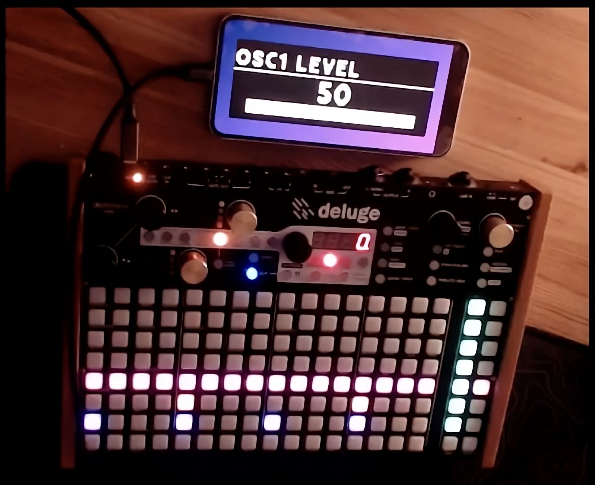

import { Badge } from "@astrojs/starlight/components"
import LinkPreviewCard from "../../../../components/LinkPreviewCard.astro"

This page lists various Deluge Applications that have been built by the community to enhance the Deluge experience.

## Deluge Synth Editor

A web-based synth preset editor for the Synthstrom Deluge, featuring graphical controls, full parameter editing, Controlled Randomisation, MIDI CC and optional direct SYSEX file transfer.

Works with ANY Deluge firmware for offline XML editing. Direct USB transfer requires Community Firmware 1.3+ or Official Firmware 4.0+.

<LinkPreviewCard
  href="https://solaris76.github.io/Deluge-Synth-Editor/"
  showSiteName={true}
/>

## Deluge Companion (Shortcut Browser) <Badge text="Web" variant="tip" />

A website for easy browsing and searching of shortcuts for the Synthstrom Deluge.

<LinkPreviewCard href="https://fheft.github.io/deluge-companion/" />
<LinkPreviewCard
  href="https://github.com/fheft/deluge-companion"
  showImage={false}
  title="Source code"
  description={false}
/>

## DEx: Deluge EXtensions - See Your Deluge Like Never Before <Badge text="Web" variant="tip" />

<LinkPreviewCard href="https://dex.silicak.es" />
<LinkPreviewCard
  href="https://github.com/silicakes/deluge-extensions"
  showImage={false}
  title="Source code"
  description={false}
/>

## Deluge Display - Just like DEx for web, mirror your Deluge screen but on MacOS, iPhone and iPad <Badge text="MacOS" variant="tip" /> <Badge text="iOS" variant="tip" />

<LinkPreviewCard
  href="https://github.com/douglas-carmichael/DelugeDisplay/releases"
  title="MacOS app"
/>
<LinkPreviewCard
  href="https://apps.apple.com/es/app/deluge-display/id6745803020"
  title="iOS app"
/>

## Delugr (File Browser) <Badge text="Web" variant="tip" />

Delugr is a web-app that lets you browse the contents of your Deluge memory card.

It uses the new File System Access API to read the contents of your memory card, so there's no need to install anything! As of December 2024, the API is not yet supported by Firefox, Safari or any of the mobile browsers.

<LinkPreviewCard href="https://delugr.haila.fi" />
<LinkPreviewCard
  href="https://github.com/MrHaila/delugr"
  showImage={false}
  title="Source code"
  description={false}
/>
<LinkPreviewCard
  href="https://forums.synthstrom.com/discussion/4547/delugr-a-wip-deluge-file-browser-in-the-browser"
  showImage={false}
  description={false}
/>

## Vuefinder (File Browser) <Badge text="Web" variant="tip" />

Vuefinder is a web-based "cloud" file browser written by Yusuf Özdemir. Jamie Fenton has adapted this program to allow manipulation of the Deluge SD card contents from a web browser using Midi System Exclusive over USB.

For more info, please see: [Vuefinder Documentation](/resources/applications/vuefinder)

<LinkPreviewCard href="https://www.fentonia.com/deluge/vuefinder/" />
<LinkPreviewCard
  href="https://github.com/SynthstromAudible/DelugeWeb/tree/main/vuefinder"
  showImage={false}
  title="Source code"
  description={false}
/>

## Downrush - Waverly (WAV File Editor) <Badge text="Web" variant="tip" />

Waverly is a program for editing .WAV files using an old version of WaveSurfer

<LinkPreviewCard href="https://www.fentonia.com/deluge/waverly/" />
<LinkPreviewCard
  href="https://github.com/SynthstromAudible/DelugeWeb/tree/main/downrush/waverly"
  showImage={false}
  title="Source code"
  description={false}
/>

## Downrush - ViewScore (Project Editor) <Badge text="Web" variant="tip" />

ViewScore is a program for viewing Deluge XML files such as KIT, SYNTH, and SONG. downrush stuff runs mostly, but has not been updated to show new Community Edition features.

<LinkPreviewCard href="https://www.fentonia.com/deluge/viewScore/" />
<LinkPreviewCard
  href="https://github.com/SynthstromAudible/DelugeWeb/tree/main/downrush/viewScore"
  showImage={false}
  title="Source code"
  description={false}
/>

## Midian (MIDI File to XML File Converter) <Badge text="Web" variant="tip" />

This program converts Midi-format files into Synthstrom Deluge SONG.XML files. This beta version also allows you to convert SONG.XML files into Midi-format files.

<LinkPreviewCard href="https://www.fentonia.com/catnip/midian/index.html" />

## Deluge Commander <Badge text="Desktop" variant="tip" />

<LinkPreviewCard href="https://neuma.studio/deluge-commander/" />
<LinkPreviewCard
  href="https://github.com/drbourbon/deluge-commander"
  showImage={false}
  title="Source code"
  description={false}
/>

## Deluge Preset Builder <Badge text="Web" variant="tip" />

<LinkPreviewCard href="https://deluge-kit-generator.vercel.app" />

## Delugeator (Synth Randomizer) <Badge text="Web" variant="tip" />

Create random synth presets for the Deluge.

<LinkPreviewCard href="https://randomdelugesynth.azurewebsites.net" />
<LinkPreviewCard
  href="https://forums.synthstrom.com/discussion/comment/22852"
  showImage={false}
  description={false}
/>

## Delugeator (Synth and Kit Editor) <Badge text="Windows" variant="tip" />

A kit and synth editor and random synth and kit creator for Deluge.

<LinkPreviewCard
  href="https://www.youtube.com/watch?v=g7STxom19KE"
  showSiteName={true}
/>
<LinkPreviewCard
  href="https://forums.synthstrom.com/discussion/5232/delugeator-2-0-out-now"
  showSiteName={true}
/>
<LinkPreviewCard
  href="https://drive.google.com/file/d/1F8inZ25Ye_BGdMAzKT6N9nUBnHDQS2cd/view"
  title="Windows Installer"
/>
<LinkPreviewCard
  href="https://drive.google.com/file/d/1WMLCxavkTbJCeRtAZ_u3pfXVqEZb_1QX/view"
  showImage={false}
  title="PDF Manual"
/>

## Dealleague (XML Fixer) <Badge text="Windows" variant="tip" />

Program to analyse and fix missing samples.

It can also set entire volumes in kits and synths and Osc volumes at once to avoid loud mistakes when jamming with others.

With this newest release you can create textfile lists of kits, synth and folders.

<LinkPreviewCard
  href="https://github.com/Queroland/DelLeague/releases/tag/V2.0"
  description={false}
/>
<LinkPreviewCard
  href="https://forums.synthstrom.com/discussion/4247/deluge-xml-fixer-and-with-set-volumes"
  showImage={false}
  showSiteName={true}
/>
